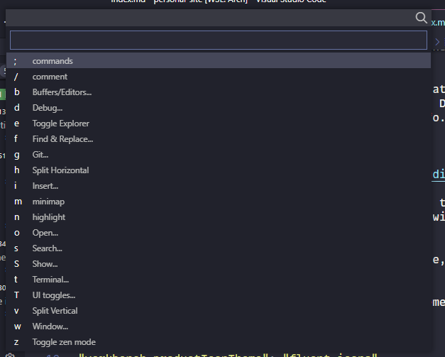
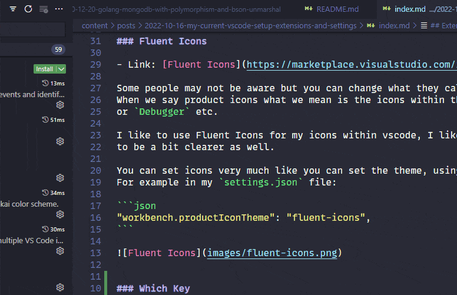
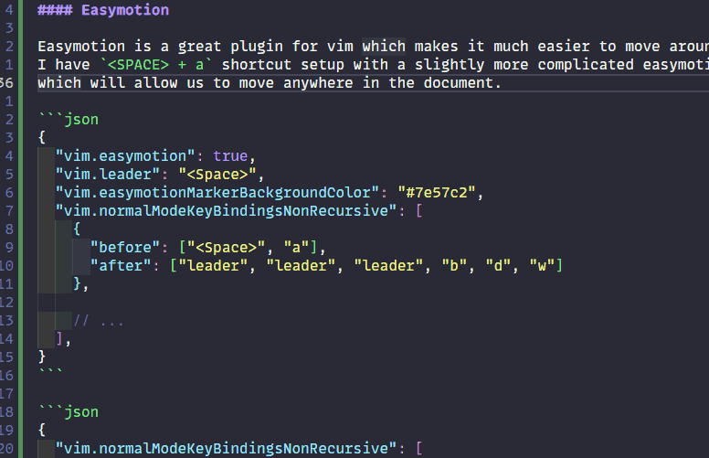

Today I will go over my current VSCode setup covering both extensions and settings.


This article may be out of date, by the time you are reading this. It is accurate as of
16th October 2022.



## Extensions

Here we will go over some extensions I find very useful:

- Full list of my [plugins here](https://gitlab.com/hmajid2301/dotfiles/-/blob/6b83e990861654506e8ecc756af75cf431438a4a/vscode/extensions.txt)

### Better Comments

- Link: [Better Comments](https://marketplace.visualstudio.com/items?itemName=aaron-bond.better-comments) 

As the name implies it improves your comments. Makes them look nicer if you add certain annotations.
Such as adding `TODO` to the comment will turn the comment orange. See the image below:


I like this extension because it makes certain comments stand out. 
I use the `TODO` comments a lot 😅. You can configure it to change what annotations to use and which colours
they should be.

### Error Lens

- Link: [Error Lens](https://marketplace.visualstudio.com/items?itemName=usernamehw.errorlens)

One of my favourite vscode extensions, what this extension does is it shows the errors inline.
A bit like Gitlens (further down), so that you don't have to hover over your code to see the error message.


I found out about this extension while at EuroPython earlier this year. I Have been using it ever since
and do love it. Would recommend it, the colour of the line changes depending on the type of error
such as warning vs error.

Give it a go and see what you think.

### Dracula Official

- Link: [Dracula Official](https://marketplace.visualstudio.com/items?itemName=dracula-theme.theme-dracula)

I like using the Dracula theme, so I tend either use this or Monokai Pro. At the moment
I'm using this theme.

One other thing I like about the Dracula theme is that it supports a ton of other programs and
applications so you can style your entire system with Dracula for a more uniform look.
[Click here](https://draculatheme.com/) for more info.

### Fluent Icons

- Link: [Fluent Icons](https://marketplace.visualstudio.com/items?itemName=miguelsolorio.fluent-icons).

Some people may not be aware but you can change what they call the product icons in vscode.
When we say product icons what we mean are the icons within the application such as for the `File Explorer`,
or `Debugger` etc.

I like to use Fluent Icons for my icons within vscode, I like the simpler look of the icons and they seem
to be a bit clearer as well.

You can set icons very much like you can set the theme, using the command palette or within your settings.
For example in my `settings.json` file:

```json
"workbench.productIconTheme": "fluent-icons",
```


### Which Key

- Link: [Which Key](https://marketplace.visualstudio.com/items?itemName=VSpaceCode.whichkey)

This adds a which-key like menu to vscode, I believe this is copied over from neovim.
It looks something like this:



In my case when I press the `/` key it opens up the menu, and the menu can be nested for better organisation.
But I use it to access common commands I run. Below you can see some of the commands behind sub-menus.



Overall I am very happy with this extension it does take a while to customise but it provides a ton of value.
I would work out which commands you use a lot and cannot/do not want to put behind a shortcut.
Put them in this which key dropdown.

[My which-key config](https://gitlab.com/hmajid2301/dotfiles/-/blob/6b83e990861654506e8ecc756af75cf431438a4a/vscode/linux/settings.json#L240-825) in my `settings.json` file.

### vim

- Link: [Vim](https://marketplace.visualstudio.com/items?itemName=vscodevim.vim)

By far the most important extension in any text editor I use. This plugin adds vim key bindings to vscode.
Super important for me. I am not amazing at vim but I use a decent number of vim shortcuts in my workflow
and would miss not having them.

### vscode-pets

- Link: [vscode-pets](https://marketplace.visualstudio.com/items?itemName=tonybaloney.vscode-pets)

Arguably the most important extensions and this is why vscode beats out any other editor. You can have
PETS in vscode! Your own pets you can play with.


## Settings

In this section I will go over some of my interesting settings for vscode.

[settings.json](https://gitlab.com/hmajid2301/dotfiles/-/blob/6b83e990861654506e8ecc756af75cf431438a4a/vscode/linux/settings.json).

### Fonts

I swap between MonoLisa (paid font) and Fira Code (free font) but recently have been using MonoLisa as my monospace font of choice.

```json
{
  "editor.fontFamily": "'MonoLisa', 'Droid Sans Mono', 'monospace', 'Noto Color Emoji'",
  // "editor.fontFamily": "'Fira Code', 'Droid Sans Mono', 'monospace', 'Noto Color Emoji'",
  "debug.console.fontFamily": "'MonoLisa', 'Droid Sans Mono', 'monospace', 'Noto Color Emoji'",
}
```

### Golang

I have some specific settings for Golang:

Before


```json
{
  "editor.tokenColorCustomizations": {
    "[Dracula]": {
      "textMateRules": [
        {
          "scope": "source.go",
          "settings": {
            "foreground": "#6dd8ce"
          }
        }
      ]
    }
  },

  "go.inlayHints.parameterNames": true,
  "go.inlayHints.compositeLiteralFields": true,
  "gopls": {
    "ui.semanticTokens": true
  },

  "go.lintTool": "golangci-lint",
  "go.lintFlags": ["--fast", "--enable", "unconvert"],
}
```

- `go.inlayHints`: Used to show parameter arguments in functions, you can see it in the image below like `a...` or `ctx`
- `go.lint`: I Set golangci-lint as my default linter, it has a lot of "sub-linters" or tools we can use. We are only enabling `unconvert` at the moment to detect unnecessary type conversions
- `gopls`: Semantic tokens improve the syntax highlighting
- `editor.tokenColorCustomizations`: Allows us to create some specific rules for syntax highlighting

After


### Vim

Most of the interesting settings are for vim;

```json
{
  "vim.smartRelativeLine": true,
}
```

In normal mode gives us relative lines to the current lines makes easier moving using vim keys such `h j k l`


```json
{
  "vim.insertModeKeyBindings": [
    {
      "before": ["j", "j"],
      "after": ["<Esc>"]
    }
  ],
}
```

This means we can access normal mode by pressing `j + j` instead of `<ESC>` key.

```json
{
  "vim.visualModeKeyBindings": [
      {
        "before": [">"],
        "after": [">", "g", "v"]
      },
      {
        "before": ["<"],
        "after": ["<", "g", "v"]
      }
  ],
}
```

This allows us to ident and outdent without needing to keep reselecting the visual block.


#### Easymotion

Easy motion is a great plugin for vim which makes it much easier to move around the document.
I have `<SPACE> + a` shortcut setup with a slightly more complicated easy motion shortcut
which will allow us to move anywhere in the document.

```json
{
  "vim.easymotion": true,
  "vim.leader": "<Space>",
  "vim.easymotionMarkerBackgroundColor": "#7e57c2",
  "vim.normalModeKeyBindingsNonRecursive": [
    {
      "before": ["<Space>", "a"],
      "after": ["leader", "leader", "leader", "b", "d", "w"]
    },

    // ...
  ],
}
```



#### Normal Key Bindings

For some other bindings, the `g` command which opens the which menu you saw above and `<SPACE> + w` will open a new vertical split.

```json
{
  "vim.normalModeKeyBindingsNonRecursive": [
    // ...

    {
      "before": ["g"],
      "commands": ["whichkey.show"]
    },
    {
      "before": ["<leader>", "w"],
      "commands": ["workbench.action.splitEditor"]
    }
  ],
}
```

## Keybindings

[keybindings.json](https://gitlab.com/hmajid2301/dotfiles/-/blob/6b83e990861654506e8ecc756af75cf431438a4a/vscode/linux/keybindings.json).

```json
[
 {
    "key": "ctrl+j",
    "command": "selectNextSuggestion",
    "when": "editorTextFocus && suggestWidgetMultipleSuggestions && suggestWidgetVisible"
  },
  {
    "key": "ctrl+k",
    "command": "selectPrevSuggestion",
    "when": "editorTextFocus && suggestWidgetMultipleSuggestions && suggestWidgetVisible"
  },
]
```

Allow us to use `ctrl+j` and `ctrl+k` to navigate auto-suggestions from vscode rather than using the arrow keys.


```json
[
  {
    "key": "ctrl+l",
    "command": "workbench.action.focusRightGroup"
  },
  {
    "key": "ctrl+h",
    "command": "workbench.action.focusLeftGroup"
  },
  {
    "key": "ctrl+h",
    "command": "workbench.action.navigateLeft"
  },
  {
    "key": "ctrl+l",
    "command": "workbench.action.navigateRight"
  },
  {
    "key": "ctrl+k",
    "command": "workbench.action.navigateUp"
  },
  {
    "key": "ctrl+j",
    "command": "workbench.action.navigateDown"
  },
]
```

Used to navigate across vscode using ctrl and the vim replacement arrow keys.
Allow us to again not have to use the mouse we can jump to any section of vscode, i.e. terminal to the editor.

```json
[
  {
    "key": "enter",
    "command": "list.select",
    "when": "explorerViewletVisible && filesExplorerFocus"
  },
  {
    "key": "l",
    "command": "list.select",
    "when": "explorerViewletVisible && filesExplorerFocus && !inputFocus"
  },
  {
    "key": "o",
    "command": "list.toggleExpand",
    "when": "explorerViewletVisible && filesExplorerFocus && !inputFocus"
  },
  {
    "key": "h",
    "command": "list.collapse",
    "when": "explorerViewletVisible && filesExplorerFocus && !inputFocus"
  },
  {
    "key": "a",
    "command": "explorer.newFile",
    "when": "filesExplorerFocus && !inputFocus"
  },
  {
    "key": "shift+a",
    "command": "explorer.newFolder",
    "when": "filesExplorerFocus && !inputFocus"
  },
  {
    "key": "r",
    "command": "renameFile",
    "when": "explorerViewletVisible && filesExplorerFocus && !explorerResourceIsRoot && !explorerResourceReadonly && !inputFocus"
  },
  {
    "key": "enter",
    "command": "-renameFile",
    "when": "explorerViewletVisible && filesExplorerFocus && !explorerResourceIsRoot && !explorerResourceReadonly && !inputFocus"
  },
]
```

These settings allow us to use the keyboard shortcut to do common actions with files. Such as creating files, creating folders etc. Again this helps us avoid using the mouse.

## Closing Thoughts

This post has ballooned a lot more than I expected, so I'll stop here. Perhaps I'll do a more in-depth post into how I use vim
with vscode, and avoid using the mouse as much as possible. But I'm getting a lot better at myself at the moment.

And finally, I will leave you with this:

<div style='position:relative; padding-bottom:calc(57.50% + 44px)'><iframe src='https://gfycat.com/ifr/PlaintiveAdorableBactrian' frameborder='0' scrolling='no' width='100%' height='100%' style='position:absolute;top:0;left:0;' allowfullscreen></iframe></div><p> <a href="https://gfycat.com/plaintiveadorablebactrian">via Gfycat</a></p>

## Appendix

- [My vscode settings](https://gitlab.com/hmajid2301/dotfiles/-/tree/main/vscode)