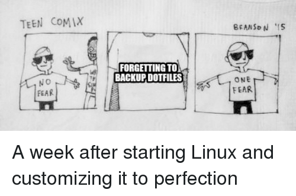


This article assumes you are familiar with dotfiles and Dobot.
If you want to know more about Dotbot [click here](/posts/2022-10-15-how-to-manage-your-dotfiles-with-dotbot)




If you are like me you have devices, such as personal desktop and a work laptop. These devices share some dotfiles but also have specific program and applications.

For example:

* Personal Desktop: Linux
* Work Laptop: Windows (WSL)

On Linux I use alacritty and in Windows I use Windows terminal I could copy all my dotfiles over and not worry
about which programs exist on which systems.

If we are using dotbot to manage our dotfiles, we can use dotbot profiles. Profiles allow us to pick which dotfiles we want to install.
We could have a `windows` profile or a `linux` profile. Then specify different types of dotfiles in each of those profile files.

## Current Setup

So imagine we have something like so:

```
.
|-- bashrc
|-- dotbot
|-- install
|-- .gitconfig
|-- install.conf.yaml
└── vscode
```

Let us take a look how we can take a "normal" Dotbot project into one that uses profiles.

## How to move to profiles?

### configs

First we will split the `install.conf.yaml` file into smaller files, I like to create files on type.
So for example I may create a file called `git.yaml` like so:

```yaml
- link:
    ~/.gitconfig: .gitconfig
```

Then we need to move this file to `meta/configs`; So now our project looks something like

```
.
├── ....
├── bashrc
├── .gitconfig
├── meta
│   ├── base.yaml
│   └── configs
│       └── git.yaml
└── vscode
```

We also added a `base.yaml` file for cleaning up like a default "job".

```yaml
- clean: ["~"]

- create:
    - ~/.config

- defaults:
    link:
      relink: true
```

The default command here applys to all commands that follow this. You can read the [docs here](https://github.com/anishathalye/dotbot#directives).
For a more thorough explanation of the directives.

### profiles

Next we want to create our profiles for our different devices. Let's see we want to create a Linux one. We create a called `meta/profiles/linux`.
In the file we write all the yaml files we want dotbot to execute for this profile. So at the moment our files would look something like:

```
git
```

When we specify the linux profile, we will see how to do this later, it will run the all the directives in the `git.yaml` file.
In this case it will copy over the gitconfig file in the project, to the host machine.

Now our setup looks something this:

```
.
├── ....
├── bashrc
├── .gitconfig
├── meta
│   ├── configs
│   │   └── git.yaml
│   ├── base.yaml
│   └── profiles
│       └── linux
└── vscode
```

### dotbot

We need to move the dotbot submodule to the `meta` folder. You can move your submodule by running `git mv dotbot meta/dotbot`.

### Profile Script

Finally we need to add a script that we can run to run all the directives specified in the profile. We will pass the profile as an argument.

Create a new file at the root of your project called `install-profile`, that looks like:


```bash
#!/usr/bin/env bash

set -e

BASE_CONFIG="base"
CONFIG_SUFFIX=".yaml"

META_DIR="meta"
CONFIG_DIR="configs"
PROFILES_DIR="profiles"

DOTBOT_DIR="dotbot"
DOTBOT_BIN="bin/dotbot"

BASE_DIR="$(cd "$(dirname "${BASH_SOURCE[0]}")" && pwd)"


cd "${BASE_DIR}"
git -C "${BASE_DIR}" submodule sync --quiet --recursive
git submodule update --init --recursive "${BASE_DIR}"


while IFS= read -r config; do
    CONFIGS+=" ${config}"
done < "${META_DIR}/${PROFILES_DIR}/$1"

shift

for config in ${CONFIGS} ${@}; do
    echo -e "\nConfigure $config"
    # create temporary file
    configFile="$(mktemp)"
    suffix="-sudo"
    echo -e "$(<"${BASE_DIR}/${META_DIR}/${BASE_CONFIG}${CONFIG_SUFFIX}")\n$(<"${BASE_DIR}/${META_DIR}/${CONFIG_DIR}/${config%"$suffix"}${CONFIG_SUFFIX}")" > "$configFile"

    cmd=("${BASE_DIR}/${META_DIR}/${DOTBOT_DIR}/${DOTBOT_BIN}" -d "${BASE_DIR}" -c "$configFile")

    if [[ $config == *"sudo"* ]]; then
        cmd=(sudo "${cmd[@]}")
    fi

    "${cmd[@]}"
    rm -f "$configFile"
done

cd "${BASE_DIR}"
```

and add `install-standalone` to the root of the project.

```bash
#!/usr/bin/env bash

set -e

BASE_CONFIG="base"
CONFIG_SUFFIX=".yaml"

META_DIR="meta"
CONFIG_DIR="configs"
PROFILES_DIR="profiles"

DOTBOT_DIR="dotbot"
DOTBOT_BIN="bin/dotbot"

BASE_DIR="$(cd "$(dirname "${BASH_SOURCE[0]}")" && pwd)"


cd "${BASE_DIR}"
git submodule update --init --recursive --remote

for config in ${@}; do
    # create temporary file
    configFile="$(mktemp)"
    suffix="-sudo"
    echo -e "$(<"${BASE_DIR}/${META_DIR}/${BASE_CONFIG}${CONFIG_SUFFIX}")\n$(<"${BASE_DIR}/${META_DIR}/${CONFIG_DIR}/${config%"$suffix"}${CONFIG_SUFFIX}")" > "$configFile"

    cmd=("${BASE_DIR}/${META_DIR}/${DOTBOT_DIR}/${DOTBOT_BIN}" -d "${BASE_DIR}" -c "$configFile")

    if [[ $config == *"sudo"* ]]; then
        cmd=(sudo "${cmd[@]}")
    fi

    "${cmd[@]}"
    rm -f "$configFile"
done

cd "${BASE_DIR}"
```

Finally we should have something like this:

```
.
├── ....
├── bashrc
├── .gitconfig
├── install-profile
├── install-standalone
├── meta
│   ├── configs
│   │   └── git.yaml
│   ├── dotbot
│   ├── base.yaml
│   └── profiles
│       └── linux
└── vscode
```

## Finally!

Then we can install the linux specific dotfiles by running `./install-profile linux`. Now of course this is a very simplified example.
In reality you'd have lots of profiles and different configs in those profiles. But I wanted to show a simple example here, to
make it easier to follow.

Speaking of finishing 😭 .... 

<div style='position:relative; padding-bottom:calc(146.67% + 44px)'><iframe src='https://gfycat.com/ifr/ContentScrawnyGrackle' frameborder='0' scrolling='no' width='100%' height='100%' style='position:absolute;top:0;left:0;' allowfullscreen></iframe></div>

## Appendix

- [My Dotfiles using profiles](https://gitlab.com/hmajid2301/dotfiles/-/tree/6b83e990861654506e8ecc756af75cf431438a4a)
- [Dotbot profiles tutorial](https://github.com/anishathalye/dotbot/wiki/Tips-and-Tricks#more-advanced-setup)
