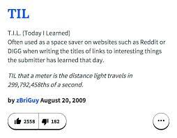

# What is a TIL post?

TIL - Stands for today I learnt. These posts will be shorts summaries of something I learnt "today".

The TIL posts have a low barrier to entry and are a lot easier to write. Therefore they should encourage me
to post more often. In all my blog posts I try to post about things that I struggled to do. If I struggled
to implement a feature or build something. It shows that there wasn't a tutorial or an easy example I could follow.
So then I decide to write my own, to make it easier for others. It also has a nice side effect of helping me remember the topic
better.

Also, a TIL is a lot easier to write as they are a lot shorter. I cannot stress how important it is that they are shorter.
More seriously it also will hopefully force me to be more concise and try to write fewer words to convey what I mean.
These posts are also great for me, and I can reference them later if I forget something, which I definitely will.


However, most likely it will be something I learnt recently, as I often don't have the energy/time to post
the same day I learn something new 😅.


## Appendix

- [My Inspiration](https://betatim.github.io/posts/til-explained/)
- [More Inspiration](https://rabea.dev/til/gitconfig-with-conditionals)