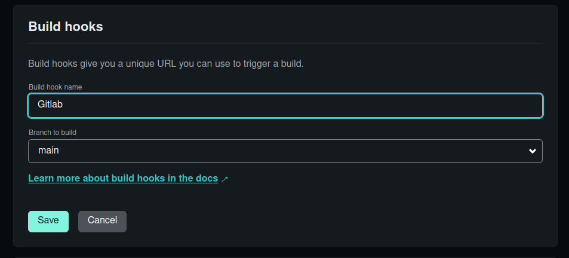
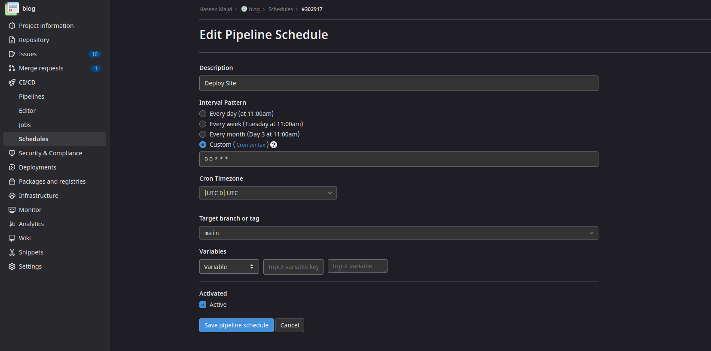

**TIL: You Can Schedule Posts on Your Hugo Blog using Netlify and Gitlab CI**

This post in fact will be a scheduled post I'm writing it on the 20th of November but it will be published on the 23rd of November.
Assuming we are using Netlify to deploy our website, what we will need to do is trigger a rebuild of our site every day using Gitlab CI.
Since Hugo builds a static site to publish our content after a set date we will need to rebuild our site. So let's see how we can automate
that. Else the post won't be visible until I next make a commit to my main branch.

I use the `date` field to determine when to make this post visible on my blog, set in the front matter of the post (markdown).

```md
---
title: "TIL: You Can Schedule Posts on Your Hugo Blog using Netlify and Gitlab CI"
canonicalURL: https://haseebmajid.dev/posts/2022-11-23-til-you-can-schedule-posts-on-your-hugo-blog-using-netlify-and-gitlab-ci/
date: 2022-11-23
---
```

We can do this by first creating a build hook on Netlify, go to your `Site Settings` (on Netlify) then `Build and Deploy`. Copy the build hook
cURL request example which will look like `curl -X POST -d {} https://api.netlify.com/build_hooks/[id]`.



Next, go to Gitlab and open your `Settings > CI/CD` settings and add a new variable called `NETLIFY_DEPLOY_WEBHOOK` and copy your build hook URL
`https://api.netlify.com/build_hooks/[id]`. Mark the variable as protected.


Then update our `.gitlab-ci.yml` with the following:

```yml
stages:
  - deploy

deploy_site:
  stage: deploy
  image: curl
  variables:
    GIT_STRATEGY: none
  script:
    - curl -X POST -d '{}' $NETLIFY_BUILD_WEBHOOK
  only:
    - schedules
```

This job will run on a schedule, i.e. once a day, that will trigger the build hook and cause Netlify to rebuild our site.
This means any posts due to be published that day will be visible on our site.

Finally, let's schedule our CI job, go to `CI/CD > Schedules`, and then create a new schedule. Set the [cron](https://crontab.guru) to whatever
you want. My pipeline schedule is set as so:



This will cause our website to build once a day, triggering a build on Netlify. So when the Gitlab CI job runs at midnight on the 23rd of November
this post will be visible to you all.

You can test your website using the `--buildFuture` flag i.e. `hugo server -D --buildFuture` when testing your site locally.

## Appendix

- [Inspired by](https://hamy.xyz/labs/hugo-schedule-rebuilds-on-netlify)