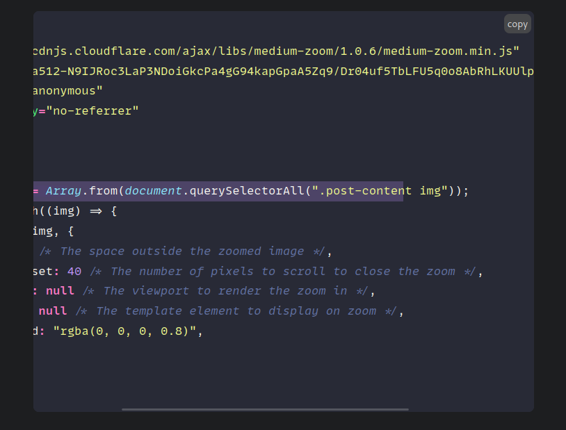
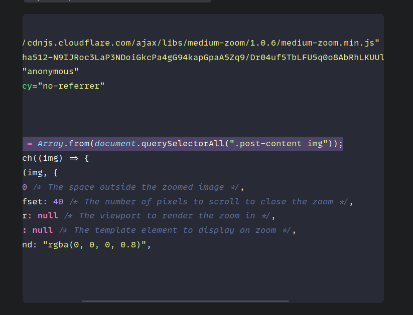

**TIL: How to Fix "Overflowing" Highlights in Hugo Code Blocks**

I am using the [PaperModX](https://reorx.github.io/hugo-PaperModX/) theme, or at least a theme that is very close to that theme.
I noticed an issue when I would try to highlight my code in code blocks. For example, if we had the following:

```markdown
```js {hl_lines=[1]}
const images = Array.from(document.querySelectorAll(".post-content img"));
\```
```

It would highlight line number the first line in the code block but just up to the width of the code block.
So if you scrolled to the right to see the rest of the code it would not be highlighted.



This doesn't look great so let's fix it, find your CSS code that does the styling for the code blocks.
In my case it is called `assets/css/lib/chroma-dark.css` and `assets/css/lib/chroma-light.css`.

Then in the `LineHighlight` part add `width: max-content;` so my light theme files looks like this:

```css
/* LineHighlight */ .chroma .hl { background-color: #ffffcc; width: max-content; }
```
and my dark theme file:

```css
/* LineHighlight */ .chroma .hl { background-color: #bd93f940; width: max-content; }
```

Now it looks like this:



That's it!
