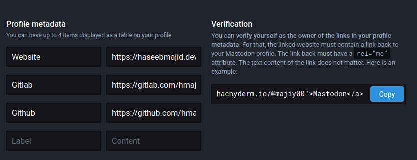

**TIL: How you can Verify Your Hugo Blog on Mastodon**

Mastodon is an open-source social media website gaining a lot of traction at the moment, thanks in part to what is happening at Twitter.
On Mastodon, we can verify a link on our profile is owned by us by linking back to Mastodon with a `rel="me"`.




- 1. Go to settings/profile
  - In my case, it is this, https://hachyderm.io/settings/profile
- 1. Find the verification link
  - It will look something like `<a rel="me" href="https://hachyderm.io/@majiy00">Mastodon</a>`
    - Yours may look different if you are on a different Mastodon instance
- Copy this into our site
  - For example, in your footer `footer.html`

```go-html-template {hl_lines=[5]}
  <span style="display: inline-block; margin-left: 1em;">
    Powered by
    <a href="https://gohugo.io/" rel="noopener noreferrer" target="_blank">Hugo</a> &
    <a href="https://github.com/reorx/hugo-PaperModX/" rel="noopener" target="_blank">PaperModX</a>.
    <a rel="me" href="https://hachyderm.io/@majiy00">Mastodon</a>
    {{- if .Site.Params.goatcounter }}
      <span>
        Analytics by <a href="https://{{ .Site.Params.goatcounter }}.goatcounter.com">Goatcounter</a>.
      </span>
    {{- end}}
  </span>
```

## PaperMod

If you are using the [PaperMod](https://adityatelange.github.io/hugo-PaperMod/) theme or similar.
You can make this change to the `config.yml`:

```yml {hl_lines=["10-11"]}
params:
  # ...
  socialIcons:
    - name: gitlab
      url: "https://gitlab.com/hmajid2301"
    - name: github
      url: "https://github.com/hmajid2301"
    - name: linkedin
      url: "https://www.linkedin.com/in/haseeb-majid-ba0a5194/"
    - name: mastodon
      url: "https://hachyderm.io/@majiy00"
```

If you drill down into the code you will see these get turned into anchors tags in `social_icons.html` page, like so:

```go-html-template
<a href="{{ trim .url " " }}" target="_blank" rel="noopener noreferrer me" title="{{ .name | title }}">
    {{ safeHTML (index $.svg $icon_name | default $.svg.default) }}
</a>
```