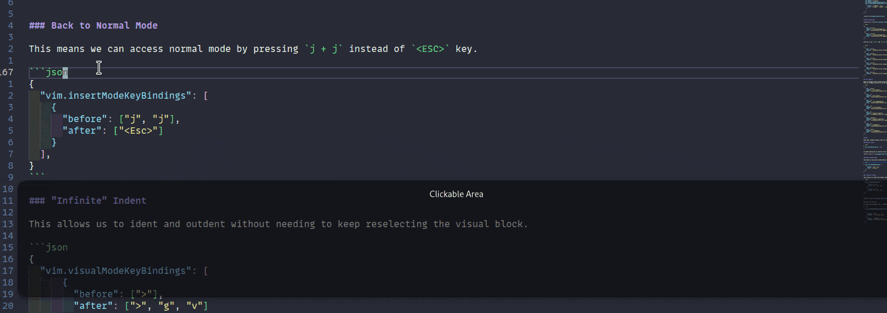

In this post, I will show you some useful and perhaps not as well-known Vim commands I use with VS Code.
As per [this previous post](/2022-10-16-my-current-vscode-setup-extensions-and-settings/), I use
[this extension](https://marketplace.visualstudio.com/items?itemName=vscodevim.vim) for Vim emulation in VS Code.

My [keybindings.json](https://gitlab.com/hmajid2301/dotfiles/-/blob/6b83e990861654506e8ecc756af75cf431438a4a/vscode/linux/keybindings.json) file.

I will repeat some of the settings I showed there for posterity.

## Useful Commands

- `xp`: To swap two characters around  i.e. `ab` -> `ba` (cursor on `a`)
- `ctrl + enter`: Creates a new line below and stays in `NORMAL`
  - `o`: Will do the same but put you in insert mode
- `ctrl + shift + enter`: Creates a new line above and stays in `NORMAL`
  - `O`: Will do the same but put you in insert mode
- `dtx`: Deletes everything up to `x` character
- `dfx`: Delete everything including `x` character
- `yi"`: Yank everything between quotes `"`
- `vi""+p`: Replace everything between quotes with what is yanked
- `va{Vy` [^1]: Yank the entire function assuming the language uses braces like `golang` or `C`
- `"_dd` [^2]: Delete without adding to register
- `"aY` [^2]: Yank into named register `a`
- `"ap` [^2]: Paste from named register `a`
- `%x``df(` [^3]: Deletes surrounding function i.e. `func(arg)` -> `arg`

### Commands as settings

To make some of these commands easier to use we can do something like:

```json
{
  "vim.normalModeKeyBindingsNonRecursive": [
    {
      "before": ["y", "a", "f"],
      "after": ["v", "a", "{", "V", "y"]
    },
    {
      "before": ["d", "s", "f"],
      "after": ["%", "x", "`", "`", "d", "f", "("]
    },
  ],
}
```

In my mind `dsf` -> `delete surrounding function` and `yaf` -> `yank a function`.

## Easymotion

Easy motion is a great plugin for vim which makes it much easier to move around the document.
I have `<SPACE> + a` shortcut setup with a slightly more complicated easy motion shortcut
which will allow us to move anywhere in the document.

```json
{
  "vim.easymotion": true,
  "vim.leader": "<Space>",
  "vim.easymotionMarkerBackgroundColor": "#7e57c2",
  "vim.normalModeKeyBindingsNonRecursive": [
    {
      "before": ["<Space>", "a"],
      "after": ["leader", "leader", "leader", "b", "d", "w"]
    },

    // ...
  ],
}
```


## Panel Navigation


```json
[
 {
    "key": "ctrl+j",
    "command": "selectNextSuggestion",
    "when": "editorTextFocus && suggestWidgetMultipleSuggestions && suggestWidgetVisible"
  },
  {
    "key": "ctrl+k",
    "command": "selectPrevSuggestion",
    "when": "editorTextFocus && suggestWidgetMultipleSuggestions && suggestWidgetVisible"
  },
]
```

Allow us to use `ctrl+j` and `ctrl+k` to navigate auto-suggestions from vscode rather than using the arrow keys.

```json
[
  {
    "key": "ctrl+l",
    "command": "workbench.action.focusRightGroup"
  },
  {
    "key": "ctrl+h",
    "command": "workbench.action.focusLeftGroup"
  },
  {
    "key": "ctrl+h",
    "command": "workbench.action.navigateLeft"
  },
  {
    "key": "ctrl+l",
    "command": "workbench.action.navigateRight"
  },
  {
    "key": "ctrl+k",
    "command": "workbench.action.navigateUp"
  },
  {
    "key": "ctrl+j",
    "command": "workbench.action.navigateDown"
  },
]
```


## File Explorer

Used to navigate across vscode using ctrl and the vim replacement arrow keys.
Allow us to again not have to use the mouse we can jump to any section of vscode, i.e. terminal to the editor.


```json
[
  {
    "key": "enter",
    "command": "list.select",
    "when": "explorerViewletVisible && filesExplorerFocus"
  },
  {
    "key": "l",
    "command": "list.select",
    "when": "explorerViewletVisible && filesExplorerFocus && !inputFocus"
  },
  {
    "key": "o",
    "command": "list.toggleExpand",
    "when": "explorerViewletVisible && filesExplorerFocus && !inputFocus"
  },
  {
    "key": "h",
    "command": "list.collapse",
    "when": "explorerViewletVisible && filesExplorerFocus && !inputFocus"
  },
  {
    "key": "a",
    "command": "explorer.newFile",
    "when": "filesExplorerFocus && !inputFocus"
  },
  {
    "key": "shift+a",
    "command": "explorer.newFolder",
    "when": "filesExplorerFocus && !inputFocus"
  },
  {
    "key": "r",
    "command": "renameFile",
    "when": "explorerViewletVisible && filesExplorerFocus && !explorerResourceIsRoot && !explorerResourceReadonly && !inputFocus"
  },
  {
    "key": "enter",
    "command": "-renameFile",
    "when": "explorerViewletVisible && filesExplorerFocus && !explorerResourceIsRoot && !explorerResourceReadonly && !inputFocus"
  },
]
```

## Misc

Some other random settings I have all of these are in my `settings.json` file.

### Relative Lines

```json
{
  "vim.smartRelativeLine": true,
}
```

In normal mode gives us relative lines to the current lines makes easier moving using vim keys such `h j k l`

### Back to Normal Mode

This means we can access normal mode by pressing `j + j` instead of `<ESC>` key.

```json
{
"vim.insertModeKeyBindings": [
  {
    "before": ["j", "j"],
    "after": ["<Esc>"]
  }
],
}
```



### "Infinite" Indent

This allows us to ident and outdent without needing to keep reselecting the visual block.

```json
{
  "vim.visualModeKeyBindings": [
      {
        "before": [">"],
        "after": [">", "g", "v"]
      },
      {
        "before": ["<"],
        "after": ["<", "g", "v"]
      }
  ],
}
```


## Normal Key Bindings

For some other bindings, the `g` command which opens the which menu you saw above and `<SPACE> + w` will open a new vertical split.

```json
{
  "vim.normalModeKeyBindingsNonRecursive": [
    // ...

    {
      "before": ["g"],
      "commands": ["whichkey.show"]
    },
    {
      "before": ["<leader>", "w"],
      "commands": ["workbench.action.splitEditor"]
    }
  ],
}
```

[^1]: Taken from https://stackoverflow.com/a/10635043/3108619
[^2]: Taken from https://stackoverflow.com/a/3638557/3108619
[^3]: Taken from https://vi.stackexchange.com/a/2985