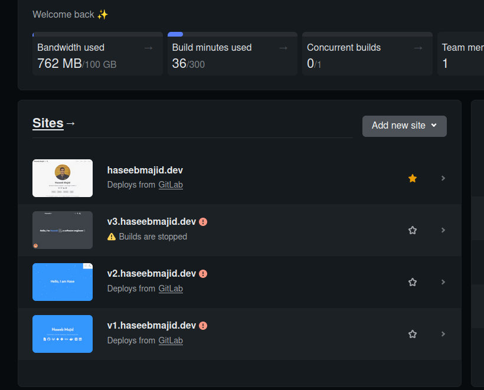
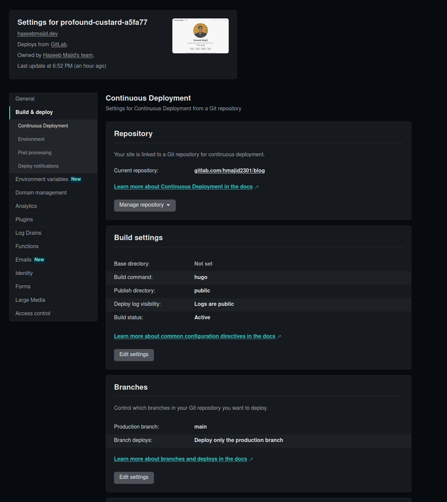
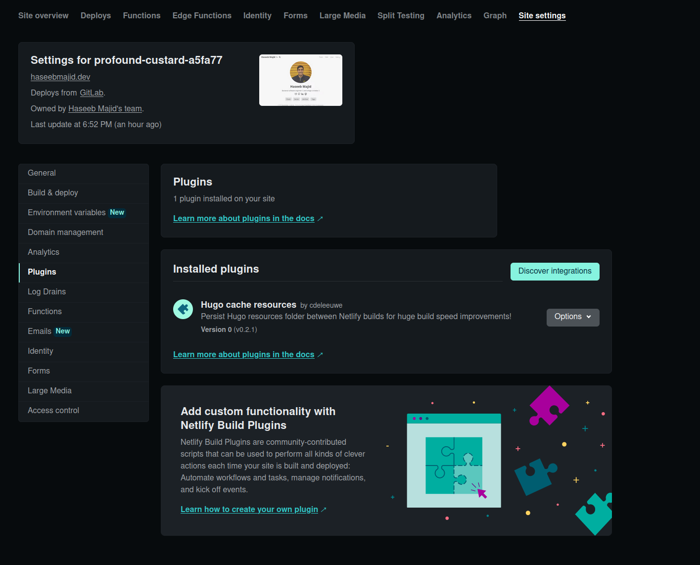
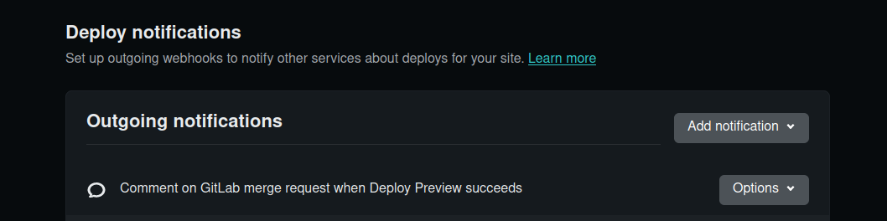
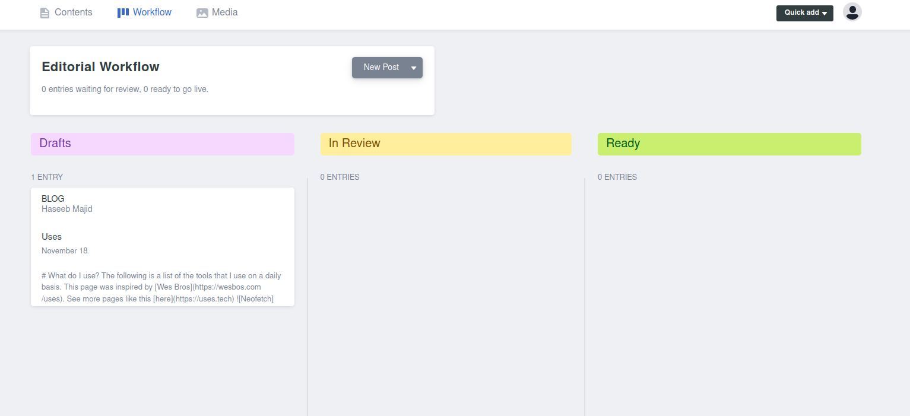
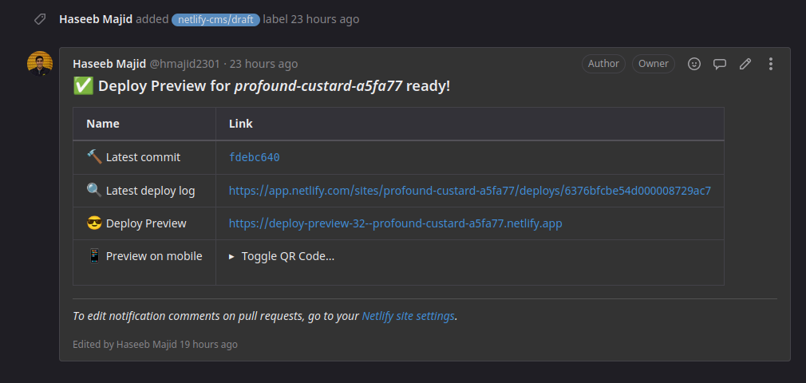

In this post, I will go over my new workflow for creating articles/posts that I now use with
my new (Hugo) blog. Though I'm sure much of this will apply to other JAM stack sites as well.


Before carrying on, this post assumes you have an existing Hugo blog.

My Hugo blog setup looked something like this:

```bash
├── archetypes
├── config.yml
├── content
├── docker-compose.yml
├── Dockerfile
├── go.mod
├── README.md
├── resources
├── static
├── Taskfile.yml
└── themes
```

We also assume you are using [page bundles](https://gohugo.io/content-management/page-bundles/).


## Netlify

First, let's use Netlify to deploy our website. Netlify is a great website that allows
us to deploy our Hugo blog for free. It has a very generous free tier. At the time of writing
100 GB bandwidth per month and 300 build minutes. To be honest my blog is more
than enough and if we ever need more at that point I can probably afford to pay for the
premium tiers.

Netlify makes it dead simple to deploy our Hugo blog all we need to do is link our Git repo,
which in our case is on [Gitlab](https://gitlab.com/hmajid2301/blog).

First, create a Netlify account if you need to, and then it will ask you to create a new team.
A project will belong to a team, you can add other users to the team. Allowing them to
manage the site on Netlify as well. In my case, I am the only one in my team as it is for my
blog.



You can add a new site; link it to your Gitlab repository. It will be set up to automatically 
deploy all changes from the main/master branch. So anytime you make a commit to your main branch.
Netlify will redeploy your website. Which is exactly what we want. Especially since Hugo
websites tend to build quite fast, we are unlikely to use the full 300 build minutes in Netlify.

I used to use Gitlab to build and deploy my site but now Gitlab has restricted the build minutes 
per month by a lot. So I let Netlify deploy for us. My deploy settings look like this:



One plugin I'd recommend which I think speeds up builds on Netlify is `Hugo cache resources`.



### Identity

We will need to enable identity to restrict access to the CMS. To turn on identity do the following:

- Go to Settings > Identity, and select Enable Identity service.
- Once enabled, select Settings and usage, and scroll down to Registration preferences. You can set this to either Open or Invite only, but usually Invite only is your best bet for a personal site.
- If you don't want to create an account, or would like to use an external provider such as GitHub or Google, you can enable those services under External providers.
- Scroll down to Services and click Enable Git Gateway.

We will need to use this later after we've set up NetlifyCMS.

### Netlify Preview

One setting you may have noticed that we turned on is using deploy previews. Which allows us to

> Deploy Previews allow you and your team to experience changes to any part of your site without having to publish them to production. - Netlify

This great feature will provide us with a unique deploy link in each of our merge requests
we create on Gitlab. So we can preview the website without needing to commit to the main
branch. Which has helped me catch a bunch of issues with my site.

Make sure to have this notification set up (also in the `Build & Deploy` settings in the screenshots above).



We will see in a bit more detail how this is used later on.

## Netlify CMS

Now that we have our blog deploying using Netlify. Let's look at setting up Netlify CMS.
Netlify CMS is an "Open source content management for your Git workflow". It super easy to
setup and will integrate very nicely with our site.

### Page Bundles

Before we look at how we can add Netlify CMS to our Hugo blog. First, let's quickly look at
(leaf) page bundles. I like using page bundles because it allows me to keep related to a post. For example the project structure
would look like this:

```bash
content/posts/2022-08-08-running-gitlab-ci-jobs-in-docker-using-docker-compose/
├── images
│   └── cover.png
└── index.md
```

You can see we have the image associated with this page as a subdirectory and the content of the post is in the `index.md` file.
For every post, all the associated files/content are within their own folder and it is nice and contained.


The folder path here `content/posts/2022-08-08-running-gitlab-ci-jobs-in-docker-using-docker-compose/`. This page would
then be accessed at
[https://haseebmajid.dev/posts/2022-08-08-running-gitlab-ci-jobs-in-docker-using-docker-compose/](https://haseebmajid.dev/posts/2022-08-08-running-gitlab-ci-jobs-in-docker-using-docker-compose/).


[Example page bundle here](https://gitlab.com/hmajid2301/blog/-/tree/51e1231b2d0f94e6d8a0158dd3c34a8ffe84a896/content/posts/2022-11-15-til-you-can-hash-none-in-python-what)

The only reason I mention page bundles is that to use Hugo page bundles with Netlify CMS we will have to adjust the Netlify CMS configuration a bit.

### Setup CMS

Now let's add [Netlify CMS](https://www.netlifycms.org/docs/hugo/) to our blog.

In your `static` folder create a new folder called `admin` i.e. `static/admin/`.

#### config.yml

Create a new file called `static/admin/config.yml`, which looks like this:

```yml {hl_lines=[7,11,13,17]}
backend:
  name: git-gateway
  branch: main
  use_large_media_transforms_in_media_library: false
media_folder: static/images
public_folder: /images
publish_mode: editorial_workflow
collections:
  - name: "blog"
    label: "Blog"
    folder: "content/posts"
    # Support Hugo page bundles that puts index.md and images in folders named by slug
    path: "{{slug}}/index"
    media_folder: "images"
    public_folder: "images"
    create: true
    slug: "{{fields.date}}-{{slug}}"
    editor:
      preview: true
    fields:
      - { label: "Title", name: "title", widget: "string" }
      - { label: "Canonical URL", name: "canonicalURL", widget: "hidden" }
      - {
          label: "Publish Date",
          name: "date",
          widget: "date",
          format: "YYYY-MM-DD",
        }
      - { label: "Tags", name: "tags", widget: "list", allow_add: true }
      - { label: "Series", name: "series", widget: "list", allow_add: true }
      - label: "Cover"
        name: "cover"
        widget: "object"
        collapsed: true
        fields:
          - {
              label: "Image",
              name: "image",
              default: "images/cover.png",
              widget: "string",
            }
      - {
          label: "Images",
          name: "thumbnail",
          widget: "image",
          choose_url: true,
          required: false,
          media_library: { config: { multiple: true } },
        }
      - { label: "Body", name: "body", widget: "markdown" }
```

I have highlighted some lines of interest in that file.

- `backend.branch`: Change this to the name of the main branch of your git repository on Gitlab i.e. `master`.
- `publish_mode: editorial_workflow`: This setting means when we make changes on the Netlify CMS i.e. create a new post it will create a new MR, this helps to keep the main branch git history nicer. It also allows you to review the post before it goes out. You can see this in the photos below.
- `folder: "content/posts"`: Here we specify where to create new posts in.
- `path: "{{slug}}/index"`:  Here is where we specify the page bundle part it will create the markdown file using the slug i.e. title and date and create an index.md file. For example, if our post title was `My Workflow To Create a New Post Using Hugo, Netlifycms, Netlify and Gitlab Together` we would create a file at `content/posts/2022-12-03-my-workflow-to-create-a-new-post-using-hugo,-netlifycms,-netlify-and-gitlab-together/index.md`.
- `slug: "{{fields.date}}-{{slug}}"`: Then we specify the slug which essentially is the name of the file created. Here we specify to use the date combined with the slug. For example, like this `2022-12-03-my-workflow-to-create-a-new-post-using-hugo,-netlifycms,-netlify-and-gitlab-together`.
 



##### fields

Finally, the fields section is what will be used to fill the frontmatter of our post I want it to be something like this:

```md
---
title: "TIL: How you can add goatcounter to your Hugo blog"
canonicalURL: https://haseebmajid.dev/posts/2022-11-20-til-how-you-can-add-goatcounter-to-your-hugo-blog/
date: 2022-11-20
tags:
  - hugo
  - blog
  - goatcounter
series:
  - TIL
  - Goatcounter with Hugo
cover:
  image: images/cover.png
---
```

Note `canonicalURL` is dynamically created and we will see how this is created, hence it is a `hidden` field which we cannot edit within NetlifyCMS.
The fields look like this:


Note to have nested fields in `frontmatter` we can do something like this:

```yml
- label: "Cover"
  name: "cover"
  widget: "object"
  collapsed: true
  fields:
    - {
        label: "Image",
        name: "image",
        default: "images/cover.png",
        widget: "string",
      }
```

To get `cover.images: images/cover.png`. You will need to set the fields as you need them to be for your front matter.

#### index.html

Create a new file called `static/admin/index.html`, which looks like this:

```html
<!DOCTYPE html>
<html>
  <head>
    <meta charset="utf-8" />
    <meta name="viewport" content="width=device-width, initial-scale=1.0" />
    <title>Content Manager</title>
    <!-- Include the script that enables Netlify Identity on this page. -->
    <script src="https://identity.netlify.com/v1/netlify-identity-widget.js"></script>
  </head>
  <body>
    <!-- Include the script that builds the page and powers Netlify CMS -->
    <script src="https://unpkg.com/netlify-cms@^2.0.0/dist/netlify-cms.js"></script>
  </body>
  <script>
    CMS.registerEventListener({
      name: "preSave",
      handler: ({ entry }) => {
        const slug = entry.getIn(['data', 'title'], '').toLowerCase().replace(/[']/g, '').replace(/[.]/g, '-').replace(/[\s]/g, '-').replace(":", '')
        const date = new Date();
        let day = date.getDate();
        let month = date.getMonth() + 1;
        let year = date.getFullYear();
        if (day < 10) {
            day = '0' + day;
        }
        if (month < 10) {
            month = `0${month}`;
        }

        const formattedDate = `${year}-${month}-${day}`
        return entry.get("data").set("canonicalURL", `https://haseebmajid.dev/posts/${formattedDate}-${slug}/`);
      },
    });
  </script>
</html>
```

Now as stated above I wanted to dynamically set the `canonicalURL` when the file was created we do this using this in the script section.
We use the `preSave` hook provided to us by the NetlifyCMS library. Where we get the slug before the file is saved and concat it with the current
date. This is not ideal however as now if we change how the file name is generated above in the `config.yaml` (`slug: "{{fields.date}}-{{slug}}"`),
we will have to adjust our logic here as well. I will see if I can come up with a better way to do this.

## Gitlab

We don't have to do anything in Gitlab, what will happen when we create a new blog post is that a new MR will be created.
It will start with the `draft` tag and change as we move the posts into the different sections in our workflow (see the image above), 
`Drafts`, `In Review` and `Ready`. When we publish the post it will auto-merge the MR in Gitlab.


Since we turned on deploy previews on MRs we will also get to preview the website, this allows us to preview the website before merging to the main branch.



I have also editted my `netlify.toml` file with the following command `--buildFuture`, so I can also preview posts that will be published
in the future.

```toml
[context.deploy-preview]
command = "hugo --gc --minify --buildFuture -b $DEPLOY_PRIME_URL"
```

## Putting it all together

Now let's put this all together to access Netlify CMS go to your website `/admin` (after you've deployed your changes).
So in my case, it would be `https://haseebmajid.dev/admin`, log in with your relevant account i.e. Gitlab or Github, depending on what
was enabled in your identity settings.

Then create a new post, after you have clicked save it will get moved to draft and create an MR on GitLab. After a few minutes, you
should see a preview environment as a comment from Netlify to preview your site. After you publish the post or merge the MR. The
post your site will start to deploy via Netlify.



## Appendix

- [My site using this workflow](https://gitlab.com/hmajid2301/blog/-/tree/e2722a7ca4a93fd37cb70663189295e534a5a49)
- [Official Netlify CMS Hugo Integration Docs](https://www.netlifycms.org/docs/hugo/)