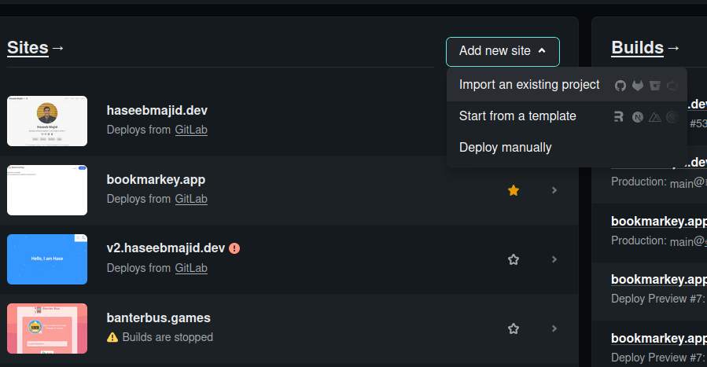

**TIL: How to Deploy a SvelteKit site on Netlify**

So you have a SvelteKit site you want to deploy to Netlify how can we do that? First, go about setting up a site like normal!
In my case, I am going to import an existing site from Gitlab.

## Netlify



In the build settings we want the following settings:



Adjust the branch to whatever your main branch is i.e. the branch you want to deploy from.


That's it now our site should start deploying, and it should also set up deploy previews for MRs automatically
[More about that here](/posts/2022-12-03-my-workflow-to-create-a-new-post-using-hugo-netlifycms-netlify-and-gitlab-together/#netlify-preview).

## Our Project

Within our SvelteKit project if you look at `svelte.config.js` it should look something like this:

```js
import adapter from '@sveltejs/adapter-auto';
import preprocess from 'svelte-preprocess';

/** @type {import('@sveltejs/kit').Config} */
const config = {
	// Consult https://github.com/sveltejs/svelte-preprocess
	// for more information about preprocessors

	kit: {
		adapter: adapter(),
	},
	preprocess: [
		preprocess({
			postcss: true
		})
	]
};

export default config;
```

You do not need to use the Netlify adapter here unless we need to specify specific options such as edge functions etc. However to let SvelteKit know we are using the Netlify adapter we need to pass an environment variable [^1].

We can also create a `netlify.toml` file repository to keep the settings locally rather than just on Netlify. The advantage of this is keeping
our settings in code (and version control).

```toml
[build]
publish = "build"
command = "npm run build"

[context.production.environment]
NETLIFY = "true"
```

[^1]: https://github.com/sveltejs/kit/blob/master/packages/adapter-auto/adapters.js
