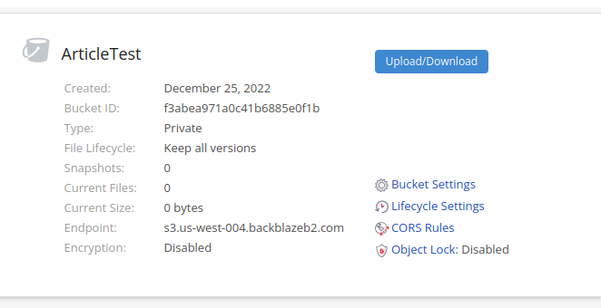

**TIL: How to Connect PocketBase and BackBlaze S3**

> By default PocketBase uses the local file system to store uploaded files. If you have limited disk space, you could optionally connect to a S3 compatible storage. - PocketBase

## Why BackBlaze ? 

Simple the prices are generally cheaper as compared with other S3 compatible storage platforms.
How can we set up BackBlaze as our S3 bucket to store uploaded files such as user avatars?

## BackBlaze

Go to `BackBlaze`

- Create an account
- Create a new bucket
    - You should be able to make it public or private

- Take note of the `endpoint` i.e. `s3.us-west-004.backblazeb2.com`.
- Then go to `App Keys`
    - Create a new `Application key`

- Take note of the `keyID` and `applicationKey`

## PocketBase

Go to your PocketBase instance:

- Go to Settings 
- Go to File storage

Add the following details

- In `ENDPOINT` add the endpoint above `https://s3.us-west-004.backblazeb2.com`
- `BUCKET` is the name of the bucket we created before `ArticleTest`
- `REGION` you can find in the URL `us-west-004`
- `ACCESS KEY` is the `keyID` above
- `SECRET` is the `applicationKey` above

Then click `Save changes` and you should see `S3 connected successfully`. 

That's It!