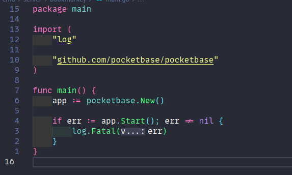
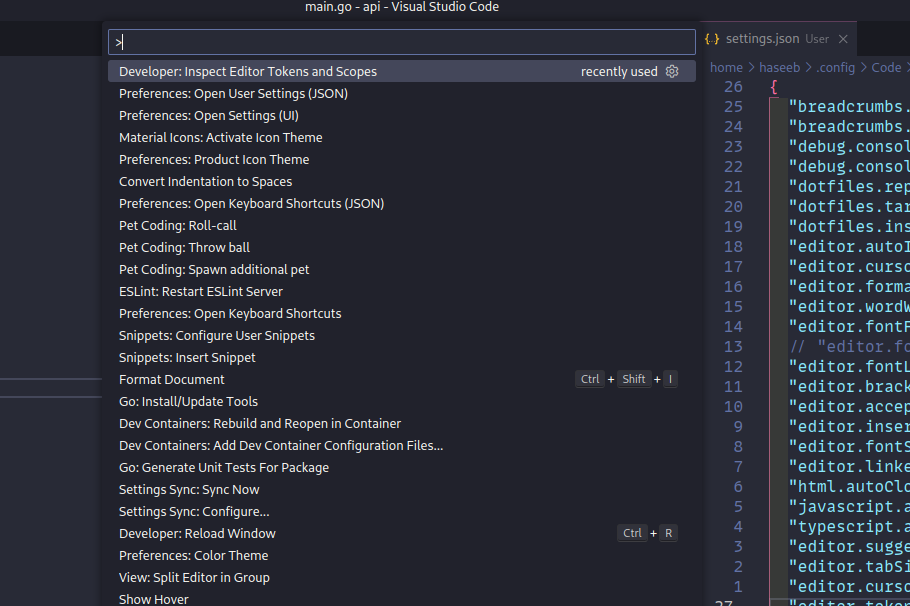

**TIL: How To Add Custom Syntax Highlighting Rules in VS Code**

The other day (a few months ago) I was comparing Goland and VS Code for Golang development.
I noticed Goland by default seemed to have nicer syntax highlighting, so I started looking at
what I could do in VS Code to do this.

> Before


> After



It turns out we can do this with our own custom rules using `editor.tokenColorCustomizations`.
To do this go to our settings (`settings.json`) and add something like:


```json
{
  "editor.tokenColorCustomizations": {
    "[Dracula]": {
      "textMateRules": [
        {
          "scope": "source.go",
          "settings": {
            "foreground": "#6dd8ce"
          }
        }
      ]
    }
  },
}
```

Where:

- `Dracula` is the colour scheme
- `scope` is the type of token we want to colour

We can find out what we should set the scope as by going to the command palette and selecting `Developer: Inspect Editor Tokens and Scopes`.



Then go and hover over the different parts of our code and it will tell you what type of token it is [^1].


That's it!

[^1]: https://blog.4d.com/setting-up-code-syntax-highlighting-using-the-visual-studio-code-extension/