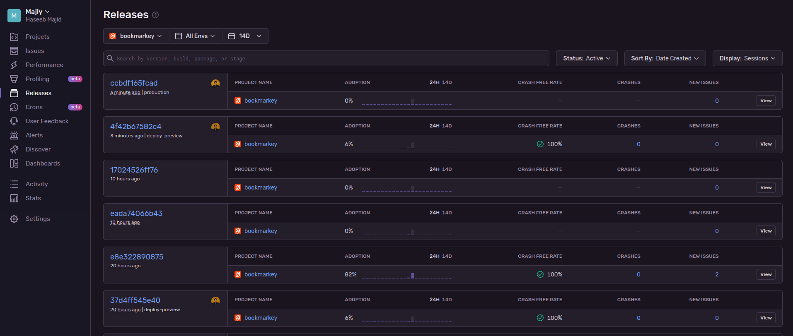

**TIL: How to Setup Netlify, Gitlab And Sentry**

I will show you in this post how you can integrate Gitlab, Netlify and Sentry. I may do a more
detailed post in the future.

## GitLab -> Sentry

To connect Gitlab and Sentry follow [this guide](https://docs.sentry.io/product/integrations/source-code-mgmt/gitlab/).
Then add the repos you want to monitor in Sentry. In my case, it is the Bookmarkey GUI.


## Netlify -> GitLab

This integration is pretty simple just go through the normal Netlify setup process to add a new site.
You can read more about that [here](/posts/2022-12-03-my-workflow-to-create-a-new-post-using-hugo,-netlifycms,-netlify-and-gitlab-together)
and [here](https://docs.netlify.com/welcome/add-new-site/).

## Netlify -> Sentry

Finally, how can we connect Netlify and Sentry?

First, why do we want to do this? It is so we can link specific releases with Netlify deploys.
Such as if it was a deploy preview or a deploy to production.



To do this we will be using the `sentry-netlify-build-plugin` [^1]. 
First, let's follow the guide in the [README](https://github.com/getsentry/sentry-netlify-build-plugin#create-a-sentry-internal-integration).

We can install this via the GUI in Netlify however I prefer to keep as much of
my config in code. So we will use a `netlify.toml` file. Append the following:

```toml
[[plugins]]
package = "@sentry/netlify-build-plugin"

[plugins.inputs]
sentryOrg = "majiy"
sentryProject = "bookmarkey"
sentryRepository = "HaseebMajid Apps / Bookmarkey / gui"
```

Update the specific sentry-related variables to match your project.
Remember since `SENTRY_AUTH_TOKEN` is a secret variable, created when we set up the internal integration with Netlify,
you should add that to the Netlify GUI directly.



All the other sentry variables were pre-populated. I only added `SENTRY_AUTH_TOKEN` via the Netlify GUI.



Note the name of the repository is not the Git URL but rather
the name of the project shown in your Sentry integration (shown in the above photo).

You can find this name by going to `Settings > Repositories`.
Then copy the name of the project i.e. `HaseebMajid Apps / Bookmarkey / gui`.
It is not the hyperlink (`gitlab.com/banter-bus/bookmarkey/gui`) [^2].


[^1]: https://github.com/getsentry/sentry-netlify-build-plugin
[^2]: Related GitHub Issue, https://github.com/getsentry/sentry-netlify-build-plugin/issues/21