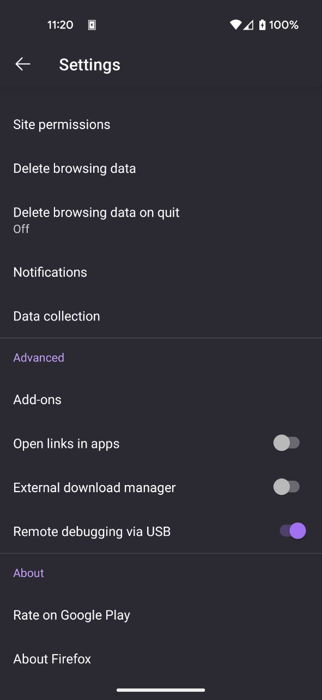

In this post, we will go over how you can test your SvelteKit app on your Android device in Firefox.
If you're like me you are building an app that you want users to use on both normal PCs (laptops, Desktop) and
their smartphones.

But the question arises how can we debug our app on a smartphone? 
One way to achieve this is to use Firefox and remote debugging, you will need to connect your
smartphone via USB to your device running the SvelteKit app i.e. your Laptop.

## SmartPhone

On your phone make sure you have developer mode on and have switched on USB debugging [^1].
Open up Firefox, then click on the 3 dots to open up the context menu go to `Settings`,
scroll down and check `Remote debugging via USB` to "on".



Next, connect your smartphone to your PC via USB.

## PC

On your PC start up your SvelteKit application for example `npm run dev -- --host --port 5173 --open`.
Where `dev` is `vite dev` in my `package.json`. This will start the app but `--host` will mean it is accessible
to devices on the same private network:

```bash
> bookmarkey-gui@0.0.1 dev
> vite dev --host --port 5173 --open

  VITE v4.0.1  ready in 701 ms

  ➜  Local:   http://localhost:5173/
  ➜  Network: http://192.168.0.26:5173/
  ➜  Network: http://10.121.2.243:5173/
  ➜  Network: http://172.24.0.1:5173/
  ➜  press h to show help
```

This means we can connect to our PC on `http://192.168.0.26:5173/` from our smartphone and access the SvelteKit site.
You may want to set up your firewall such that only your smartphone can connect to your PC. In my case, since I am only
developing at home I have allowed all traffic on port 5173.



Make sure you know what you are doing when playing around with your firewall rules!
You don't want to allow more access than is necessary. Especially if you working in say
a coffee shop on public WIFI.


### Firefox


Now on your PC still: 
- Open Firefox 
- Go to `about:debugging`
- You should see your device under `USB enabled`.
- Select connect
- Click on your phone
- Then select your SvelteKit app to inspect



If you don't see your device it may be because your USB preferences are set to only charge your device.
On my phone, I have to change it to `File Transfer/Android Auto`. Then Firefox can see the phone.



[^1]: How to setup USB debugging, https://www.youtube.com/watch?v=nYoH5B2GXXY