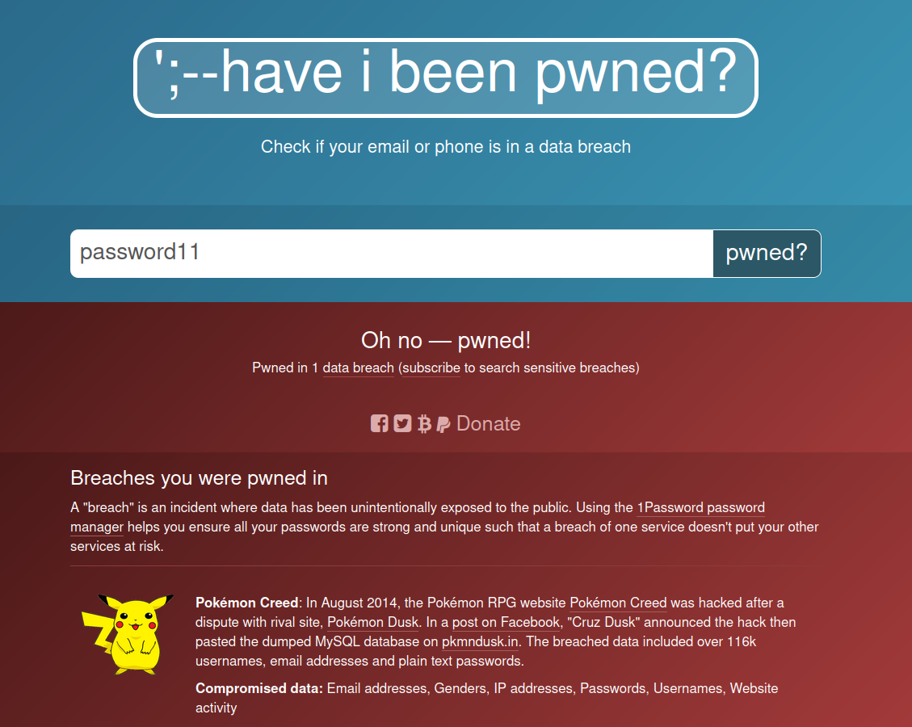
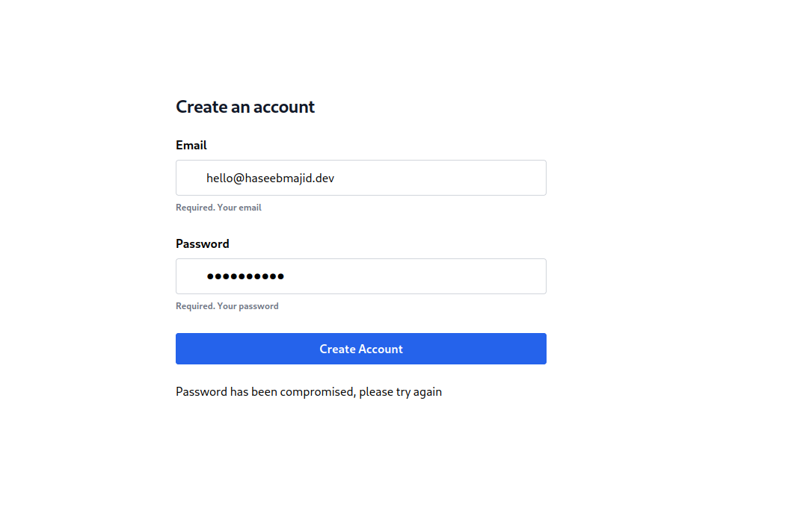

In this post, I will go over how you can use the have I been pwned (hibp) API to improve UX [^1] in our registration flow in our SvelteKit app.
When the user signs up we can check if that password has been compromised in a previous data breach (on another site).
Then we can prompt the user to enter another password. This will help avoid users using simple & common passwords like `password11`.
Ideally, our user would be using a password manager to generate secure and strong passwords. You can see us using the hibp website below,
of course, in our case, we will want to use the API. 




In this post, we will be using TailwindCSS and Zod [^2]. I will do another post on these in more detail.


## Current Application

### +page.svelte

Let's pretend we have a simple registration form at `src/routes/+page.svelte`:

```svelte {hl_lines=[18]}
<script lang="ts">
  import type { ActionData } from './$types';

  export let form: ActionData;
</script>

<div class="mx-auto flex w-full flex-col items-center justify-center px-6 py-8 md:h-screen lg:py-0">
  <div
      class="flex flex-col rounded-2xl border-slate-100 bg-white dark:bg-slate-900/70 md:w-2/3 lg:w-1/3 w-full"
  >
    <div class="space-y-4 p-6 sm:p-8 md:space-y-6">
      <div class="space-y-4 p-6 sm:p-8 md:space-y-6">
        <h1
            class="text-xl font-bold leading-tight tracking-tight text-gray-900 dark:text-white md:text-2xl"
        >
            Create an account
        </h1>
        <form class="space-y-4 md:space-y-6" action="?/register" method="post">
            <div class="mb-6 last:mb-0">
                <label for="email" class="mb-2 block font-bold ">Email</label>

                <input
                    id="email"
                    autocomplete="username"
                    name="email"
                    required={true}
                    type="email"
                    placeholder="your@email.com"
                    value={form?.data.email}
                    class="h-12 w-full max-w-full rounded border bg-white px-3 py-2 pl-10 focus:ring dark:border-gray-700 dark:bg-slate-800 dark:placeholder-gray-400 border-gray-300"
                />

                <div class="mt-1 py-1 text-xs font-semibold text-gray-500 dark:text-slate-400">
                    Required. Your email
                </div>
            </div>
            <div class="relative mb-6 w-full last:mb-0">
                <div class="mb-6 last:mb-0">
                    <label for="password" class="mb-2 block font-bold ">Password</label>

                    <input
                        id="password"
                        autocomplete="new-password"
                        name="password"
                        required={true}
                        type="password"
                        placeholder="Your password"
                        value={form?.data.password}
                        class="h-12 w-full max-w-full rounded border bg-white px-3 py-2 pl-10 focus:ring dark:border-gray-700 dark:bg-slate-800 dark:placeholder-gray-400 border-gray-300"
                    />

                    <div class="mt-1 py-1 text-xs font-semibold text-gray-500 dark:text-slate-400">
                        Required. Your password
                    </div>
                </div>
            </div>
            <button
                class="inline-flex cursor-pointer items-center justify-center whitespace-nowrap rounded border border-blue-600 bg-blue-600 px-1 py-1 font-semibold text-white ring-blue-300 transition-colors duration-150 last:mr-0 hover:border-blue-700 hover:bg-blue-700 focus:outline-none focus:ring dark:border-blue-500 dark:bg-blue-500 dark:ring-blue-700 hover:dark:border-blue-600 hover:dark:bg-blue-600 lg:px-2 lg:py-2 my-2 w-full"
                type="submit">Create Account</button
            >
        </form>
        {#each form?.errors?.email || [] as error}
            <p>{error}</p>
        {/each}
        {#each form?.errors?.password || [] as error}
            <p>{error}</p>
        {/each}
      </div>
    </div>
  </div>
</div>
```

### +page.server.ts

and and let's say we have a `src/routes/+page.server.ts`:

```ts
import { fail, redirect, type Actions } from '@sveltejs/kit';
import { pwnedPassword } from 'hibp';
import { z } from 'zod';

export interface Register {
    email: string;
    password: string;
}

const registerSchema: z.ZodType<Register> = z.object({
    email: z
        .string({ required_error: 'Email is required' })
        .email({ message: 'Email must be a valid email.' }),
    password: z
        .string({ required_error: 'Password is required' })
        .min(8, 'Password must be a minimum of 8 characters.')
});

export const actions: Actions = {
  register: async ({ request }) => {
      const data: Register = Object.fromEntries((await request.formData()) as Iterable<[Register]>);
      const result = await registerSchema.safeParseAsync(data);

      if (!result.success) {
          return fail(400, {
              data: data,
              errors: result.error.flatten().fieldErrors
          });
      }

      // Create user logic here ...
      console.log('CREATE USER');
      throw redirect(303, '/');
  }
};
```

Here we are using Zod to do our form validation for us [^2]. Zod is a great typescript first schema validation library [^3].
In this case, we have some simple validation rules:

```ts
export interface Register {
    email: string;
    password: string;
}

const registerSchema: z.ZodType<Register> = z.object({
  email: z
      .string({ required_error: 'Email is required' })
      .email({ message: 'Email must be a valid email.' }),
  password: z
      .string({ required_error: 'Password is required' })
      .min(8, 'Password must be a minimum of 8 characters.')
});
```

- Email: check it is a valid email and is not empty
- Password: check it is at least 8 characters and is not empty.

The next part of the file is our form action [^4], which receives a request from our form in the `+page.svelte` file (see above highlighted line).

```ts
export const actions: Actions = {
  register: async ({ request }) => {
    const data: Register = Object.fromEntries((await request.formData()) as Iterable<[Register]>);
    const result = await registerSchema.safeParseAsync(data);

    if (!result.success) {
        return fail(400, {
            data: data,
            errors: result.error.flatten().fieldErrors
        });
    }

    // Create user logic here ...
    console.log('CREATE USER');
    throw redirect(303, '/');
  }
};
```


What is happening is the form is sending a POST request to `/register`, which matches our actions name.
Then the code in this action function is called and we can do what we want.


The first part of the function just checks if the data passed from the form is valid using Zod.
If it fails validation it returns errors, which we can then show the user.

```ts
const data: Register = Object.fromEntries((await request.formData()) as Iterable<[Register]>);
const result = await registerSchema.safeParseAsync(data);

if (!result.success) {
  return fail(400, {
      data: data,
      errors: result.error.flatten().fieldErrors
  });
}
```

Which we do in `+page.svelte`

```svelte
{#each form?.errors?.email || [] as error}
    <p>{error}</p>
{/each}
{#each form?.errors?.password || [] as error}
    <p>{error}</p>
{/each}
```

Now that we have a working registration form, how can we add a check if a user's email was compromised?

## Have I Been Pwned

First, we want to use the hibp API, lucky for us we can use a library that someone has already written.
Handily called [`hibp`](https://github.com/wKovacs64/hibp/). We can install like:

```bash
npm i -D hibp
```

Then we need to update our `+page.server.ts` file to add a function which will return a boolean based
on if the password has been compromised or not.

```ts
const isSafePassword = async (password: string) => {
  try {
      const pwned = await pwnedPassword(password);
      return pwned <= 3;
  } catch (err) {
      console.log(err);
      return true;
  }
};
```

Where `pwnedPassword` returns a promise which resolves to the number of times the password has been exposed in a breach.
In our example above the function returns false if the password has been exposed in 3 or more breaches.

Now in our schema validation let's add the `refine` function:

```ts {hl_lines=[8-10]}
const registerSchema: z.ZodType<Register> = z.object({
  email: z
      .string({ required_error: 'Email is required' })
      .email({ message: 'Email must be a valid email.' }),
  password: z
      .string({ required_error: 'Password is required' })
      .min(8, 'Password must be a minimum of 8 characters.')
      .refine(isSafePassword, () => ({
          message: `Password has been compromised, please try again`
      }))
});
```

Now the `isSafePassword` function is used in our schema validation, where if the function returns false
the validation fails and returns the error with the message we specified.

## That's It!

That's it, we've added a simple check to see if the password a user tries to register with has been 
previously compromised and also show this error back to the user.

Some other things to look into are progressive enhancement to improve UX [^5].



## Appendix

- [Example source code](https://gitlab.com/hmajid2301/blog/-/tree/main/content/posts/2023-01-08-how-to-add-have-i-been-pwned-to-your-registration-flow-in-sveltekit/source_code)
- [Example Registration Form](https://gitlab.com/bookmarkey/gui/-/tree/886f230e0c6c75b6f5f7f9e445205fd90b6fbf33/src/routes/(unprotected)/(account)/register)

[^1]: https://web.dev/sign-up-form-best-practices/
[^2]: Great tutorial about SvelteKit and Zod https://www.youtube.com/watch?v=3PYdcm-HBiw
[^3]: Zod, https://github.com/colinhacks/zod
[^4]: https://kit.svelte.dev/docs/form-actions
[^5]: https://www.youtube.com/watch?v=jXtzWMhdI2U
---
title: {? {slicestr (replace .Name "-" " ") 11 | title: ''} : ''}
date: {? {dateFormat "2006-01-02" .Date: ''} : ''}
canonicalURL: https://haseebmajid.dev/posts/{{.Name}}
tags: []
cover:
  image: images/cover.png
---
cover:
  image: images/cover.png
---
title: Hello World
date: "2015-05-01T22:12:03.284Z"
description: "Hello World"
cover:
  image: images/cover.png
---
This is my first post on my new fake blog! How exciting! I'm sure I'll write a lot more interesting things in the future. Oh, and here's a great quote from this Wikipedia on [salted duck eggs](https://en.wikipedia.org/wiki/Salted_duck_egg). > A salted duck egg is a Chinese preserved food product made by soaking duck > eggs in brine, or packing each egg in damp, salted charcoal. In Asian > supermarkets, these eggs are sometimes sold covered in a thick layer of salted > charcoal paste. The eggs may also be sold with the salted paste removed, > wrapped in plastic, and vacuum packed. From the salt curing process, the > salted duck eggs have a briny aroma, a gelatin-like egg white and a > firm-textured, round yolk that is bright orange-red in color. 
---
title: My Second Post!
date: "2015-05-06"
tags: ["food", "blog"]
cover:
  image: images/cover.png
---
Wow! I love blogging so much already. Did you know that "despite its name, salted duck eggs can also be made from chicken eggs, though the taste and texture will be somewhat different, and the egg yolk will be less rich."? ([Wikipedia Link](https://en.wikipedia.org/wiki/Salted_duck_egg)) Yeah, I didn't either.
---
title: Hello World
date: "2015-05-01"
tags: ["food", "duck"]
cover:
  image: images/cover.png
---
This is my first post on my new fake blog! How exciting! I'm sure I'll write a lot more interesting things in the future. Oh, and here's a great quote from this Wikipedia on [salted duck eggs](https://en.wikipedia.org/wiki/Salted_duck_egg). > A salted duck egg is a Chinese preserved food product made by soaking duck > eggs in brine, or packing each egg in damp, salted charcoal. In Asian > supermarkets, these eggs are sometimes sold covered in a thick layer of salted > charcoal paste. The eggs may also be sold with the salted paste removed, > wrapped in plastic, and vacuum packed. From the salt curing process, the > salted duck eggs have a briny aroma, a gelatin-like egg white and a > firm-textured, round yolk that is bright orange-red in color. 
---
title: My Second Post!
date: "2015-05-06T23:46:37.121Z"
cover:
  image: images/cover.png
---
Wow! I love blogging so much already. Did you know that "despite its name, salted duck eggs can also be made from chicken eggs, though the taste and texture will be somewhat different, and the egg yolk will be less rich."? ([Wikipedia Link](https://en.wikipedia.org/wiki/Salted_duck_egg)) Yeah, I didn't either.
---
title: My Second Post!
date: "2015-05-06T23:46:37.121Z"
cover:
  image: images/cover.png
---
Wow! I love blogging so much already. Did you know that "despite its name, salted duck eggs can also be made from chicken eggs, though the taste and texture will be somewhat different, and the egg yolk will be less rich."? ([Wikipedia Link](https://en.wikipedia.org/wiki/Salted_duck_egg)) Yeah, I didn't either.
