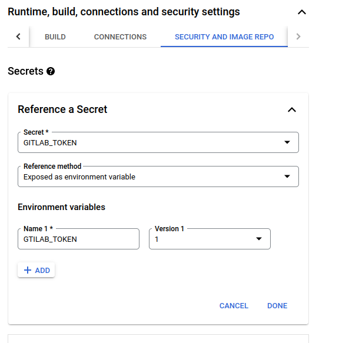

In this post, I will show you how you can update your GitLab CI pipeline with the status of your Netlify deploys.
As it is quite nice to have everything in one place if our CI pipeline passed or failed.

I have spoken about this in a
[previous article](/posts/2022-12-03-my-workflow-to-create-a-new-post-using-hugo,-netlifycms,-netlify-and-gitlab-together),
how you might go about setting up merge request preview environments with Netlify.


This can be set up to also leave comments as shown above, and notify us if our website deployed successfully. Which will look like so:


However, there is currently no way to update our CI pipeline/GitLab on the main branch when our app is deployed on Netlify [^1].
Netlify does allow us to set up webhooks depending on the different statuses of our builds. So what we need is to set up webhooks
on Netlify, then have that call something say a serverless function which will then call the GitLab to commit status API. When we update
the commit status it looks something like this:

[GitLab CI](images/main_branch_ci.png)

## Netlify GitLab Commit Status

I have created this simple script in Golang [here](https://gitlab.com/hmajid2301/netlify-gitlab-commit-status).
Which does this for us.
In my case, I have it deployed as a google cloud function and have set up CI in that project so it automatically deploys
when we push to the main branch.

```yaml
deploy:
  image: google/cloud-sdk:latest
  only:
    - main
  script:
    - gcloud auth activate-service-account --key-file $GCLOUD_SERVICE_KEY
    - gcloud config set project haseeb-majid
    - gcloud functions deploy netlify-build-commit-status --region us-central1 --gen2 --runtime go119 --trigger-http --allow-unauthenticated --entry-point=webhook
```


At the moment the script will only work with repositories you are the owner of in GitLab.
Hence you cannot just say point to my google cloud function and get it to work with your repository.


## Google Cloud

### Set Up

Assuming you want to deploy this as a cloud function as well, fork my repo.
Then go to [Google cloud platform](https://console.cloud.google.com/welcome) (GCP).

1. Create a new project if you need to.
1. Go to service accounts and create a new service account i.e. I called my `functions@[project].iam.gserviceaccount.com`
1. Assign the service account at least these two permissions `Cloud Functions Developer`, `Service Account User`
1. Go to `Secret Manager`, then create two secrets
    1. `JWS_SECRET`: A secret shared with Netlify webhooks so we can confirm the webhook came from Netlify
    1. `GITLAB_TOKEN`: Used to interact with GitLab API
        1. Create on GitLab by clicking on your Avatar (top right)
        1. Select `Preferences`
        1. Select `Access Token` (left sidebar)
        1. Create a new token with `api, read_repository` (as shown in the image below)

You set permissions on the service account in IAM like so:

[GCP IAM Permissions](images/iam_gcp.png)

You can create a GitLab token like so:

[GitLab Access Token](images/gitlab_access_token.png)

### Cloud Function


I think the easiest way to deploy this function the first time is to do it manually so we can also add our secrets.
Which CI currently does not do for us. Here are the settings I have used:

First, let's create a new function and use gen2 which comes with a bunch of improvements.


Next, let's set the max instance count to 1, we don't need 100 instances running this code 😂.


Next, add the secrets we created above as ENV variables, in this example, I have added just `GITLAB_TOKEN` but we also need `JWS_SECRET`.
Also with the same name as the ENV variable.



Finally copy the code from the repo over to this section including `go.mod` file.


After this, we should be able to deploy using CI from now on. Take note of the URL of the function.

### GitLab

We do need to do one final thing to setup GitLab CI to publish our cloud function we will need to get the JSON key file-related
to our service account and put that as a secret CI/CD variable in GitLab. To do this:

- Go to your service account
- Go to `keys` and select `Add Key` > `Create new key`
- Select `JSON`
- Copy the contents of the files and go to GitLab CI/CD settings for your project
    - Call this variable `GCLOUD_SERVICE_KEY`
    - When creating a new variable specify the type as `file` (see image below)

GCP service account key export:


CI/CD variables for repo in GitLab:

[GitLab CI](images/gitlab_ci_vars.png)

Create a new variable:

[GitLab CI](images/gitlab_ci_new_var.png)

## Netlify

Now that we deployed our function let's go to Netlify, go to your site settings on Netlify.

- Then go to `Build & Deploy` (left-hand side)
- Go to `Deploy notifications`
- `Add notifications` > `Outgoing webhook`
   - Select `Deploy Started`
   - Paste the URL of the cloud function and the JWS secret

Now do this also for `Deploy failed` and `Deploy succeeded


Now Netlify will call out the cloud function and depending on the Netlify status it will set the relevant commit status
on our GitLab repo/CI.

In part II we will go over how the code works! But for now, you should be able to get "deploy" statuses in GitLab CI.
Which is nice. It will be called `Deploy to Netlify`, this is set within the code itself.

## Appendix

- [Netlify GitLab Commit Status Repo](https://gitlab.com/hmajid2301/netlify-gitlab-commit-status)

[^1]: https://answers.netlify.com/t/gitlab-commit-status/79572
