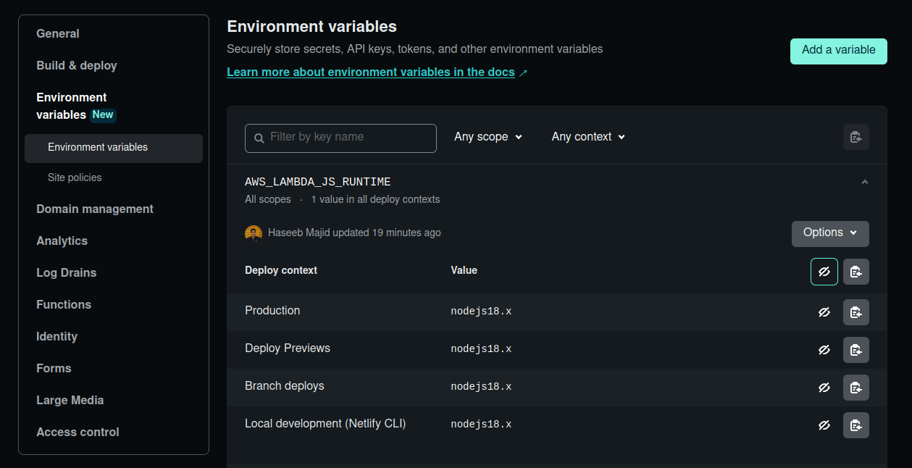

**TIL: How to fix `structuredClone` to work on Netlify SvelteKit Site**

Recently I was working on my SvelteKit site and added some code like so to my `hook.server.ts`:

```ts {hl_lines=[4]}
try {
    if (event.locals.pb.authStore.isValid) {
        await event.locals.pb.collection("users").authRefresh();
        event.locals.user = structuredClone(event.locals.pb?.authStore.model);
    }
} catch (err) {
    console.log("failed to refresh auth", err);
    event.locals.user = undefined;
    event.locals.pb.authStore.clear();
}
```

I needed to add the `structuredClone` function so that only POJO (plain old javascript objects) would get stored in the `event.locals.users`
variable. However when I deployed this to production in Netlify. This broke my site! Specifically it wouldn't let the user login.

If you deploy your SvelteKit app on Netlify the server side code gets turned into functions for us automagically! I was able to work out
that `structuredClone` function broke my app because in my `login` function I could see something like:

```
ReferenceError: structuredClone is not defined
```


It seems that the `structuredClone` was only added in nodejs 17 [^1]. However, Netlify functions default to nodejs 16.

> For all Node.js functions deployed on or after July 11, 2022, Netlify uses Node.js 16 as the default runtime. - https://docs.netlify.com/functions/optional-configuration/?fn-language=js

Reading the docs we can see if we set the `AWS_LAMBDA_JS_RUNTIME` in the GUI to `nodejs18.x` this will force our functions to use nodejs 18.



And that's it! By setting our nodejs version to 18, we will be able to use the `structuredClone` function.

[^1]: https://stackoverflow.com/a/73704608/3108619