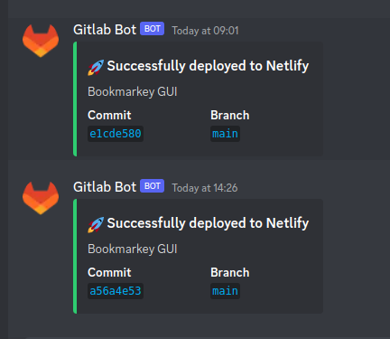
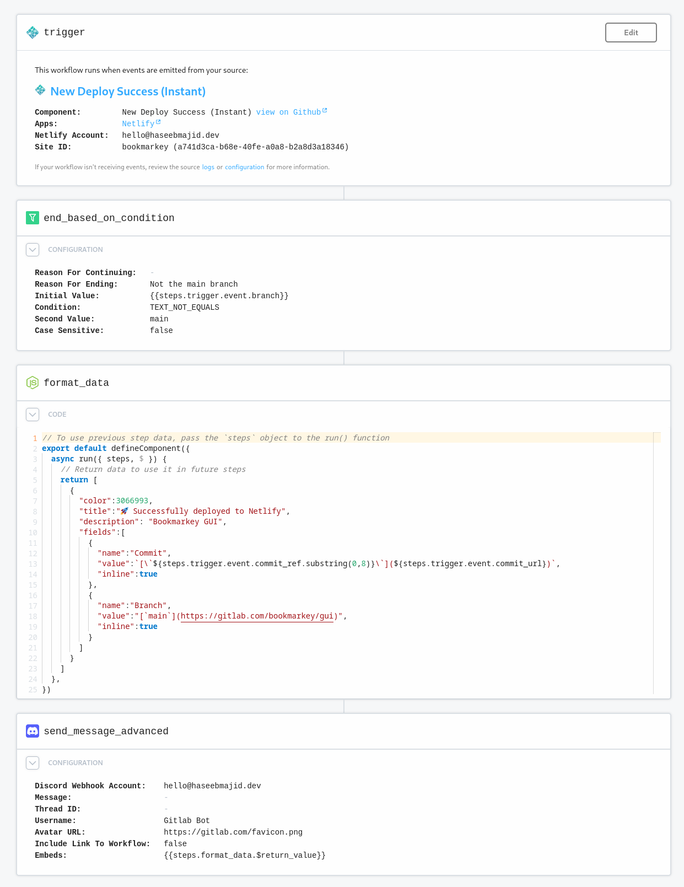

Hi everyone, I recently went about setting up notifications about my Netlify deploys in Discord. Netlify does have an official way to do
however, you cannot use it on the free tier.

So I looked at other solutions, and I eventually discovered a SaaS product called [PipeDream](pipedream.com/). It is a website which allows
us to connect different components without needing to write any code. Such as what to do when we receive a webhook. There are 100s
of different apps, triggers and actions. What we want to end up with is something like this:



So let's take a look at what we need to do to post a discord message based on if our Netlify build fails or passes.
First, we need to create a new workflow, the workflow I have created looks like this for:



## Triggers

First, we setup PipeDream to trigger when a deployment is successful of my website/app, like so:


This sets up a webhook from Netlify to this PipeDream workflow. So every time the deployment succeeds on Netlify
it will trigger this Pipedream workflow. We can even see the data that was sent for specific webhooks. Which looks like this:

[PipeDream Trigger Data](images/pipedream_netlify_webhook.png)

## Condition

Since my app will also build for deploy previews on branches and I only want messages for my production deploys i.e.
on my `main` branch on GitLab. I will next add a simple condition which checks if the branch name in the trigger
is `main` and then carry on, else stop the workflow. Since this is a variable and will vary on builds we can refer to it as 
`{{steps.trigger.event.branch}}` in condition check, to compare branch name with `main`.

## Format Data

Next, since I want to send the data as an embed to format it nicely it is recommended to use NodeJS to format ours into a nice JSON
object which the discord component can then use. Yes, this does mean we can execute code in a PipeDream workflow.


```js
// To use previous step data, pass the `steps` object to the run() function
export default defineComponent({
  async run({ steps, $ }) {
    // Return data to use it in future steps
    return [
      {
        "color":3066993,
        "title":"🚀 Successfully deployed to Netlify",
        "description": "Bookmarkey GUI",
        "fields":[
          {
            "name":"Commit", 
            "value":`[\`${steps.trigger.event.commit_ref.substring(0,8)}\`](${steps.trigger.event.commit_url})`,
            "inline":true
          },
          {
            "name":"Branch",
            "value":"[`main`](https://gitlab.com/bookmarkey/gui)",
            "inline":true
          }
        ]
      }
    ]
  },
})
```

In this case, the only thing we are templating is the commit ref and commit URL, which we get from previous parts of the workflow
i.e. `${steps.trigger.event.commit_url}` could be `https://gitlab.com/bookmarkey/gui/commit/eb5f80376e7c8bc2d33e9e0cf6fc1d3248f2ce0f`.

## Discord Message

Finally, we configure the discord message itself we set up which channel and server the message should go to.
In my case since I want to use a Discord embed I picked the advanced discord message.

To use the formatted data above we can refer to it as `{{steps.format_data.$return_value}}`.
I also set the username and the avatar URL which is what shows up in our discord message.


## That's It!

So that it's! Now I also created a very similar workflow when my Netlify deployment fails.
I couldn't find any easy way to turn it into one workflow, so I just went with the easiest solution.

Also, it's a shame at the moment we cannot store our PipeDream workflows in git or code.
Hopefully, this is a feature that'll come soon and we can deploy our workflows from CI
and track changes using version control!
