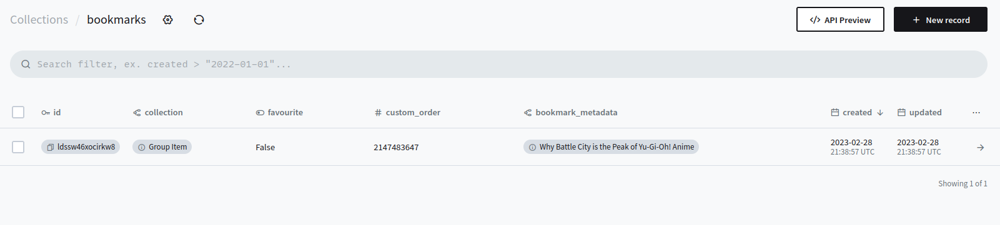

**TIL: How to Set a Relationship on Golang Pocketbase**

[Pocketbase](https://pocketbase.io/) is a backend as a service, it is very nice because it is written in Golang
it can compile down to a single binary. It also allows us to extend it using Golang and use it as a framework.
In my case, I needed some extra logic before adding data to the database so I decided to extend Pocketbase
and write some of my business logic.

Part of the code involved adding some entries to the Database including a relationship. However, I noticed that the relationship
looked different in the Pocketbase GUI as compared with the ones I created using the Pocketbase client in the SvelteKit part of my app.

The other relationships showed up a bit differently, they didn't include the id of the relationship (as a foreign key) but rather a field
on the other collection. In the example below the relationship field I am referencing is the `bookmark_metadata`. Which uses the `title` field.



Where the bookmark metadata may look like:


We can achieve this using the following code:

```golang {hl_lines=[2]}
bookmarkRecord := models.NewRecord(collection)
bookmarkRecord.Set("bookmark_metadata", []string{metadataRecord.Id})
bookmarkRecord.Set("favourite", false)
bookmarkRecord.Set("collection", collectionID)
bookmarkRecord.Set("custom_order", math.MaxInt32)
```

The key being that we set `bookmark_metadata` as a slice (array).
However, if we did:

```golang {hl_lines=[2]}
bookmarkRecord.Set("bookmark_metadata", metadataRecord.Id)
```

In the GUI the record would look like this:


Both options will work for setting up a relationship between two collections. I just wanted to show you how you can set it
so it shows up like relationship created via the JS SDK. You can read more about creating records with Golang
[here](https://pocketbase.io/docs/record-methods/#create-new-record).