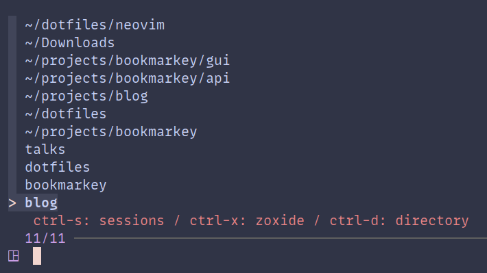
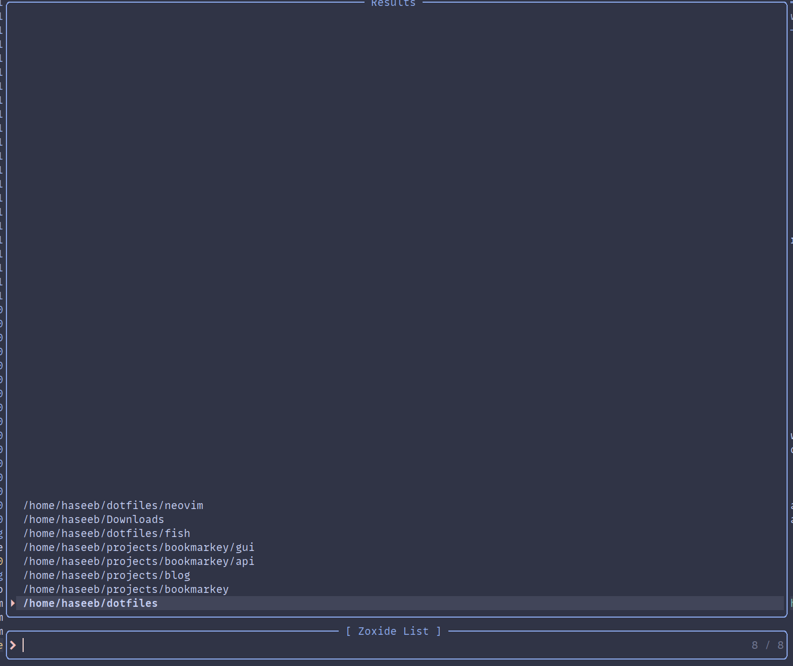
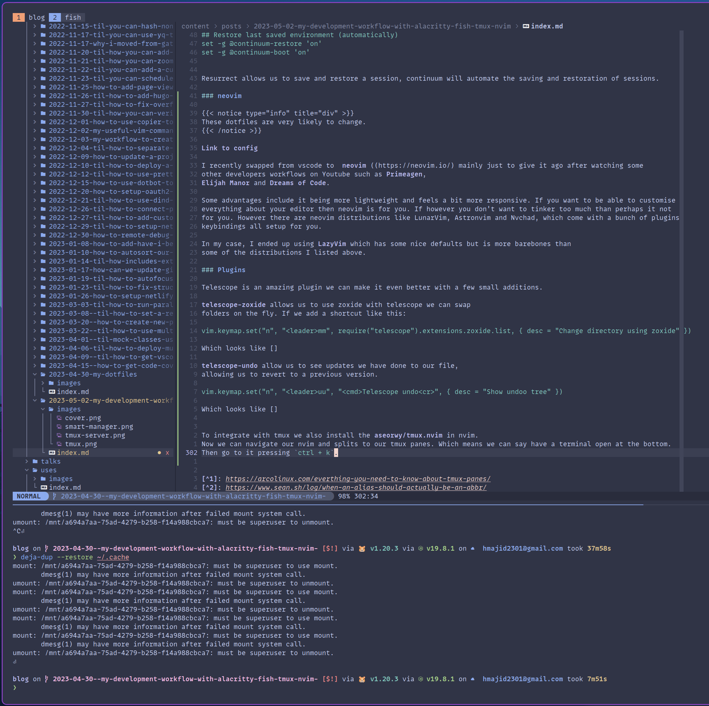

In this blog post, I will go over my current development workflow using the above tools namely, fish shell tmux and neovim.
I'll be using the [dotfiles](https://gitlab.com/hmajid2301/dotfiles/-/tree/8da9d515234d050dc34703e94f647fd9cb40c61a)
found here.

I aim to move away from using my mouse as much as possible as it just slows me down when my hands
are away from my keyboard.


I am using the catppuccin theme with the frappe variant.


## Alacritty

[Link to config](https://gitlab.com/hmajid2301/dotfiles/-/tree/8da9d515234d050dc34703e94f647fd9cb40c61a/alacritty)

This section should be pretty quick, [alacritty](https://alacritty.org/) is the terminal I use on both Linux and MacOS.
I use it because it will run on Linux and MacOS so I can have a similar terminal between all of my devices where
I do any development. It is also GPU rendered so it should have better performance as compared with
the default terminals available on your OS.

It was born out of frustration with using vim inside tmux being slow. I haven't noticed
any issues with speed or lag when using alacritty that's the terminal I'll stick with.

Some people like to use [kitty](https://sw.kovidgoyal.net/kitty/), but I've had no reason to swap yet.
One thing you cannot do in alacritty is open tabs, you can open multiple terminals or use tmux.

### config

My Alacritty config doesn't have much of interest, except this snippet
which allows me to copy to my clipboard my selected text in the terminal and also right-click paste.

```yml
selection:
  save_to_clipboard: true
mouse_bindings:
  - { mouse: Right, action: Paste }

```

However, as I'm trying to use my mouse less this config is a lot less relevant

#### MacOS

Since I want similar keymaps between Linux and MacOS I've swapped the ctrl and super keys on my Mac.
So it matches my Linux machine and I don't have to memorise/get confused between
two different key bindings.

```yml
key_bindings:
  - { key: C, mods: Command, chars: "\x03" }
  - { key: D, mods: Command, chars: "\x05" }
  - { key: R, mods: Command, chars: "\x13" }
  - { key: W, mods: Command, chars: "\x17" }
  - { key: A, mods: Command, chars: "\x01" }
  - { key: H, mods: Command, chars: "\x08" }
  - { key: J, mods: Command, chars: "\x0A" }
  - { key: K, mods: Command, chars: "\x0B" }
  - { key: L, mods: Command, chars: "\x0C" }
  - { key: Back, mods: Super, chars: "\x15" }
  - { key: Left, mods: Super, chars: "\eb" }
  - { key: Right, mods: Super, chars: "\ef" }
  - { key: Left, mods: Command, chars: "\eOH", mode: AppCursor }
  - { key: Right, mods: Command, chars: "\eOF", mode: AppCursor }
  - { key: J, mods: Alt, chars: "\ej" }
  - { key: K, mods: Alt, chars: "\ek" }
  - { key: H, mods: Alt, chars: "\eh" }
  - { key: L, mods: Alt, chars: "\el" }
  - { key: N, mods: Alt, chars: "\en" }
  - { key: Minus, mods: Alt, chars: "\e-" }
  - { key: Equals, mods: Alt, chars: "\e=" }

```

So here `ctrl + c` (remember my super and ctrl keys are swapped) will map to `super + c` in the terminal to kill a process.

## fish

[Link to config](https://gitlab.com/hmajid2301/dotfiles/-/tree/8da9d515234d050dc34703e94f647fd9cb40c61a/fish)

I use [fish](https://fishshell.com/) shell as my default shell. You can replicate a lot of the features I am about to
discuss in zsh as well, using extensions. However, I found it slowed down zsh a lot and it wasn't as responsive as fish.

You should know that fish shell is not POSIX compliant, which means you cannot always run bash commands in fish the
syntax sometimes will vary.

Some features I like in fish include:

Suggested commands as you type it will try to guess which command to run. The last one in your history that best matches.

[Auto Suggestions](images/suggestion.png)

I'm also a big fan of using abbreviations [^2] which are similar to aliases except when you the "alias" it gets converted
to the actual command you want to run. Say we have:

`__git.create_abbr gco        git checkout`

When we type `gco` the shell will expand into `git checkout`. This has a few advantages now in your
shell history we have `git checkout` not `gco` making it easier to search through. Also, we know which command we will
type.

Fish also provides some syntax highlighting for our commands which makes them nicer to look at because colours are great!

### Plugins

Some fish plugins I use include:

[PatrickF1/fzf](https://github.com/PatrickF1/fzf.fish) integrates fzf (powerful fuzzy finder) nicely with fish.
My main use case is improving reverse search seen below. 


But it can allow you to do lots of other things such as searching for files `ctrl + alt + f`.


[edc/bass](https://github.com/edc/bass) allows us to run bash utilities in fish shell.
 
### Starship

As my shell prompt, I use [starship prompt](https://starship.rs/) a super customisable font with great defaults.


But overall I could probably easily swap to zsh but I find fish to be more responsive and feel snappier. It has some
nice features which make our lives a bit easier.

## tmux

[Link to config](https://gitlab.com/hmajid2301/dotfiles/-/tree/8da9d515234d050dc34703e94f647fd9cb40c61a/tmux)

I mentioned [tmux](https://github.com/tmux/tmux) above. What is tmux? Well, it is in the name itself.
It's a terminal multiplexer, what does that mean? Well, it means we can open multiple
panes (think of each as its separate terminal).

One nice feature of tmux is that say your terminal crashes and the tmux session will still be alive.
We can simply reattach to it later.

[Tmux Panes](images/tmux.png)

In the image above we have 3 panes. 

### Session vs Window vs Pane

tmux has this concept of sessions, windows and panes

 [^1]

- a session can have multiples windows (think of a window as tabs in a terminal)
- a window can have multiple panes
- a pane is where we run our commands

Typically I create a new session for each project I am working on.
For example, at the moment I have the following sessions:

```bash
# tmux ls
blog: 2 windows (created Sun Apr 30 22:37:51 2023) (attached)
bookmarkey: 2 windows (created Sun Apr 30 20:15:51 2023)
dotfiles: 1 windows (created Sun Apr 30 20:15:51 2023)
talks: 1 windows (created Sun Apr 30 20:15:51 2023)
```

Where bookmarkey, for example, has two windows one for the gui and one for the api, as it is a full-stack application.

### Smart Session Manager

To help manage my sessions I use [tmux smart session manager](https://github.com/joshmedeski/t-smart-tmux-session-manager).
This amazing plugin allows us to create a new session in a specific folder.

Outside of tmux, I can use `t` to open this menu below:



Where you can see the existing sessions at the bottom see `blog`, `dotfiles` etc.
If I navigate to a folder where a session already exists it will automatically attach to that session.
Else it will create a session in that folder.

Note that plugin uses [zoxide](https://github.com/ajeetdsouza/zoxide) which you can think of it as a smarter `cd`.
It keeps track of which folders we visit the most. For example, I have a folder at `~/projects/bookmarkey/gui`
since I visit it so often I can go to the folder by using this command `z gui`. The script combines this with the fzf fuzzy finding tool.
Provides a nice way to search through our folders and sessions.

Once I am done with a session I simply detach from it and swap to another session either by `<prefix> + d` or using the
`t` command or even within tmux `<prefix> + shift + t`, which brings up that search menu.

Essentially this means I can have all my different projects opened and set up just how I want but they are out of "focus"
until I need them. Making it easier to just focus on the project I am working on.

This was the plugin that convinced me to start using tmux.

### Config

Some parts of my config that may be interesting 

```conf
set-option -g prefix C-a
unbind-key C-b
bind-key C-a send-prefix

unbind %
unbind '"'
bind | split-window -h -c "#{pane_current_path}"
bind - split-window -v -c "#{pane_current_path}"
```

I remap the prefix key from `ctrl + b` to `ctrl + a` and to create a split using `-` for horizontal and `|` for vertical
splits (all taken from other people's configs ofc 😅). These mappings just make more sense in my head and also are
similar to mappings to make splits in nvim as well.

I use the following plugins:

```conf
# List of plugins
set -g @plugin 'tmux-plugins/tpm'
set -g @plugin 'aserowy/tmux.nvim'
set -g @plugin 'joshmedeski/t-smart-tmux-session-manager'
set -g @plugin 'ofirgall/tmux-window-name'
set -g @plugin 'tmux-plugins/tmux-resurrect'
set -g @plugin 'tmux-plugins/tmux-continuum'
set -g @plugin 'ofirgall/tmux-browser'

run '~/.tmux/plugins/tpm/tpm'
```

They are set up using the [tpm](https://github.com/tmux-plugins/tpm). Then to install any new plugins you add to your
config you can do `<prefix> + shift + I`.

- aserowy/tmux.nvim: Installed in tmux and nvim allows for easier navigation between the two
- joshmedeski/t-smart-tmux-session-manager: We spoke about this above, easier session management
- tmux-plugins/tmux-resurrect: This and tmux-continuum are used to save and restore sessions so they persist even after shutdown
- ofirgall/tmux-browser: I haven't gotten this to work yet but in theory, it opens a browser when you attach and closes when you detach

For restoring sessions:

```conf
## Restore Vim sessions
set -g @resurrect-strategy-vim 'session'
## Restore Neovim sessions
set -g @resurrect-strategy-nvim 'session'
## Restore Panes
set -g @resurrect-capture-pane-contents 'on'

## Restore last saved environment (automatically)
set -g @continuum-restore 'on'
set -g @continuum-boot 'on'
```

Resurrect allows us to save and restore a session, continuum will automate the saving and restoration of sessions.

### neovim


These dotfiles are very likely to change.


[Link to config](https://github.com/hmajid2301/starter/tree/9281544559ce93b5202fdbad9c700c8d11ba77cf)

I recently swapped from VSCode to [neovim]((https://neovim.io/) mainly just to give it ago after watching some
other developers' workflows on Youtube such as [Primeagen](https://www.youtube.com/c/theprimeagen),
[Elijah Manor](https://www.youtube.com/@ElijahManor) and [Dreams of Code](https://www.youtube.com/@dreamsofcode).

Some advantages include it being more lightweight and feels a bit more responsive. If you want to be able to customise
everything about your editor then neovim is for you. However, there are neovim distributions like LunarVim, 
Astronvim and Nvchad, which come with a bunch of plugins keybindings all set up for you.

In my case, I ended up using [LazyVim](https://www.lazyvim.org/) which has some nice defaults but is more barebones than
some of the distributions I listed above.

### Plugins

Telescope is an amazing plugin we can make it even better with a few small additions.

[telescope-zoxide](https://github.com/jvgrootveld/telescope-zoxide) allows us to use zoxide with telescope we can swap
folders on the fly. If we add a shortcut like this:

`vim.keymap.set("n", "<leader>mm", require("telescope").extensions.zoxide.list, { desc = "Change directory using zoxide" })`



[telescope-undo](https://github.com/debugloop/telescope-undo.nvim) allows us to see updates we have done to our file,
allowing us to revert to a previous version.

`vim.keymap.set("n", "<leader>uu", "<cmd>Telescope undo<cr>", { desc = "Show undoo tree" })`


To integrate with tmux we also install the [aseorwy/tmux.nvim](https://github.com/aserowy/tmux.nvim) in nvim.
Now we can navigate our nvim and splits to our tmux panes. Which means we can say have a terminal open at the bottom.
Then go to it by pressing `ctrl + k`.



Finally, look at some of the keymaps (mostly nicked from ThePrimeagen):

Paste our contents without replace what's in the register.

```lua
vim.keymap.set("x", "<leader>p", "\"_dP", { desc = "Paste without updating register" })
```

Allows us to keep indenting or outdenting without needing to reselect.
```lua
vim.keymap.set("v", "<", "<gv", { desc = "Stay in visual mode during outdent" })
vim.keymap.set("v", ">", ">gv", { desc = "Stay in visual mode during indent" })
```

At the moment my neovim setup is pretty basic but I'm it will change as I learn more about neovim and improve my setup,
suggestions are always welcome.

## Summary

I hope you enjoyed this post a bit different to what I usually write but I enjoyed documenting my development workflow.
I will likely add more posts in the future going into my Linux setup and also other tools I'm to become more efficient.
Such vim binding on Firefox. Basically I'm trying to be more keyboard driven.

[^1]: https://arcolinux.com/everthing-you-need-to-know-about-tmux-panes/
[^2]: https://www.sean.sh/log/when-an-alias-should-actually-be-an-abbr/
