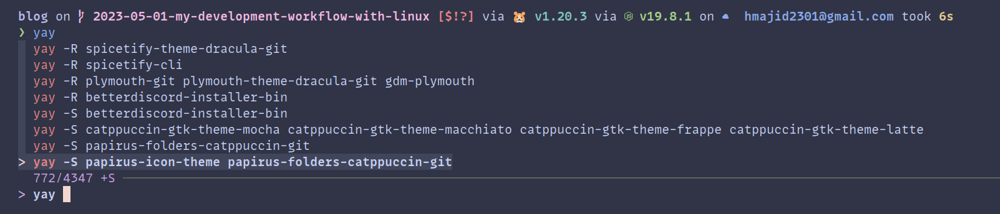
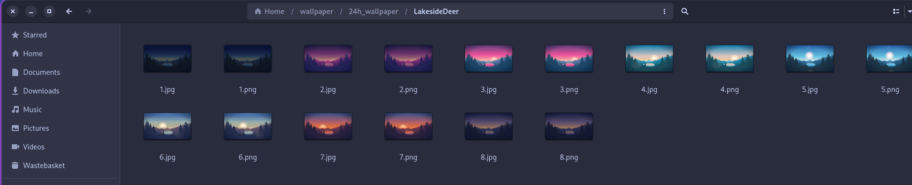

Following on from my previous post about dotfiles and my development workflow (WIP), in this post I will go over my
operating system.

## Arch

As the name implies I use Linux as my main operating system. I am a big fan of Linux because not only is free and
open-source, it provides a great developer experience where I find tools that just work on Linux. It also is a lot more 
customisable as compared with Windows or MacOS. Finally, I tend to find it more lightweight as well and takes fewer
resources to run especially if you are using Docker.

[*Insert meme about how I use arch btw*](https://github.com/overmighty/i-use-arch-btw).
More seriously the main reason I use Arch is because of access to the [Aur]((https://aur.archlinux.org/), the Arch user
repository.

The AUR provides an easy way for us to install any package using a package manager like `yay` or `pamac`.
It is similar to `brew` that people use on MacOS. If I want to install a package I can usually do something like

`yay -S <package>` some of the recent things I have installed can be seen below

So if I didn't use the AUR I would've had to say git clone the project and then run a command. It also then means updating
is a pain as I need to do it manually by remembering to do it. Rather than leaving it to a package manager to tell us
when to update.

## Gnome



[Link to config](https://gitlab.com/hmajid2301/dotfiles/-/blob/8da9d515234d050dc34703e94f647fd9cb40c61a/linux/gnome/settings.ini)

I use gnome as my desktop environment (with Wayland), I tried using Qtile and AwesomeWM but found I didn't enjoy tinkering
with things at that low of a level and prefer just having a lot of the basics set up for me. For example, even something as
simple as the volume indicator I could never style it to how I wanted it to look. So I eventually came back to Gnome
and I have been able to customise it enough to my liking.

### Shortcuts

Some shortcuts I use:

- `super + t`: Opens an alacritty terminal
- `super + a`: Opens search light for opening apps similar to spotlight search in MacOS

### Extensions

The main way I customise gnome is by using extensions 

[Pop Shell](https://github.com/pop-os/shell) is used for tiling I tried a tiling window manager in the past and to be honest
this extension is good enough for me whilst not being as powerful as say Qtile or AwesomeWM. For my use case, it is 
absolutely fine.

I can navigate windows just using my keyboard `super + h j k l` to move between windows similar to how we would in vim.
It also has some shortcuts to maximise a window so it can ignore the tiling when needed. But again the main thing is
I don't need to use my mouse I can use my keyboard.

[Aylurs Widgets](https://extensions.gnome.org/extension/5338/aylurs-widgets/) You can think of this as a collection of
extensions which provides features such as making the top bar look nicer and the drop-down settings menu.

[AppIndicator](https://extensions.gnome.org/extension/615/appindicator-support/) shows app indicators in the top bar
for different applications like Discord or mullvad vpn.

[Updates Indicator](https://extensions.gnome.org/extension/1010/archlinux-updates-indicator/) lets me know via an app
indicator that updates are available then when we click the button it will open a terminal and run `yay` to update.

[Space Bar](https://extensions.gnome.org/extension/5090/space-bar/): I replace Aylurs workspace with this extension.
It is a bit more powerful and I think it looks better.

[Search Light](https://extensions.gnome.org/extension/5489/search-light/): Like spotlight search for MacOS.

Some other extensions I use include:

- [Rounded Window Corners](https://extensions.gnome.org/extension/5237/rounded-window-corners/): Purely for 
aethestic purposes
- [Pano](https://extensions.gnome.org/extension/5279/pano/): A better clipboard manager
- [Just Perfection](https://extensions.gnome.org/extension/3843/just-perfection/): Allows you to tweak almost everything in gnome
- [Blur my Shell](https://extensions.gnome.org/extension/3193/blur-my-shell/): Blur shell when viewing context menu
- [Logo Menu](https://extensions.gnome.org/extension/4451/logo-menu/): Adds a logo to top bar, similar to MacOS.

## CLI Tools

I have added all of the [modern unix cli tools](https://github.com/ibraheemdev/modern-unix).
Some CLI tools I use daily include:

- [fzf](https://github.com/junegunn/fzf): Fuzzy search tool, especially for reverse search in my terminal with [fish shell](https://github.com/PatrickF1/fzf.fish)
- [zoxide](https://github.com/ajeetdsouza/zoxide): Smarter cd tool, integrated well with fzf, nvim and tmux
- [exa](https://github.com/ogham/exa): A replacement for `ls` with better syntax highlighting
- [ripgrep](https://github.com/BurntSushi/ripgrep): A faster `grep`
- [navi](https://github.com/denisidoro/navi): Interactive cheat sheet
- [restic](https://restic.net/): Backup tool used to backup my home directory to the cloud (off-site).

## Misc

Some other "fun" things I have set up in Linux.

### Wallpaper

I found some nice [wallpaper](https://old.reddit.com/r/wallpapers/comments/3ueq55/lakeside_day_night_transition_credit_louis_coyle/)
which can change throughout the day depending on the sun. I use this with a script called [sunpaper](https://github.com/hexive/sunpaper).
This script lets us change the wallpaper depending on the time of day and the very cool it does is it uses the sun.
So it changes depending on where the sun is. For example, 15 minutes before the sunset it will change the wallpaper
and then after the sunset it will change it to another wallpaper you just need to set up a directory will wallpapers
named `1.jpg`, `2.jpg` ...

Where my directory looks like (ignore the png files you don't need those):

You can find my copy of the [script here](https://gitlab.com/hmajid2301/dotfiles/-/tree/8da9d515234d050dc34703e94f647fd9cb40c61a/wallpaper).

That's it! That's a quick blog post on my current Linux set-up.

## Appendix

- [My Dotfiles](https://gitlab.com/hmajid2301/dotfiles)
