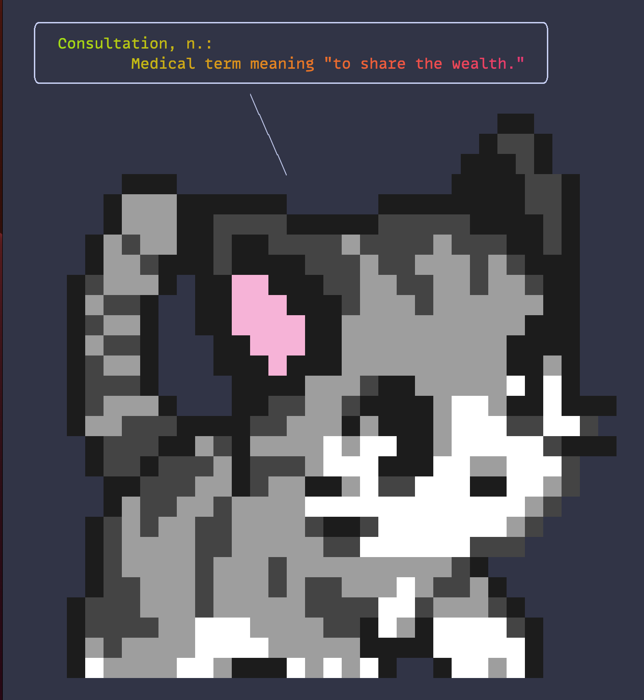

**TIL: How to change the fish greeter**

In this post I will show you how you can change your fish shell greeter from the default

```bash
Welcome to fish, the friendly interactive shell
Type `help` for instructions on how to use fish
```

To something custom, this will run every time you open a new shell!



To do this, go to your `fish_greeter.fish` file which can usually be found at `~/.config/fish/functions/fish_greeting.fish`.
Where mine looks like: 

```fish
function fish_greeting
    fortune | lolcat -f | chara say -c kitten
end
```

fortune generates a random quote, then lolcat colours that quote as a rainbow and finally chara prints out the kitten.

## Nix (Optional)

If you are using fish to configure your fish shell you can do something like (I do this in a file called `fish.nix`):

```nix
{ lib, pkgs, ... }:

{
  programs.fish = {
    enable = true;
    functions = {
      fish_greeting = {
        description = "Greeting to show when starting a fish shell";
        body = "fortune | lolcat -f | chara say -c kitten";
      };
    };
  }
}
```


