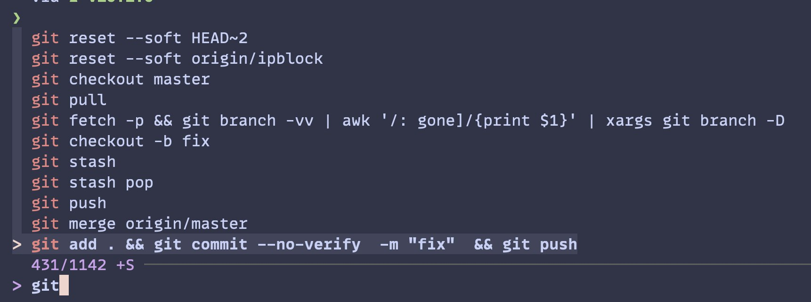

**TIL: How to Add Vim Navigation FZF**

[FZF](https://github.com/junegunn/fzf) is an amazing fuzzy finder tool, that is super flexible and you can create some
cool cli one-liners with it. For example, I use it with the fish shell plugin to search through my command history (CTRL + R).



In this post, I will show you how vim style navigation to the FZF pop-up preview. All we need to do is add the following to the
relevant file i.e. `fish.config`, `.bashrc` or `.zshrc`.

```bash
export FZF_DEFAULT_OPTS="--bind 'j:down,k:up,ctrl-j:preview-down,ctrl-k:preview-up'"
```
This will mean we can move and up down using the normal Vim binding `j` and `k`
