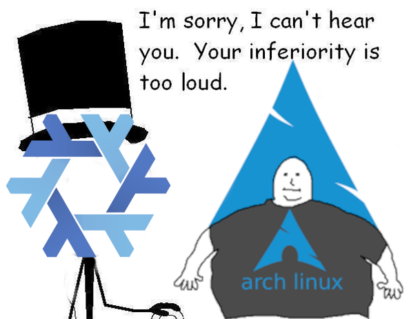
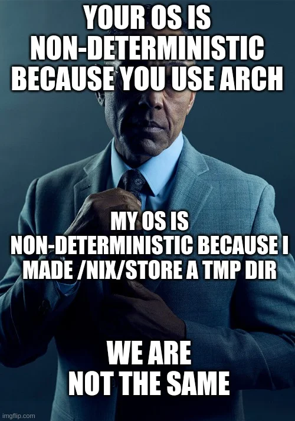
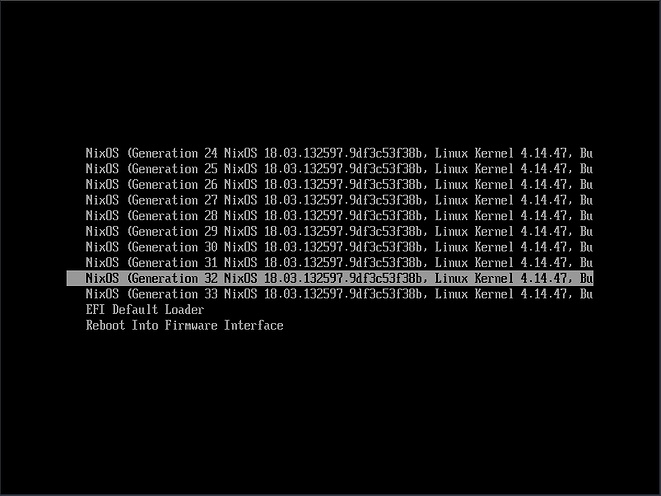

Recently I decided to move from Arch Linux to NixOS. Rather than doing what I should've done which was
try to use NixOS in a VM first and learn Nix properly. I decided to jump into the deep end and completely delete my
current Arch Linux build with Nix. This included replacing my dotfiles setup using DotBot moving them to Nix flakes and
home-manager (more on this in a bit). In this post, I'll go over why I moved over to NixOS, and why I am staying put for now.
What I like about it and some difficulties I have had.

Also, NixOS is the new Arch meme.




I'm pretty new to NixOS so there is a chance something I have said isn't quite correct.
Please let me know via Gitlab Issue (click on the edit button).


## Background

I first heard about NixOS last year at EuroPython 2022, when I went to a round table discussion around tooling. This was
mostly focused on CLI tools that people used. But someone mentioned they used NixOS and you could have your entire machines config
in a single repository. I was intrigued. I personally love reproducibility, and I have enjoyed using Docker for that very reason.
Though I have since learnt Docker is repeatable but Nix with Flakes is far more reproducible. Anyways tangent aside, I want and explored
but I just couldn't be bothered to swap. So I stuck with Arch Linux the main reason being it seemed like Arch with its AUR (arch user repository)
had far more packages.

Then recently I have been looking to improve my developer workflow, I have moved mostly to neovim with tmux (see previous posts in the series).
I was using pop shell as a "pseudo" tiling manager, and it was fine, to begin with. Then I started to explore more and came across Hyprland,
a Wayland compositor. Which looked quite powerful, and more flexible than what I had. For example, I had it set up so that workspaces could only
change my primary display. AFAIK on Gnome you couldn't have workspaces per monitor, changing workspace would change it on both monitors.

However, with Hyprland (and many other such window managers etc) you can set a workspace per monitor. I had tried to use qtile before but soon
found myself not wanting to configure everything. But I am much more experienced with Linux and said why not.
So essentially my initial reasons for moving were I wanted to have my machine configured via a single git repo and have it reproducible and also
try a new window manager, so I thought let us do both at once :laugh:

Around this time to make it even more interesting I decided to try and see if I could live just working on my Framework laptop which I barely used since
I bought it. In theory, moving back to my desktop should be a lot easier if I use NixOS.

## Nix vs NixOS

The language can be a bit confusing so let's define what we mean: [^2]

- nix: The package manager, think like apt or Pacman
- nixlang: The nix programming language, a functional language
- nixos: An operating system built around nix package manager
- machine/system/laptop/desktop: I use these words interchangeably, for NixOS I've only set it up on my Laptop

You can run Nix in any Linux distribution (and even macOS), so what I probably should have done is started using the Nix package manager first.
Then tried NixOS in a virtual machine (on my Arch machine). Then after I was comfortable with nix and nixlang, assuming I liked it, move properly
NixOS on my system.

## Moving to NixOS



So I moved to NixOS using their graphical installer, which was very easy to use and set up. Even setting up hibernate with ease, which I remember being
a pain on Arch Linux (mainly due to my lack of understanding but none the less nixos made it pretty easy).

Now Arch Linux is a rolling release distribution which means rather than getting "big" updates every 6 months with say POP!_OS (my previous distro).
You receive updates far more frequently, so you have a more up-to-date system. The down-side things can break, my most recent issue being
Plymouth breaking and me not being able to type in my password to decrypt my LUKs disk, so not being able to boot.
I then need to use a live USB to remove the Plymouth config from my grub setup.

So one of the features that convinced me to move to nixos was the ability to roll back to previous generations.
So if I install or update a package and it breaks my system I can roll back to the previous generation.
So the way my Arch system broke would not happen in NixOS alongside this and the ability to define the state of my system
in "code" was enough to convince me.



Another feature I liked was able to define my system state in code (nixlang). The idea being I could setup
on a new machine a lot quicker than I could with another Distro.

My dotfiles setup at the time used dotbot which did help me get set up faster but still involved lots of manual steps.
I thought about using Ansible to help configure my setup, but in the end, never got around to doing it.
So having the ability to define my system state in nixlang was a nice feature to have.

The final feature that I liked was the ability of atomic updates. So nix never overwrites packages it simply adds them to a new path
(in the /nix/store directory). It means we can maintain multiple versions of the same library (think like in Golang). It also means
there is no team where we have some of the old files and new ones. So if your upgrade fails in the middle, we can simply revert to the older version. [^1]

### Summary

- Define system state in Nixlang
- Roll back to previous generations
- Atomic updates

## Learnings

In this section, I will go over a few of my learnings, since picking up NixOS a month ago. It is not a beginner-friendly distribution.
If you are new to Linux I recommend trying a distribution like POP!_OS first then after you are more comfortable with Linux you can try
nix as a package manager and after that move to NixOS. I will go over more why later in this post.

There was a bunch of confusion about how to set up my repository to configure my system. What I ended up with was the following [^3]

- Use Nix Flakes [^4]
 - Improves reproducibility
- Use home-manager to configure dotfiles
- Use NixOS configuration for the rest of the system
  - Such as bootloader
  - Luks encryption
- Allow multiple different host machines (laptop, desktop, etc)
  - Share common config
- Separate home-manager config
  - So can use machines that won't run NixOS (like work laptop)

### Imperative vs Declarative

I wanted my config to be declarative, which means I tell NixOS I want x,y,z i.e. Grub, Mullvad VPN and then NixOS works out how to get the system into the correct state.
Nix/NixOS have some imperative operations [^5] like using `nix-env` is which more similar to other package managers to install packages. But I avoid using those.
Except `nix-shell -p <pkg>`, which creates a shell with the package installed temporarily which is great for quickly trying out the package without committing to an install.
Essentially I want to define my system state in code, so it can be reproduced on other machines.

### Nix Flakes

Again I'm pretty new to Nix but I think from what I've seen Nix flakes are the recommended way to use Nix.
Flakes essentially provide us with a lot more reproducibility. They are self-contained units which have inputs and outputs.
A flake needs a `flake.nix` file, which contains inputs and outputs.
The inputs can be other flakes (like home-manager), and these get locked to specific versions in a `flake.lock` file.

Where out flake file may look like this:

```nix
{
  description = "My NixOS Config";
  inputs = {
    nixpkgs.url = "github:nixos/nixpkgs/nixos-unstable";
    home-manager.url = "github:nix-community/home-manager";
  };

  outputs = { self, nixpkgs, home-manager, nur, ... }@inputs:
}
```

They also help with structuring nix repositories acting as a "main" function [4]. When I start doing programming projects
I will likely look into using flakes for even better reproducibility as compared with Docker.

### Home Manager

Home Manager makes it easier to manage the user environment using the Nix package manager (again declaratively). Anything related to the user
is managed here. Things like dotfiles, which applications to install and which config such as alacritty as my terminal.

In theory, my config is set up to support multiple users but at the moment there is only one user `haseeb`.
One nice feature I didn't consider was how it would be to swap back to Gnome from Hyprland. This makes it much easier to experiment
and try out new window managers or desktop environments. My current config has both my gnome config and hyprland config and with a few lines
I should be able to back to Gnome, if I want (and vice versa).

As you can probably imagine most of my config is here, as most changes happen in userland. I can run this separately to NixOS because
I will have machines where I cannot use NixOS, like my work laptop but can use the nix package manager.

command: `home-manager switch --flake ~/dotfiles#haseeb@framework`

### NixOS Configuration

This is like home manager except for system-wide changes, split up via device (currently only my framework laptop).
Things like the bootloader, and fingerprint reader. I only put config here if it needs to be system-wide.

This also builds the home manager config

[Click here for an example](https://gitlab.com/hmajid2301/dotfiles/-/blob/6f2bac80e57999c793eb8ae48ca1dfc8dafa8f9e/hosts/framework/default.nix).
The common config can be shared

command: `sudo nixos-rebuild switch --flake ~/dotfiles#framework`

### Issues

Some issues I encountered whilst moving to NixOS. Lots of docs still refer to nix-env and nix-channel as a way to install packages.
But from what I've read and my personal preference it seems the preferred way is the declarative way I described above.
However, when you first get started this is not always clear

Docs are a bit messy in my opinion, I often find myself reading multiple different blog posts to understand what to do. 
Or looking through [sourcegraph](https://sourcegraph.com) for code examples and working it out that way.
As I said you will still see references to the imperative way to use nix.

I also think the error messages that home-manager and NixOS configuration can throw, can at times be a bit obtuse and hard to
understand (at least for me). 

Overall these are just small issues, which I hope will get better over time. Nix/NixOS can be infuriating at times, when you know
on another distribution/package manager would be much quicker. However knowing that my builds are more reproducible is worth it!

That's it! Some reasons why I've moved to NixOS and why I will be staying for now. In a future article, I will break down my own
NixOS configuration.

## Appendix

- [Nix Config](https://gitlab.com/hmajid2301/dotfiles/-/tree/6f2bac80e57999c793eb8ae48ca1dfc8dafa8f9e)
- [NixOS Basic, a great read imo!](https://thiscute.world/en/posts/nixos-and-flake-basics/#iii-nix-flakes-and-the-old-nix)

[^1]: https://nixos.org/guides/how-nix-works.html
[^2]: https://news.ycombinator.com/item?id=23251895
[^3]: Heavily inspired by this repo: https://github.com/Misterio77/nix-config
[^4]: https://www.tweag.io/blog/2020-05-25-flakes/
[^5]: https://nixos.wiki/wiki/Overview_of_the_NixOS_Linux_distribution
