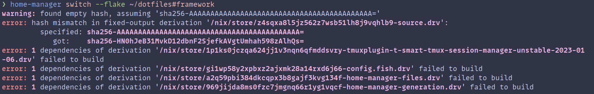

## Introduction

In this post I will show you how you can setup tmux (plugins) using the nix package manager, specifically using home-manager.
I will also show you how you can avoid an issue I encountered where tmux resurrect wasn't working properly due to 
plugin ordering.

Typically we use the [tmux plugin manager](https://github.com/tmux-plugins/tpm) to manage our tmux plugins.
However, when I moved to NixOS, I wanted to move away from having lots of different ways of managing what is on my
system. For example, on my Arch Linux machine I had:

- Pacman/Yay
- lazyvim
- tpm

However, it wasn't obvious how to do this. In my case, I decided to use [home-manager](https://nixos.wiki/wiki/Home_Manager) 
which is a tool we can use with
Nix to manage user config including dotfiles. For tmux specifically, there is a module we can leverage. So assuming
you already have home manager and Nix setup. We can create a new module, say called `tmux.nix`

## tmux.nix

```nix
{ pkgs, ... }:
let
  tmux-super-fingers = pkgs.tmuxPlugins.mkTmuxPlugin
    {
      pluginName = "tmux-super-fingers";
      version = "unstable-2023-01-06";
      src = pkgs.fetchFromGitHub {
        owner = "artemave";
        repo = "tmux_super_fingers";
        rev = "2c12044984124e74e21a5a87d00f844083e4bdf7";
        sha256 = "sha256-cPZCV8xk9QpU49/7H8iGhQYK6JwWjviL29eWabuqruc=";
      };
    };
in
{
  programs.tmux = {
    enable = true;
    shell = "${pkgs.fish}/bin/fish";
    terminal = "tmux-256color";
    historyLimit = 100000;
    plugins = with pkgs;
      [
        {
          plugin = tmux-super-fingers;
          extraConfig = "set -g @super-fingers-key f";
        }
        tmuxPlugins.better-mouse-mode
      ];
    extraConfig = ''
    '';
  };
}
```

In the file above there are a few key things I'd like to discuss `programs.tmux.enable = true`, this automatically installs
tmux for us. We also set some other config options such as the shell to use and the history limit. Nix will automatically
add these to our tmux config file for us, which helps manage the config a bit easier in my opinion.

Next install tmux plugins available as a
[nix package](https://search.nixos.org/packages?channel=unstable&show=tmuxPlugins.better-mouse-mode&from=0&size=50&sort=relevance&type=packages&query=better+mouse+mode) we can simply do:

```nix
 plugins = with pkgs;
      [
        tmuxPlugins.better-mouse-mode
      ];

```

If however the plugin is not available, we can still install it like we did for tmux super fingers. 

```nix
tmux-super-fingers = pkgs.tmuxPlugins.mkTmuxPlugin
{
    pluginName = "tmux-super-fingers";
    version = "unstable-2023-01-06";
    src = pkgs.fetchFromGitHub {
        owner = "artemave";
        repo = "tmux_super_fingers";
        rev = "2c12044984124e74e21a5a87d00f844083e4bdf7";
        sha256 = "sha256-cPZCV8xk9QpU49/7H8iGhQYK6JwWjviL29eWabuqruc=";
    };
};
```

We tell home-manager where to get the plugin from on Git Hub,
which plugin we'd like to install, and a specific revision (can be a tag or a commit sha). There is also a sha256, which
can be found when you run the `home-manager switch` command and leave the `sha256` field empty. It will initially fail
with the expected sha value which you can then copy over to the file.



This sha is used to check if this derivation is already built by Nix and available to the machine, so we can skip
building it again. You can read more about it [here](https://discourse.nixos.org/t/how-is-used-the-sha256-of-fetchfromgithub-exactly/4837).


When I was first setting it up, I didn't fully realise what the sha256 was used for and shared between multiple plugins.
What will happen is that the first plugin will be installed. Then Nix will see that SHA is already installed so won't
install the remaining plugins.

**So make sure you add your plugins one at a time, to avoid this.**


Then we add it to our list of plugins we want to be installed. We can also specify extra config related to that plugin,
using the `extraConfig` field.
which I think helps organise our config a bit more, like so:

```nix
{
    plugin = tmux-super-fingers;
    extraConfig = "set -g @super-fingers-key f";
}
```

### continuum & resurrect issues

I had some issues getting tmux resurrect and continuum to work on my new machine. It turned out it was due to the ordering
of my plugins. Any plugin that edits the right status bar, like the catppuccin theme plugin needs to go before these two.
Now my tmux sessions automatically save and reload themselves. So when I shut down my PC I can carry on from where I left.

Like so:

```nix
# must be before continuum edits right status bar
{
    plugin = tmuxPlugins.catppuccin;
    extraConfig = '' 
    set -g @catppuccin_flavour 'frappe'
    set -g @catppuccin_window_tabs_enabled on
    set -g @catppuccin_date_time "%H:%M"
    '';
}
{
    plugin = tmuxPlugins.resurrect;
    extraConfig = ''
    set -g @resurrect-strategy-vim 'session'
    set -g @resurrect-strategy-nvim 'session'
    set -g @resurrect-capture-pane-contents 'on'
    '';
}
{
    plugin = tmuxPlugins.continuum;
    extraConfig = ''
    set -g @continuum-restore 'on'
    set -g @continuum-boot 'on'
    set -g @continuum-save-interval '10'
    '';
}
```

I haven't worked out how to restore my nvim session, however. The resurrect plugin needs a session.vim file to do that.
For now, this is good enough, as I have a session manager with nvim itself so it is simply a button press to restore it.

If you are using home-manager make sure to import this module into your main home manager nix file such as `home.nix`.
Then you should be able to run `home-manager switch` to install the tmux, and its plugins and build the config at
`~/.config/tmux/tmux.conf`.

[My tmux file](https://gitlab.com/hmajid2301/dotfiles/-/blob/ccb08009df7e0d884db790bca57317748661e35b/home-manager/programs/tmux.nix)

