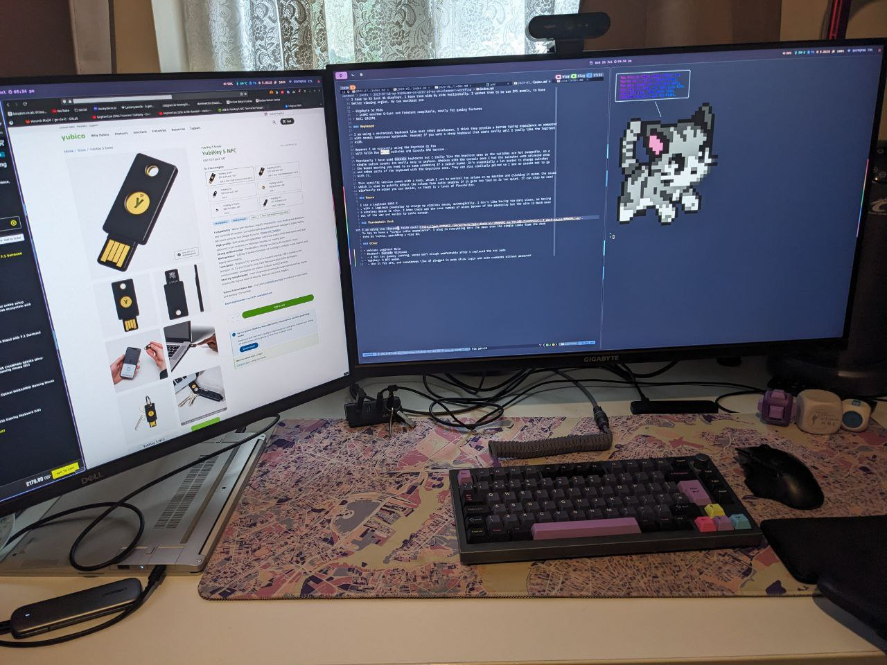
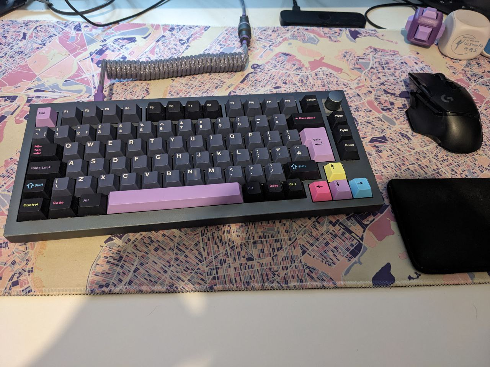

This series has been inspired by [Dev Workflow Intro by Josh Medeski](https://www.joshmedeski.com/guides/dev-workflow-intro/).

This is sort of a precursor to my series about how I have set up my development workflow. Hopefully, you will be able to
pick a few tips and tricks you can add to your development workflow to make it more efficient. Or even give me tips
on how I can make my workflow more efficient. 

In this post we will go over arguably the least important, but at the same time quite important, part of our workflow.
Because in theory, we can run the same development workflow on lots of different types of hardware. I don't
necessarily need a mechanical keyboard or a monitor I can just use a keyboard.

However, if you work from the same environment i.e. your desk at home or work you also want to make your setup as
comfortable as possible. With a nice monitor, a comfortable keyboard and mouse.

## Introduction

There are 100s of different machines and configurations you could use for development. I can of course not list them all.
Instead for this "part 0", I will just go over my specific setup what's good about and what issues I have with it.

I reckon most developers use a laptop, especially for work, for each of my jobs I have been given a work laptop and
have done all of my development on it. Whether I use a laptop or a desktop I like to treat them the same.
For most of my personal development at home, I have used a desktop, which also doubled as my gaming machine. Recently
I have moved to a laptop, a framework 12th generation, to do all my development (and a bit of gaming).

## Laptop vs Desktop

The main reason for moving to a laptop was to be able to have a portable development environment. If I wanted to travel,
I found it took some time to set up my laptop. Whether that be making sure to git pull all the repos I wanted to work on,
essentially I had to make sure my laptop was in sync with my desktop. Sometimes even updating the system could take
a while,  using just my laptop I could solve this problem.

## Laptop Setup

At the moment I am using a 12th-generation framework laptop as my main development machine, alongside a 2019 MacBook for
work. However, if I had it my way I wouldn't be using that :cry:! 

I like to use my laptops in a way that still gives me a "desktop-style experience", what this means is I dock my laptop
in a stand (closed lid). I then connect it to a Thunderbolt dock, where the dock is connected to my monitors,
2 x 32-inch 4k monitors, mechanical keyboard, mouse etc. So if your laptop supports TB3/TB4 you can setup your
environment with just a single cable connecting to the laptop. When I need to be mobile, I can just disconnect the
laptop from that single cable and go on about my day.

### eGPU

In terms of trying to game on my laptop or heavier workloads where I want to use a GPU, I am going to attempt to use
an external GPU enclosure and put one of my graphics cards in there. For gaming I have got VFIO GPU passthrough, using
a Windows VM with libvirt. However, I haven't been able to get any game except Guild War 2 to run properly.

### Cons

- The laptop is very loud even under moderate load, fans start to spin
- Not as powerful as my desktop
- Cannot game on it properly

## Specific Setup

Going over the specific hardware I use, note there will be lots of alternatives these are just the ones I use.

### Monitors

I have to 32-inch 4k displays, I have them side by side horizontally. I wanted them to use IPS panels, to have
better viewing angles. My two monitors are

- Gigabyte 32 M32U
  - 144HZ monitor G-Sync and FreeSync compatible, mostly for gaming features
- Dell G3223Q

Please ignore the mess of cables, I'd like to pretend my desk is tidier most of the time :rolling_on_the_floor_laughing:

### Keyboard 

I am using a mechanical keyboard like most other developers, I think they provide a better typing experience as compared
with normal membrane keyboards. However, if you want a cheap keyboard that works really well I really like the Logitech
k120.

However, I am currently using the [Keychron Q1 Pro](https://www.keychron.com/products/keychron-q1-pro-qmk-via-wireless-custom-mechanical-keyboard)
with Kalih Box White switches and Dracula GMK keycaps. 

Previously I have used Corsair keyboards but I really like the Keychron ones as the switches are hot-swappable, so a
single switch breaks it's really easy to replace. Whereas with the Corsair ones I had the switches were soldered onto
the board meaning you need to do some soldering if a switch broke. It's essentially a lot easier to change switches
and other parts of the keyboard with the Keychrone ones. They are also similarly priced so I see no reason not to go
with it.

This specific version comes with a knob, which I use to control the volume on my machine and clicking it mutes the sound
which is nice to quickly adjust the volume from audio sources if it gets too loud or is too quiet. It can also be used
wirelessly or wired you can decide, so there is a level of flexibility.

Once again please ignore the mess of cables, I'd like to pretend my desk is tidier most
of the time :rolling_on_the_floor_laughing:

### Mouse

I use a [Logitech G502 X](https://www.logitechg.com/en-gb/products/gaming-mice/g502-x-wireless-lightforce.910-006190.html)
, with a Logitech powerplay to charge my wireless mouse, automagically. I don't like having too many wires, so having
a wireless mouse is nice. I know there is the same number of wires because of the powerplay but the wire is much more
out of the way and easier to cable manage.

### Thunderbolt Dock

I am using the [Corsair TB100 dock](https://www.corsair.com/uk/en/p/hubs-docks/cu-9000001-eu/tbt100-thunderbolt-3-dock-eu-cu-9000001-eu).
To try to have a "single cable experience". I plug everything into the dock then the single cable from the dock
into my laptop, providing a nice UX.

### Other

- Dual Laptop Stand
  - One for work laptop (MacBook)
  - Another for personal laptop (Framework)
  - It's next to the Thunderbolt dock
- Webcam: [Logitech Brio](https://www.logitech.com/en-gb/products/webcams/brio-4k-hdr-webcam.960-001106.html)
- Headset: [Corsair Virtuoso](https://www.corsair.com/uk/en/p/gaming-headsets/ca-9011185-eu/virtuoso-rgb-wireless-high-fidelity-gaming-headset-carbon-eu-ca-9011185-eu)
  - A bit too gamery looking, worse well enough comfortable after I replaced the ear pads
- Yubikey: [5 NFC model](https://www.yubico.com/gb/product/yubikey-5-series/yubikey-5-nfc/) 
  - Use it for 2FA, and convenience like if plugged in auto allow login and sudo commands without a password

That's it a quick look at some of the important bits of hardware I use. As I say most of this can be swapped out with
other components. Especially a desktop with a laptop. The next part in this series will go over what operating system
I use and why!
