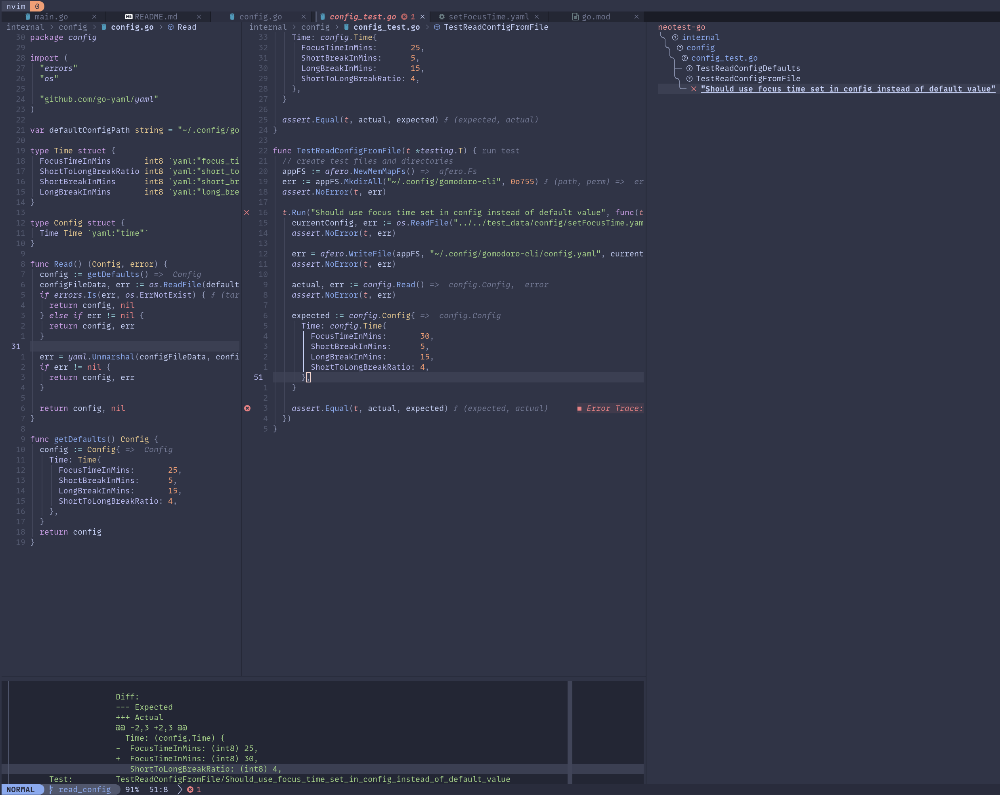
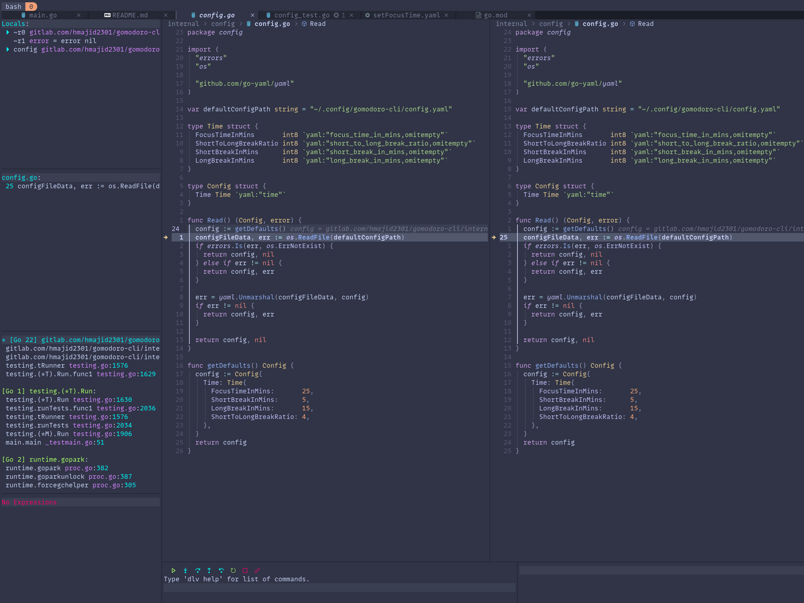

In this blog post, I will show you how you can easily setup Neotest to make testing easier in neovim and DAP to make
debugging your tests is a lot easier.

I am using the [LazyVim](https://www.lazyvim.org/) neovim distribution, where these two come as easily installed extra
plugins. However, it should be easy enough for you to copy the config over to your neovim lua config.
LazyVim even has the config available on its website, you don't even need to deep dive into the code :smile:.

For example with [dap](https://www.lazyvim.org/extras/dap/core). Here are some examples of what it can look like. The two
main bits we will look at today don't come by default with LazyVim but are "extras" we can add them

## Neotest

To set up Neotest on LazyVim, go to your LazyVim [starter repo](https://github.com/LazyVim/starter). Then open our
`lazy.lua` file and add the following lines:

```lua{hl_lines=[5-6]}
spec = {
    -- add LazyVim and import its plugins
    { "LazyVim/LazyVim", import = "lazyvim.plugins" },
    -- import any extras modules here
    { import = "lazyvim.plugins.extras.test.core" },
    { import = "lazyvim.plugins.extras.lang.go" },
    -- import/override with your plugins
    { import = "plugins" },
},
```

Here you can see the output from a test at the bottom (from Neotest) and a test summary (on the right).
Using the test summary we can easily run one test at a time, even subtests.



The config that LazyVim sets the following key binds.

```lua
keys = {
    { "<leader>tt", function() require("neotest").run.run(vim.fn.expand("%")) end, desc = "Run File" },
    { "<leader>tT", function() require("neotest").run.run(vim.loop.cwd()) end, desc = "Run All Test Files" },
    { "<leader>tr", function() require("neotest").run.run() end, desc = "Run Nearest" },
    { "<leader>ts", function() require("neotest").summary.toggle() end, desc = "Toggle Summary" },
    { "<leader>to", function() require("neotest").output.open({ enter = true, auto_close = true }) end, desc = "Show Output" },
    { "<leader>tO", function() require("neotest").output_panel.toggle() end, desc = "Toggle Output Panel" },
    { "<leader>tS", function() require("neotest").run.stop() end, desc = "Stop" },
},
```

So we can get the test summary by pressing `<space> + t + s`.
Or test output using `<space> + t + shift + o`. Where `<space>` is my leader key. Also if a test fails when I run
the nearest test `<space> + t + n`, the output panel (at the bottom) auto opens.

## DAP Core

Similar to above to add debugging support we can add an extra plugin like so:

```lua{hl_lines=[5]}
spec = {
    -- add LazyVim and import its plugins
    { "LazyVim/LazyVim", import = "lazyvim.plugins" },
    -- import any extras modules here
    { import = "lazyvim.plugins.extras.dap.core" },
    -- import/override with your plugins
    { import = "plugins" },
},
```



To debug our tests first we can add a breakpoint using `<space> + d + b`. Then we can run our test in debug mode using
`<space> + t + d`, which will run the nearest test in [debug mode](https://github.com/LazyVim/LazyVim/blob/566049aa4a26a86219dd1ad1624f9a1bf18831b6/lua/lazyvim/plugins/extras/lang/go.lua#L20).

When we start to debug our tests it looks something like this. If you have used the VSCode debugger this will look very
similar. We can explore the current state, the values various variables have etc. Run commands in the debugger at the
bottom.

That's it! We can improve our testing experience in Go using neovim with Neotest and DAP. I am also able to replicate
some features I used to have in VSCode and now also have in neovim 💗.


## Appendix

- [This video helping me get set up by Elijah Manor (he does great videos btw)](https://www.youtube.com/watch?v=7Nt8n3rjfDY)

