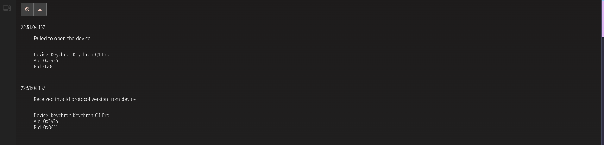
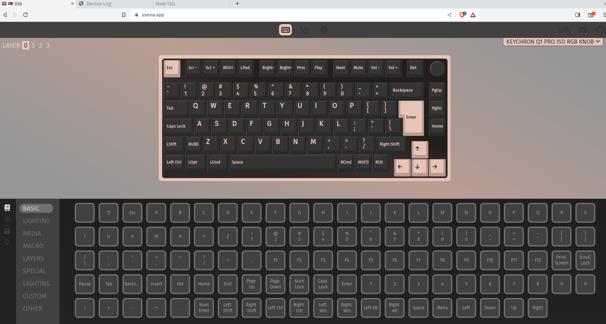

**TIL: How to Fix VIA Permission Issues on Linux**

Recently I have been trying to configure my newish Keychron keyboard using [VIA](https://www.caniusevia.com/).
To add a key to be able to take print screens, making use of the layers provided,
as my Keychron Q1 PRO doesn't have a dedicated print key :sweat:.

However, when I opened the app or the [website](https://usevia.app/), I would get
the following error.

If we go to `chrome://device-log` you should be able to see something like this:
`Failed to open '/dev/hidraw9': FILE_ERROR_ACCESS_DENIED`.



> hidraw enables raw access to USB and Bluetooth Human Interface (hidraw) devices.

This means Chrome cannot access our keyboard, so to fix this we can do something like:

```
sudo chmod a+rw /dev/hidraw9
```

Then open the app/go to the website and you should see the errors are gone.



To set the original permissions you can do:

```
sudo chmod 600 /dev/hidraw8
```

## Appendix

- [Arch Forum Post which helped me](https://bbs.archlinux.org/viewtopic.php?id=285709)

