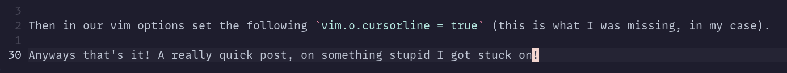

**TIL: How to Colour Neovim Line Numbers**

Recently I was trying to configure my own neovim config. I wanted the current line I was onto be coloured slighty 
differently and also the line number to be white. So it's easier to see the line number and which line I was on.



It was not immediately obvious how to do this and took me long to work out than I'd like to admit 😅.

First we need to create to two highlight groups:

```lua
-- Highlights the line
CursorLine = { fg = 'NONE', bg = c.black2 },

-- Highlights the line number
CursorLineNr = { fg = c.white },
```

Then in our vim options set the following `vim.o.cursorline = true` (this is what I was missing, in my case).

Anyways that's it! A really quick post, on something stupid I got stuck on!
