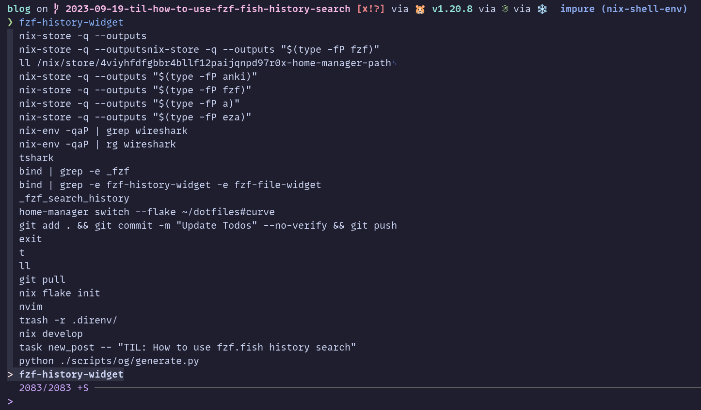
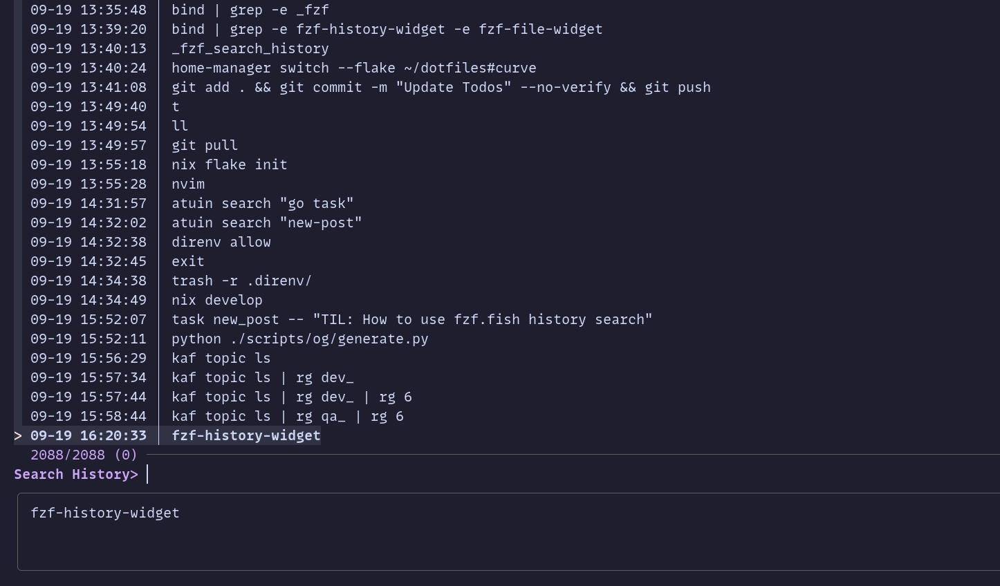

**TIL: How to Use fzf.fish History Search**

I use Fish Shell with fzf and [fish fzf plugin](https://github.com/PatrickF1/fzf.fish).
I installed fzf using nix and home-manager:

```nix
{
  programs.fzf = {
    enable = true;
    enableFishIntegration = false;
  };
}
```

It adds `fzf-history-widget` script, which is bound to `ctrl+r`, shell reverse history search. 
Which we can see when we run this: `bind | grep -e fzf-history-widget -e fzf-file-widget`

Whereas I wanted to use the `_fzf_search_history` which is made available by that fish fzf plugin.
Now PatrickF1 recommends running the uninstaller script from fzf, but I found another way we can overwrite
the binding by adding the following lines to our `fish.config`:

```fish
bind \cr _fzf_search_history
bind -M insert \cr _fzf_search_history
```

So now when I press `ctrl+r` in my shell I used to get this (before):



but now I get this (after):




## Appendix

- [My nix fish shell config](https://gitlab.com/hmaji](https://gitlab.com/hmajid2301/dotfiles/-/blob/a34417ed452fe068ec4a91fba7ef0a14fca31b76/home-manager/shells/fish.nix#L48-49)
