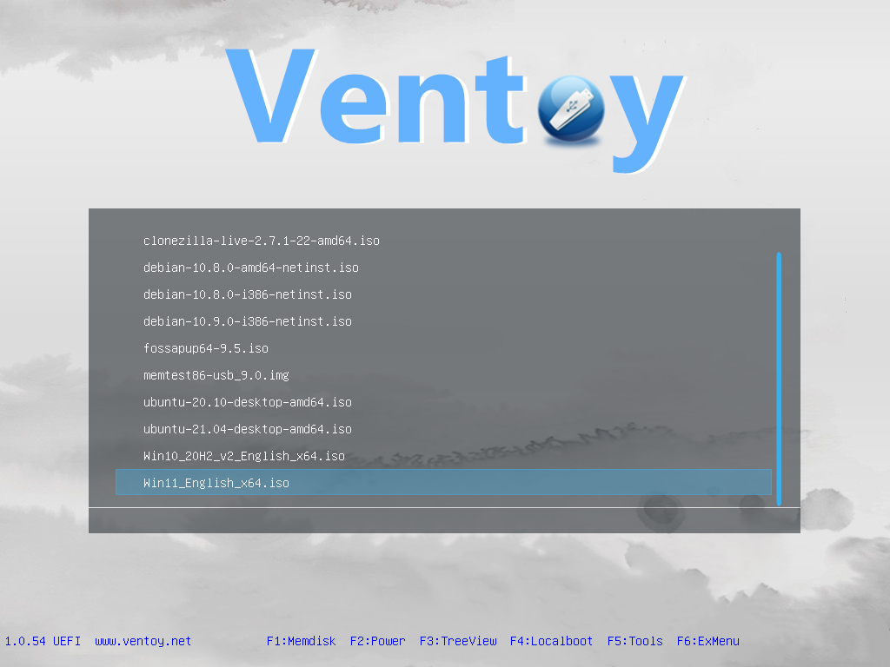
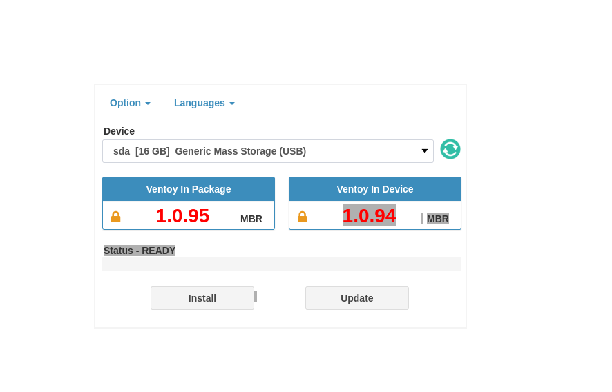
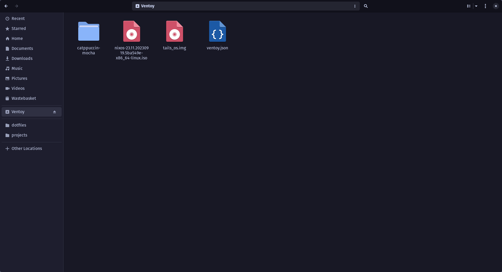

## Introduction

Typically when we want to install a new OS we use an ISO to create a bootable USB drive. We can then plug this into
our device, say laptop, and boot from that USB and install our OS. However, typically you can only put a single ISO on
a USB. So what if wanted a USB with say Window, Arch Linux, TailsOS and NixOS how could we do that? 

I'm sure there are other multi-bootable USB tools we could use but I recently came across [ventoy](https://www.ventoy.net/).
All we need to do is format our USB drive with Ventoy, then simply copy our ISO (or other relevant files) onto it.
So we can now have an ISO for windows, arch etc etc. Then we can decide during boot time which ISO ventoy will load
for us.



## Install on Nix (/NixOS)

So how do we go about setting it up? Well, I will show you how I set it up on Nix. First plug in a USB that you don't
mind losing all the data on.

If we want to just "install" ventoy temporarily we can do something like:

```bash
nix-shell -p ventoy-full

sudo ventoy-web

===============================================================
  Ventoy Server 1.0.95 is running ...
  Please open your browser and visit http://127.0.0.1:24680
===============================================================
```

- Open the webpage at `http://127.0.0.1:24680`, 
- Select the device you would like to flash
- Press the install button



After its done you should be able to see a drive called Ventoy and copy over your ISOs to it.



## Summary

That's it! You now have a USB that will allow you to boot to multiple different OS. I originally set this up because
I was creating my own ISO file using Nix flakes. To help automate the installation of new devices (or reinstalling of older ones).

But this is quite cool now because I can have an ISO for my custom Nix image, I can also run TailsOS which gives me
access to Linux on any device. Say, I'm at the library, which only has Windows machines. It just avoids the hassle of
either carrying multiple USB devices or constantly formatting and reformatting my USB.

Hope you found this useful!!!
