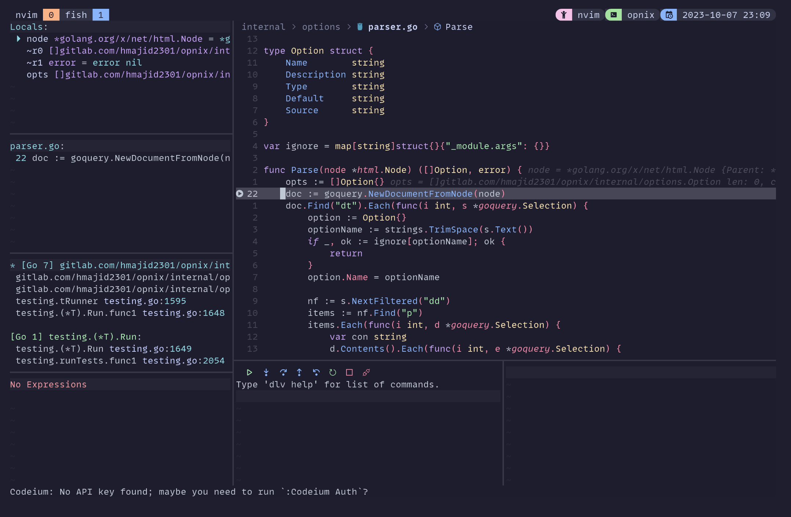

**TIL: How to Colour Dap Breakpointed Line in Neovim**

I wanted to change the background colour of the line when it was stopped during debugging using DAP with neovim.
To make it easier to see where we are currently breakpointed.

We already have a highlight group called `DapStopped`. Which in my case is defined as:
`DapStopped = { bg = C.grey }`.

Then we need to assign the custom highlight group, the key bit being `linehl` for our use case.

```lua {hl_lines=[8]}
require("dap")

local sign = vim.fn.sign_define

sign("DapBreakpoint", { text = "●", texthl = "DapBreakpoint", linehl = "", numhl = ""})
sign("DapBreakpointCondition", { text = "●", texthl = "DapBreakpointCondition", linehl = "", numhl = ""})
sign("DapLogPoint", { text = "◆", texthl = "DapLogPoint", linehl = "", numhl = ""})
sign('DapStopped', { text='', texthl='DapStopped', linehl='DapStopped', numhl= 'DapStopped' })
```

Then we start the debugger and it stops at a breakpoint line it looks something like in the photo below.



