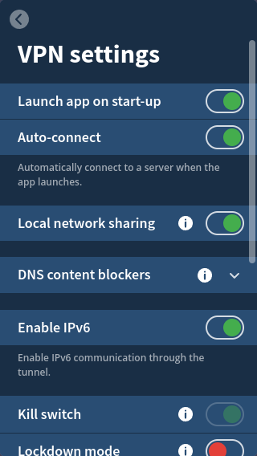

**TIL: How to Fix Networking Issues in a Libvirt VM and Mullvad VPN**

Recently, I was trying to run a libvirt virtual machine, created using [virt-manager](https://virt-manager.org/).
The VM was running NixOS and somehow no matter what I did it would not connect to the internet.

I was running Mullvad as my VPN, and it turned out this was the app causing issues, I had to turn on 
`Local network share` [^1]. Like in the photo below:

That's It! Simple fix that took me longer to work than I'd like to admit.

[^1]: https://mullvad.net/en/help/#29
