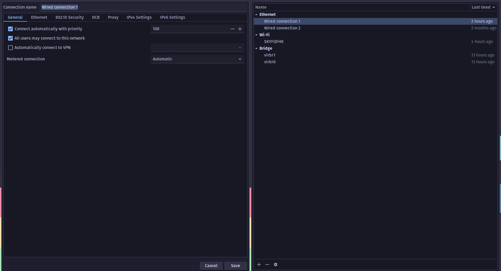

**TIL: How to Set Network Manager Priority to Use Wired Connection Over Wi-Fi**

If you use network manager on Linux and have both Wi-Fi and wired connection. You may want to prefer using
a wired connection over Wi-Fi, due to stability. To do open the `nm-connection-editor`, if you are using Nix, you can 
download it from nixpkgs like usual.

> Higher number means higher priority.

So for our wired connection I set the priority to `100` (it was previously -1) and then for our Wi-Fi connection
I set the priority to `1`.

That's it! We should now see network manager prefer to use Ethernet over Wi-Fi.

