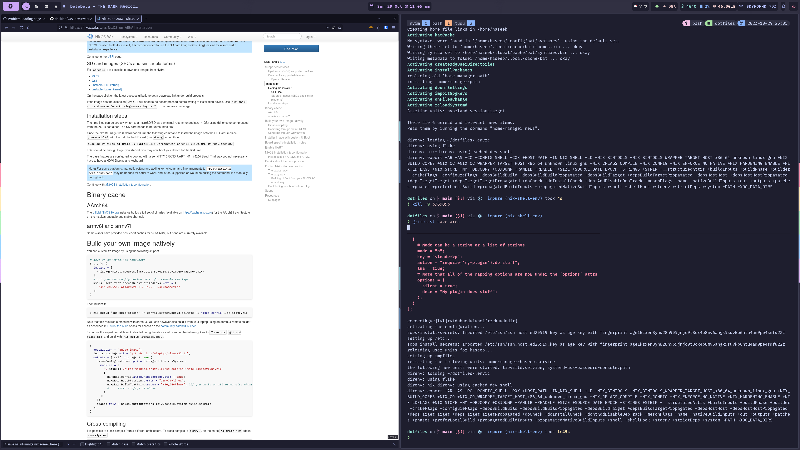

## Preamble

Now we have looked at our choice of hardware, which OS to use and specifically, how to configure NixOS (at a high-level),
using a git repository.

In this part, we will go over which window manager to use. There are two main types we could use here. Either a desktop
environment like Gnome or KDE. Which comes with batteries included, it provides us with everything we need and we 
don't need to configure much to get stuff working. Things like a notification daemon, polkit (for auth). 

Whereas in a more bare-bones window manager such as Hyprland, i3, Sway they are far more bare bones and we need to 
setup a lot more things ourselves. They are more customisable but more effort to set up, they also tend to be more light
weight on resources.

In this section, we will look at using a tiling window manager [Hyprland](https://wiki.hyprland.org/),
though, you could also look at using [Sway](https://swaywm.org/).

## Why a tiling manager? 

A tiling window manager is great because it handles placing our window automatically for us. This allows for more
efficient usage of our space. Rather than multiple overlapping windows, each window has its own space on the display.



It also makes it much easier to be keyboard-driven, so we need to rely on our mouse a lot less. We can use the keyboard
to swap between open windows. We can also open apps using a tool like `rofi` again from the keyboard. This just helps
us be quicker, not wasting time needing to reach for the mouse.


## Why Hyprland? 

I mean, between Sway and Hyprland I don't think there is much difference, the main reason I chose to use Hyprland was because
I saw plenty of people ricing it on unixporn, especially with NixOS. So I used some of their setups as inspiration.

Hyprland also has a few nice compositor tweaks like transparency and animations. Which I think makes things more interesting.
But any other Wayland tiling manager will do, such as Sway or River. I don't have a super strong reason to use Hyprland.

Saying that, since plenty of people seem to be using it, it's easy to find example setups and copy them or nick bits I like.

## How do I use Hyprland?

So you may be wondering how does a window manager fits in to our development workflow. Specifically, a tiling window manager.
 Typically, I will have 5–6 workspaces in use:

- 1: Coding (main monitor)
  - Entirely dedicated to my code editor (Neovim in my terminal)
      - Usually has a few splits for different buffers
- 2: Firefox (secondary monitor)
  - Two Firefox windows
    - One playing random YouTube videos
    - The other with documentation or related to the work I am currently doing
- 3: Secondary project
  - Contains terminal with Neovim
  - Firefox window related to project
- 4: Monkeytype
  - Firefox for me to practice my typing when I get bored
- 5: Social Apps
  - Ferdi
  - Discord
- 6: Gaming
  - Steam
  - Lutris

I mainly use workspace 1 & 2, I also use [tmux-browser](https://github.com/ofirgall/tmux-browser) which means
I can manage my browser tabs per tmux session (more on this in a future post). Where the open Firefox window will often
be one managed by tmux-browser.

## Wayland

I have personally decided to try to use Wayland compilable window managers. I know people have issues with Wayland.
But for the most part, Wayland just seems to work fine for me. I originally swapped to Wayland because I had two monitors
and I wanted to set the refresh rate of each separately. Whereas XServer treats them as one display, so I had to set it 
60Hz, but now I can have one monitor on 144Hz and another on 60Hz.

Note your mileage may vary, and you may well have issues with Wayland, especially if you are using an Nvidia GPU.

# Setup

One of the things I like about NixOS is it makes it straightforward to add new packages and config.

## flake input

First, update our flake inputs to add Hyprland.

```nix
hyprland.url = "github:hyprwm/Hyprland";
```

## home-manager

So, having a look at my `hyprland.nix` file:

```nix
{ inputs
, config
, pkgs
, ...
}:
let
  laptop_lid_switch = pkgs.writeShellScriptBin "laptop_lid_switch" ''
    #!/usr/bin/env bash

    if grep open /proc/acpi/button/lid/LID0/state; then
        hyprctl keyword monitor "eDP-1, 2256x1504@60, 0x0, 1"
    else
        if [[ `hyprctl monitors | grep "Monitor" | wc -l` != 1 ]]; then
            hyprctl keyword monitor "eDP-1, disable"
        fi
    fi
  '';
in
{
  imports = [
    inputs.hyprland.homeManagerModules.default
    ./common
  ];

  home.packages = [
    inputs.hypr-contrib.packages.${pkgs.system}.grimblast
    inputs.hyprland.packages.${pkgs.system}.xdg-desktop-portal-hyprland
  ];

  nix.settings = {
    substituters = [ "https://hyprland.cachix.org" ];
    trusted-public-keys = [ "hyprland.cachix.org-1:a7pgxzMz7+chwVL3/pzj6jIBMioiJM7ypFP8PwtkuGc=" ];
  };

  wayland.windowManager.hyprland = {
    enable = true;
    # TODO: move to https://github.com/spikespaz/hyprland-nix
    extraConfig = ''
      # ASCII Art from https://fsymbols.com/generators/carty/
      input {
      	kb_layout = gb
      	touchpad {
      		disable_while_typing=false
      	}
      }

      general {
      	gaps_in = 3
      	gaps_out = 5
      	border_size = 3
      	col.active_border=0xff${config.colorscheme.colors.base07}
      	col.inactive_border=0xff${config.colorscheme.colors.base02}
      }

      decoration {
      	rounding=5
      }

      misc {
       vrr = 2
       disable_hyprland_logo = 1;
      }

      $notifycmd = notify-send -h string:x-canonical-private-synchronous:hypr-cfg -u low

      # █▀ █░█ █▀█ █▀█ ▀█▀ █▀▀ █░█ ▀█▀ █▀
      # ▄█ █▀█ █▄█ █▀▄ ░█░ █▄▄ █▄█ ░█░ ▄█
      bind = SUPER, Return, exec, ${config.my.settings.default.terminal}
      bind = SUPER, b, exec, ${config.my.settings.default.browser}
      bind = SUPER, a, exec, rofi -show drun -modi drun
      bind = ALT, Tab, exec, rofi -show window
      bind = SUPER, w, exec, makoctl dismiss
      # ...

    '';
  };
}
```

I cut out some config so it's easier to follow the file above. By going over it section by section:

```nix
  laptop_lid_switch = pkgs.writeShellScriptBin "laptop_lid_switch" ''
    #!/usr/bin/env bash

    if grep open /proc/acpi/button/lid/LID0/state; then
        hyprctl keyword monitor "eDP-1, 2256x1504@60, 0x0, 1"
    else
        if [[ `hyprctl monitors | grep "Monitor" | wc -l` != 1 ]]; then
            hyprctl keyword monitor "eDP-1, disable"
        fi
    fi
  '';
```

This first bit, a simple bash script which is used to switch off the display on a laptop when the lid is closed. We will
see how it is used later, we give it the name `laptop_lid_switch`.

```nix
  imports = [
    inputs.hyprland.homeManagerModules.default
    ./common
  ];

  home.packages = [
    inputs.hyprland.packages.${pkgs.system}.xdg-desktop-portal-hyprland
  ];

  nix.settings = {
    substituters = [ "https://hyprland.cachix.org" ];
    trusted-public-keys = [ "hyprland.cachix.org-1:a7pgxzMz7+chwVL3/pzj6jIBMioiJM7ypFP8PwtkuGc=" ];
  };
```

The next bit, we import our packages `inputs.hyprland.homeManagerModules.default`, using the input we defined before.
Which handles things like creating a config file for us. I also have some common settings I like to share between
my window managers, like GTK settings.

Next, we install `xdg-desktop-portal-hyprland`, which lets other apps communicate with the compositor through d-bus.
Think for use cases like screen sharing.

> An XDG Desktop Portal (later called XDP) is a program that lets other applications communicate swiftly with the compositor through D-Bus.

Then finally we set some nix settings, to point to a new binary cache to pull Hyprland dependencies from as they aren't
built on the normal nix cache. This saves us time building the Hyprland deps locally.

The next bit, we specify our Hyprland options in Nix:

```nix
{
  wayland.windowManager.hyprland = {
    enable = true;
    extraConfig = ''
      # ASCII Art from https://fsymbols.com/generators/carty/
      input {
      	kb_layout = gb
      	touchpad {
      		disable_while_typing=false
      	}
      }
    '';
  };
}
```

For now, using the options available in home-manager, I enable Hyprland. Then basically the rest of the config is in
`extraConfig`, we just pass it a string, and it writes it to the `~/.config/hypr/hyprland.conf`.
More options here: https://mipmip.github.io/home-manager-option-search/?query=hyprland

> At some point Hyprland may be configured differently using, https://github.com/spikespaz/hyprland-nix

#### config

Going over the most interesting bits of my Hyprland config:

```
bind = SUPER, Return, exec, ${config.my.settings.default.terminal}
bind = SUPER, b, exec, ${config.my.settings.default.browser}
bind = SUPER, a, exec, rofi -show drun -modi drun
bind = ALT, Tab, exec, rofi -show window
```

Here we set some key bindings such as how to open my terminal and Rofi my app launcher. Probably my two most key bindings,
especially Rofi, how I open new apps in Hyprland.

```
windowrulev2 = fullscreen, title:^(Guild Wars 2)$
windowrulev2 = idleinhibit focus, class:^(mpv)$
windowrulev2 = idleinhibit fullscreen, class:^(firefox)$
```

Next, we define some exceptions to our rules, such as Guild Wars 2 (video game) starting in full-screen mode by default.
Then, if Firefox is in full screen, i.e. when watching a video, stop idling from occurring.

```
exec-once = swaync &
exec-once = kanshi &
exec-once = sway-audio-idle-inhibit -w &
exec-once = waybar &
exec-once = gammastep-indicator &
exec-once = swaybg -i ${config.my.settings.wallpaper} --mode fill &
```

Next we define a bunch of apps we want to be run on startup, such as swaync for notifications, swaybg for wallpaper
and gammastep-indicator to tell us when our blue light filter is on.

```
bindl=,switch:Lid Switch, exec, ${laptop_lid_switch}
```

Here, we use it to run our laptop lid switch script every time our laptop lid status changes.

```
bind=,XF86MonBrightnessUp,exec, brightness --inc
bind=,XF86MonBrightnessDown,exec, brightness --dec
bind=,XF86AudioRaiseVolume,exec, volume --inc
bind=,XF86AudioLowerVolume,exec, volume --dec
bind=,XF86AudioMute,exec, volume --toggle
bind=,XF86AudioMicMute,exec, volume --toggle-mic
bind=,XF86AudioNext,exec,playerctl next
bind=,XF86AudioPrev,exec,playerctl previous
bind=,XF86AudioPlay,exec,playerctl play-pause
bind=,XF86AudioStop,exec,playerctl stop
bind=ALT,XF86AudioNext,exec,playerctld shift
bind=ALT,XF86AudioPrev,exec,playerctld unshift
bind=ALT,XF86AudioPlay,exec,systemctl --user restart playerctld
```

The rest of the config is just key bindings, this bit is around "special" keys on my keyboard either the volume control
knob or laptop function keys to increase volume and brightness. Where `brightness` and `volume` are custom scripts
I have defined myself. We will see them a bit later.

```
bind=SUPER,h,movefocus,l
bind=SUPER,l,movefocus,r
bind=SUPER,k,movefocus,u
bind=SUPER,j,movefocus,d
```

The next bit of my config is all around window management. Note all of these bits will use a combination of the vim
keys to do various things, i.e. here pressing super+l changes the focus to the window to the right. To simplify I will
just show the first key binding, but there will be 4 key bindings for each of the following.

- `bind=SUPER,h,movefocus,l`: Pressing `SUPER+h` will change focus to a window on the left of the current focused one.
- `bind=SUPERSHIFT,h,swapwindow,l`: Pressing `SHIFT+SUPER+h` will swap the current focused window with the one to the left of it
- `bind=SUPERCONTROL,h,focusmonitor,l`: Pressing `CTRL+SUPER+h` will swap the focus to the monitor on the left
- `bind=SUPERALT,h,movecurrentworkspacetomonitor,l`: Pressing `ALT+SUPER+h` will move the current workspace (all the windows) to the monitor on the left
- `bind=SUPERALT,h,movecurrentworkspacetomonitor,l`: Pressing `ALT+SUPER+h` will move the current workspace (all the windows) to the monitor on the left


```
 bind=SUPER,1,workspace,01
```

One of our most important commands, changes to that workspace when pressing `SUPER+1`. I have workspaces from 0 to 9.
Again, assume, for the following commands, it goes from workspace 1 - 10.


```
bind=SUPERSHIFT,1,movetoworkspacesilent,01
```

This command moves the current focused window to a specific workspace, i.e. `SUPER+SHIFT+1` moves the window to workspace 1.

```
bind = SUPER, Q, killactive,
bind = SUPER, F, fullscreen, 0
bind = SUPER, F, exec, $notifycmd 'Fullscreen Mode'
bind = SUPER, S, pseudo,
bind = SUPER, S, exec, $notifycmd 'Pseudo Mode'
bind = SUPER, Space, togglefloating,
bind = SUPER, Space, centerwindow,
```

These commands can be used to change our windows, I use `SUPER + Q` a lot to kill the focused window.
The other can be used to turn an app full screen, or let it float or even move it centre. Which can be useful in 
specific circumstances.

```
bindm=SUPER, mouse:272, movewindow
bindm=SUPER, mouse:273, resizewindow

binde = SUPERALT, h, resizeactive, -20 0
binde = SUPERALT, l, resizeactive, 20 0
binde = SUPERALT, k, resizeactive, 0 -20
binde = SUPERALT, j, resizeactive, 0 20
```

Finally, we have a bunch of commands for resizing windows, either using the keyboard or our mouse (sometimes we all feel lazy).

## NixOS

Setting up Hyprland using home-manager is not enough, we also need to set it in NixOS. The main thing being is we need
to import `inputs.hyprland.nixosModules.default`. This sets up a bunch of stuff we will need, such as polkit etc.

### greetd

Then finally, we need a way to launch Hyprland when we log in, I decided to use `greetd` to do that for us.
Here, we tell it to run the `Hyprland` command for the user `haseeb` (I have set up auto-login).

```nix
{
  services.greetd = {
    enable = true;
    settings = rec {
      initial_session = {
        command = "Hyprland";
        user = "haseeb";
      };
      default_session = initial_session;
    };
  };
  environment.etc."greetd/environments".text = ''
    Hyprland
  '';
}
```

## Other Apps

That's it in terms of setting up Hyprland; however, there are some tools that we should look at setting up with Hyprland
to make it more usable and closer to a desktop environment such as Gnome.

- rofi: Mainly used to launch apps
- grimblast: Used to take screenshots
- gammastep-indicator: Blue light filter
- waybar: The top bar, which shows useful information like internet connection, volume and memory usage
- kanshi: Used to set up display layouts
- swaync: Used to receive notifications
- swaybg: Used to set the wallpaper

In a future article, I will do a deeper dive into these apps and how I use them in my workflow. But this post has
gone on long enough for now! In the next main part, we will look at which terminal emulator I use.

## Appendix

- [My Hyprland Nix Config, at the time of writing](https://gitlab.com/hmajid2301/dotfiles/-/blob/59bf75086353721f1c6902e5811ac30b6148faff/home-manager/desktops/wms/hyprland.nix)
- [Hyprland Wiki](https://wiki.hyprland.org/0.19.1beta)


