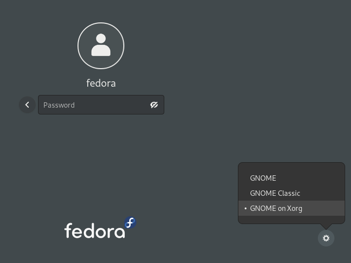

As you may know from my previous articles, my work laptop is an Ubuntu (22.04) laptop. However, on the rest of my devices
I use NixOS with Hyprland as my tiling window manager. I wanted to be able to use Hyprland on my laptop as well, 
I tried using Sway and, it worked mostly pretty well, but it was yet another to manage and there were some slight
differences. Also, I like the animations on Hyprland 😅.

So I had tried to work out how to install Hyprland on Ubuntu 22.04. I couldn't make it work via Nix/Home-manager.
There is this great gist for how to set it up on 
[Ubuntu 23.04](https://gist.github.com/Vertecedoc4545/3b077301299c20c5b9b4db00f4ca6000). However, some of the versions
available to me in the Ubuntu repository didn't match the versions required by Hyprland. Hyprland is bleeding edge
and themselves say they do not officially support Ubuntu.

In that gist above, one of the comments [^1] mentions [Pika OS](https://pika-os.com/) which builds Debian packages
for Hyprland (and all of it dependencies). So we can add Pika OS as one of our sources and install Hyprland.
To achieve this, I downloaded the [`dists/lunar/pika-sources.deb`](https://ppa.pika-os.com/dists/lunar/pika-sources.deb) (Where I assume
Lunar is based on Lunar Lobster, Ubuntu 23.04).

First we can see what it is going to install and where, by doing:

```bash
dpkg -c ./pika-sources.deb

drwxr-xr-x root/root         0 2022-10-01 13:50 ./
drwxr-xr-x root/root         0 2022-10-01 13:50 ./etc/
drwxr-xr-x root/root         0 2022-10-01 13:50 ./etc/init.d/
-rwxr-xr-x root/root       247 2022-10-01 13:50 ./etc/init.d/calamares-sources-undo
drwxr-xr-x root/root         0 2022-10-01 13:50 ./etc/rc2.d/
drwxr-xr-x root/root         0 2022-10-01 13:50 ./etc/rc3.d/
drwxr-xr-x root/root         0 2022-10-01 13:50 ./etc/systemd/
drwxr-xr-x root/root         0 2022-10-01 13:50 ./etc/systemd/system/
-rw-r--r-- root/root       522 2022-10-01 13:50 ./etc/systemd/system/steam-repos-fix.service
drwxr-xr-x root/root         0 2022-10-01 13:50 ./usr/
drwxr-xr-x root/root         0 2022-10-01 13:50 ./usr/share/
drwxr-xr-x root/root         0 2022-10-01 13:50 ./usr/share/apt-pika/
drwxr-xr-x root/root         0 2022-10-01 13:50 ./usr/share/apt-pika/apt/
drwxr-xr-x root/root         0 2022-10-01 13:50 ./usr/share/apt-pika/apt/apt.conf.d/
-rw-r--r-- root/root       146 2022-10-01 13:50 ./usr/share/apt-pika/apt/apt.conf.d/99steam-launcher
drwxr-xr-x root/root         0 2022-10-01 13:50 ./usr/share/apt-pika/apt/keyrings/
-rw-r--r-- root/root      1744 2022-10-01 13:50 ./usr/share/apt-pika/apt/keyrings/pika-keyring.gpg.key
drwxr-xr-x root/root         0 2022-10-01 13:50 ./usr/share/apt-pika/apt/preferences.d/
-rw-r--r-- root/root       282 2022-10-01 13:50 ./usr/share/apt-pika/apt/preferences.d/0-pika-radeon-settings
-rw-r--r-- root/root        91 2022-10-01 13:50 ./usr/share/apt-pika/apt/preferences.d/1-pika-ubuntu-settings
-rw-r--r-- root/root       102 2022-10-01 13:50 ./usr/share/apt-pika/apt/sources.list
drwxr-xr-x root/root         0 2022-10-01 13:50 ./usr/share/apt-pika/apt/sources.list.d/
-rw-r--r-- root/root       274 2022-10-01 13:50 ./usr/share/apt-pika/apt/sources.list.d/system.sources
drwxr-xr-x root/root         0 2022-10-01 13:50 ./usr/share/doc/
drwxr-xr-x root/root         0 2022-10-01 13:50 ./usr/share/doc/pika-sources/
-rw-r--r-- root/root       617 2022-10-01 13:50 ./usr/share/doc/pika-sources/changelog.Debian.gz
drwxr-xr-x root/root         0 2022-10-01 13:50 ./usr/share/dpkg/
drwxr-xr-x root/root         0 2022-10-01 13:50 ./usr/share/dpkg/scripts/
-rwxr-xr-x root/root       516 2022-10-01 13:50 ./usr/share/dpkg/scripts/steam-launcher.sh
-rwxr-xr-x root/root       643 2022-10-01 13:50 ./usr/share/dpkg/scripts/steamdeps
lrwxrwxrwx root/root         0 2022-10-01 13:50 ./etc/rc2.d/S01calamares-sources-undo -> ../init.d/calamares-sources-undo
lrwxrwxrwx root/root         0 2022-10-01 13:50 ./etc/rc3.d/S01calamares-sources-undo -> ../init.d/calamares-sources-undo
```

The main file being `sources.list.d/system.sources` which will add the Pika repository a source to our (apt) package 
manager. So after we download the pika-source file, we can then do:

```bash
# Assuming you are in the folder where you downloaded pika-sources.deb
dpkg-deb --fsys-tarfile pika-sources.deb | tar xv
sudo xcp ./usr/share/apt/source.list.d/system.sources /etc/apt/sources.list.d/system.sources
sudo apt update
sudo apt install hyprland xdg-desktop-portal-hyprland -y
```

This will install Hyprland and the desktop portal, which will allow us to do things like screen share-specific windows
on apps like Google Meet.

Finally, you can also remove the Pika sources because in my case it wanted to upgrade 1600 packages as it uses
Ubuntu 23.04 as a base. So wants to update numerous packages. To achieve this we do: `sudo rm /etc/apt/sources.list.d/system.sources`.

That's It! You should now have Hyprland installed and when you reboot, you should be able to select Hyprland in the
GDM login screen, after selecting the user, click the settings and then select Hyprland. An example below showing different
versions of Gnome.

 [^2]

 
 I originally used `dpkg` to install the deb it will overwrite
 your sources.list file. So make sure you revert back to the original version if you do that!


[^1]: https://gist.github.com/Vertecedoc4545/3b077301299c20c5b9b4db00f4ca6000?permalink_comment_id=4595603#gistcomment-4595603
[^2]: Image Source: https://docs.fedoraproject.org/en-US/quick-docs/configuring-xorg-as-default-gnome-session/

