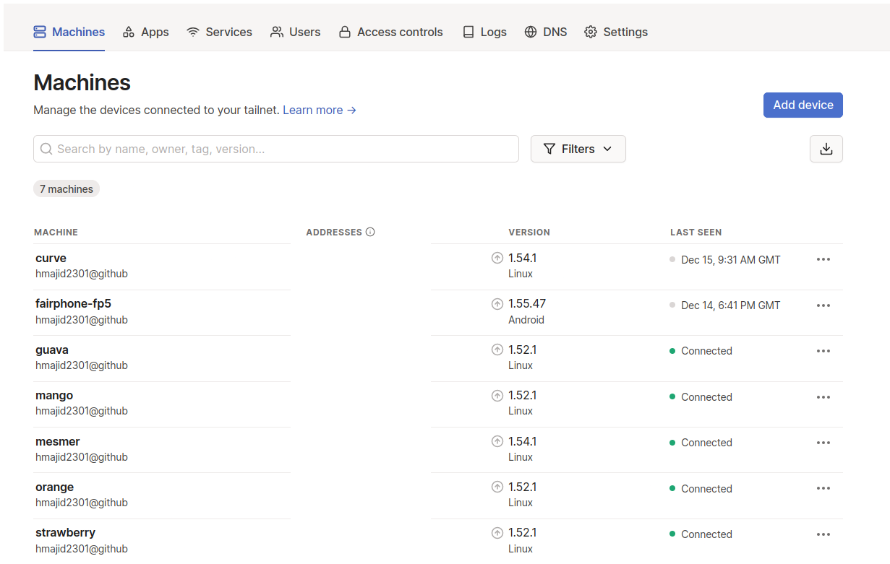

**TIL: How to Use Tailscale to Connect to K3S PI Cluster**

So what do we do if want to connect to our K3S cluster running our RPIs, but we are not on the same network/at home.
Well we can look to use a VPN, in this article we will be using [tailscale](https://tailscale.com/). It is super easy
to setup on NixOS, and we need very little config for Tailscale. It also has a generous free tier, which will be
more than enough for our home lab use case.

So essentially, what we will need to do is have a Tailscale service always running on each of PI hosts, though we
could have it running on our main control node only (called strawberry from me, see previous articles in this series 
for more context). Once we start the service we will need to auth with Tailscale the first time, manually though.

The device we want to connect to our cluster from will also need to be running the Tailscale VPN, but we only need it
running when we want to access our cluster. 

All we need to do is add a line to our `common.nix`, this line `services.tailscale.enable = true;`. We can then 
deploy this using Colmena like `colmena apply switch --build-on-target`. This will deploy tailscale onto each our PI 
cluster nodes.

Then to authenticate with Tailscale we can ssh to our node and run the following `sudo tailscale up`. We can then auth
in the browser by logging in. We can then also see the device on the Tailscale website.

Then where before I might use `strawberry.local` to connect now I can use `strawberry` when I am on the Tailscale VPN.
Note if you want self host rather than using Tailscale, there is an open source project called 
[headscale](https://github.com/juanfont/headscale).

That's it! We deployed Tailscale and can connect to our PI K3S cluster, from anywhere.
