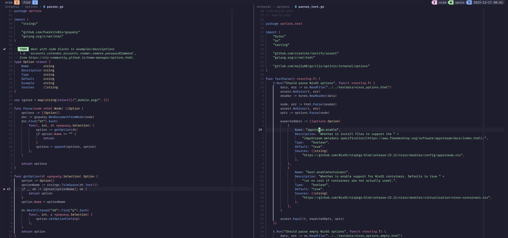

**TIL: How to Use Open Buffers When Debugging With Neovim's DAP Plugin**

I had an issue that whilst debugging my Golang tests in Neovim, the buffer I was focusing on would always change to 
the breakpoint. Even when the buffer was open and visible already, say I had the code with the breakpoint on the left 
buffer and the tests I was starting the debugger from on the right buffer.

You can see the example belows:

When I start the DAP debugger on the right hand side, by using it to debug the nearest tests, the buffer will change
to the breakpointed line. However I want it to use the open buffer on the left because it is already open.

To do this we need to update our Neovim options: `vim.o.switchbuf = "useopen,uselast"`. This will now behave as we 
want. Note `uselast`, here is the default value for this option. You can read more about by typing `:help 'switchbuf`.

That's it! We can now debugger our code and keep the layout we have.
