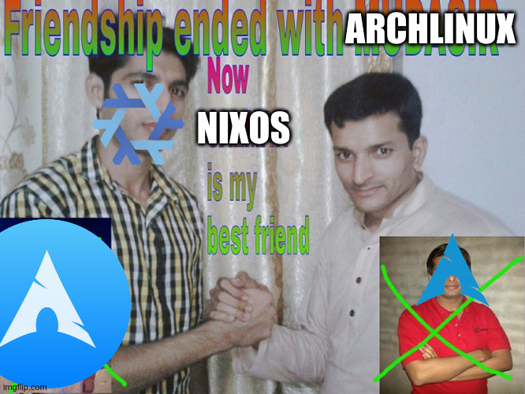

For once, I am actually doing a year in review, to go over some of the things I've learnt over the last year. 
Part of the reason is this has been probably my most transformative year since I have been a software engineer. 
I have become far more terminal development driven, if that is a phrase one can use. What I mean is I changed my 
development workflow to leverage being in the terminal more. I feel far more productive and efficient than I was at 
the beginning of the year, for what it's worth

The following sections will break down what I learnt, why I found it useful. The sections are ordered roughly in
the order I learnt the tool/thing throughout the year.

## Neovim

The first big change I made was in April. I moved away from using VS Code to Neovim, mostly to flex on other developers
(joking of course). I had a colleague who started to have a look at Neovim, and I was intrigued at the things you can 
now do in Neovim. It looked like it had all the main features I was using in VS Code.

I originally started using [Astronvim](https://astronvim.com/), but when I started adding my own plugins I found I broke it effortlessly, probably
a layer 8 issue. I then moved over to [Folke's LazyVim](https://www.lazyvim.org/), which had much better defaults and plugins for what I wanted.

Furthermore, I also took this as an opportunity to learn more vim binding and to become more efficient in vim. As I had got a bit 
complacent with my current knowledge of vim bindings and shortcuts to move around and edit code.

Eventually, I ended up creating my own configuration, which most people recommend trying to do. I ended up using NixVim 
to do this (more on NixOS later). But it was very useful to be able to see what Neovim could do, before I started 
on my own config.

Since VS Code and my Neovim config both use the same LSP behind the scenes gopls, for Golang development I wasn't really
missing out on any features that VS Code offered over Neovim. Except perhaps remote sharing.

So why use Neovim:

-  As most things with me and using Linux, I like to be able to customise and personalise things for myself
-  Requires fewer resources to run compared with my old editor
- Runs in the terminal so can use it with tmux
- Forced me to learn my tools a lot better

By staying in the terminal, it allowed me to use tmux with Neovim, and manage my different projects much easier. It also
made it a lot more efficient to jump between different projects. Which is very useful when working with microservices.

If you want to use Neovim, I recommend doing the following:

- learn vim bindings, use a plugin in your current editor
- use a distribution like LazyVim
- write your own config
- alongside this, look at other peoples' workflow and see what you like, i.e. using tmux.

Some of my favourite plugins:

- telescope of course
- dap for debugging
- neotest for testing
- oil, for managing folders and files
- codeium for AI completions

### Tmux

One of the main reasons I ended up moving to Neovim was that I was able to stay in the terminal more. I found a really
good workflow with Tmux. Where each folder/repository, would be a separate session in tmux. I would then use a the [
t smart session manager](https://github.com/joshmedeski/t-smart-tmux-session-manager), with the tmux resurrect and continuum plugins to help manage my sessions I have.

Tmux is a multiplexer, with a client server architecture, which means I can kill the terminal and the session still is 
alive on the server. It also means I could open terminal windows effortlessly. Creating splits with ease. It also 
stopped me from having a hundred VS Code instances open and trying to work out which one is the one I need. 

For me, whilst Neovim was really cool to learn, combining it with tmux was a real game changer for my workflow. It just 
made me feel so much more efficient, jumping between sessions, without needing a mouse being able to be more keyboard 
driven.

## Touch Typing

To become a more efficient developer, I also started to learn how to touch type properly, using all 5 of my fingers vs 
previously relying mostly on two fingers. Even though I could type at a decent speed of 80 WPM, I would make plenty of mistakes.
Eventually, it would be much better for my wrists and fingers to touch type properly. Using several tools such as 
typing club and monkey type. I was able to get back to my normal typing speed in a few months, which fewer mistakes.

Especially as I was now trying to use my vim bindings, and expanding my knowledge of vim shortcuts, I didn't want to have 
to think where certain letters were or go and redo a shortcut because I made a mistake.

If you don't know how to touch type, I would recommend spending the effort, Especially if you look down when you type 
it's better for you ergonomically and will be better for you eventually, I think.

## NixOS

One of the other significant changes was in May I moved from Arch (I used arch btw), to shock surprise NixOS. I divided straight 
into it. Which probably wasn't the cleverest thing I've ever done. As there was a steep learning curve. I've written 
some previous articles which go more into detail about NixOS and how I set it up.

The best thing about Nix was I can use declaratively set up my config, which makes it easier to keep multiple machines
in sync. I also think alongside home-manager it makes managing my user, such as installing software and config 
for the apps. So even when I use another OS, I can still use nix and share config between multiple machines.

At times, it does feel like I am fighting the OS, especially when the package I need is not in nixpkgs, but overall, I am 
happy to be able to keep all my config in code. Sync multiple devices. Also being able to revert to older 
generations, making it harder to break my system.

I think where nix is powerful is its development environments you can create using nix flakes. Which solves a 
lot of issues I had with dev containers. Making sure people have the same versions of the tools they require for a project.

So why use NixOS:

- declarative: put your config in code
- rollbacks: easy to rollback changes
- multiple versions of the same tool, installed

If you want to use NixOS, I recommend doing the following:

- Try nix package manager on your current setup
- Try NixOS in a VM
- Move to NixOS, installing via an ISO
- Look at nix flakes, for even more reproducibility

You can read more about my basic [setup here](https://haseebmajid.dev/posts/2023-10-24-part-2-how-to-setup-nixos-as-part-of-your-development-workflow/)

## Hyprland

Alongside moving to NixOS, soon after I moved away from Gnome to Hyprland I wanted to have another go at a tiling window manager.
I kept seeing people using Hyprland, I tried a tiling manager QTile but found it a pain to 
set everything up myself, that of a normal desktop environment. 

Hyprland is nice because Wayland support, you might be thinking, why not use sway. I ended up using Hyprland because 
the desktop sharing support was better with its own desktop portals fork. Allowing me to share a specific window 
rather than my entire screen. This made it more practical to use at work. It also has a few nice features that people like
when ricing, like rounded corners, gaps and also some slick animations.

Other than that, a tiling manager allows you  to customise your setup to almost exactly whatever you want, as you 
have to set up things like a notification daemon, app launcher and a status bar if you want one. It also allows us to 
be more keyboard focused.

I think Hyprland has helped me use the keyboard more, relying on the mouse less. Allowing to be organised more 
keeping different apps in different workspaces. Such as one for my main, another for the browser and for my to-dos etc.

You can read more about my [Hyprland setup here](https://haseebmajid.dev/posts/2023-11-15-part-3-hyprland-as-part-of-your-development-workflow/)

## Split Keyboard

Another one I copied from a colleague at work, he used a split keyboard so very late into the year, around December 
I decided to take the plunge and buy a ZSA Voyager. Split keyboards, also sometimes called ergonomic keyboards, have 
several benefits, here is a [link](https://www.youtube.com/watch?v=76eALNFp3kk) to the video that finally convinced me. 

The main advantages are because its split it opens up your chest, the keys are column staggered and so your fingers
just need to go up and down rather to the side. They are not cheap, however, and are quite an investment. So this 
It would be something I upgrade after having most of the rest of your setup, such as a mouse, monitors etc. As a stop 
gap mechanical keyboards are plenty affordable these days. You can get some fantastic ones cheapish, especially if 
you can get it during a sale.

## Desktop vs Laptop

I bought a framework laptop, with an eGPU and then removed my desktop, and have had two stints trying to just live using
my laptop. Which is cool as it's more portable and when it's on my desk I can make more of a workstation. Close the lid 
and connect it to all my peripherals, giving me a desktop like experience. Two monitors, keyboard, mouse, webcam and mic 
etc.

Especially with the AMD motherboard, I am even able to play some games with minimal lag on 4k monitors without an 
eGPU, such as gw2 and master duel (I know not very extensive games but still very cool).

I tried it earlier in the year and gave up on it and moved back to my desktop as it made gaming easier. But I am going 
to give it another crack, especially with an AMD board, making Guild Wars 2 playable.
