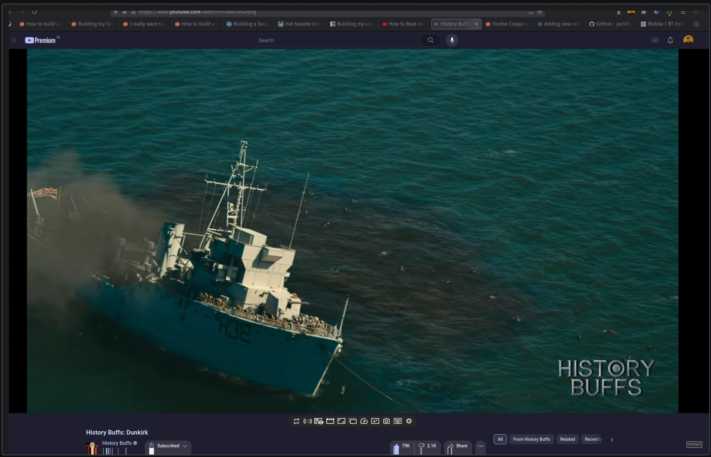
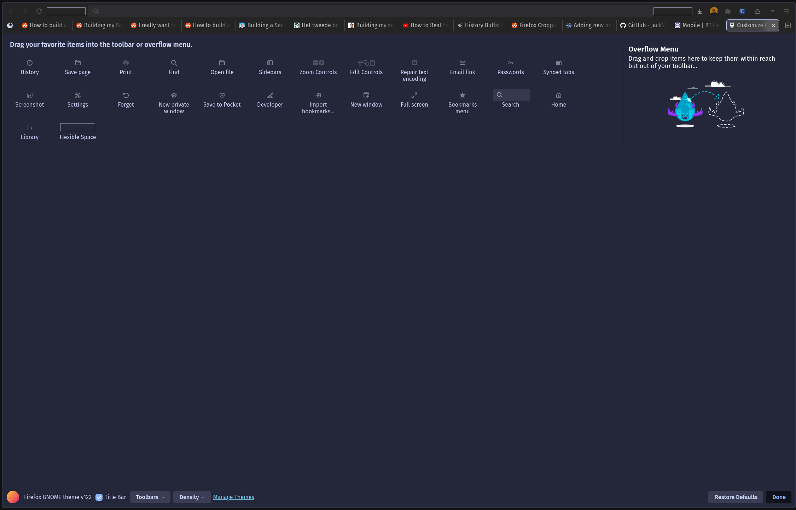

**TIL: How to Fix Firefox Rendering Bug in Hyprland**

Recently, I had an issue with my Ubuntu laptop running Hyprland, when running Firefox it had this ugly border around
it. Which looked something like this:



You can see a weird border around the browser, and if you try to view some of the context menus, they appear small and difficult to read.

## Fix

As per this [Reddit thread](https://old.reddit.com/r/hyprland/comments/18o8m8q/firefox_croppingbad_rendering/) [^1]. 
There are two fixes, one upgrade to version 0.33 which I could not easily do with Ubuntu. So I used the other fix,

- Right click on title bar
- Select `Customize Toolbar..`
- Then check `Title Bar`
    - You may have to full-screen the app to make it easier to select the title bar



### Hyprland Version

```bash
hyprctl version
Hyprland, built from branch HEAD at commit 5b8cfdf2efc44106b61e60c642fd964823fd89f3  (props: bump ver to v0.31.0).
Tag: v0.31.0

flags: (if any)
debug
```

[^1]: Reddit Post with Fix: https://old.reddit.com/r/hyprland/comments/18o8m8q/firefox_croppingbad_rendering/

