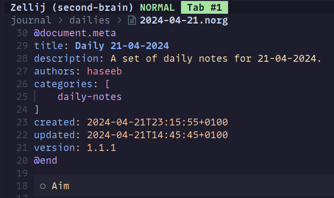

**TIL: How to Fix Neorg Metadata Tree Sitter Issues With NixVim**

If you are like me, you may be configuring your Neovim configuration using NixVim. Which is a "framework" making it
easier to configure Neovim using mostly Nix configuration. Allowing us to keep most of our config in one language,
at least in my case.

I started using Neorg to manage my notes and to-do lists in my "second-brain", but noticed that the metadata part
was not being highlighted as I expected.

My config looked something like:

```nix
{
  programs.nixvim = {
    plugins = {
      neorg = {
        enable = true;
        lazyLoading = true;
        modules = {
          # ...
        };
      };

      treesitter = {
        grammarPackages = with config.programs.nixvim.plugins.treesitter.package.builtGrammars; [
          norg
        ];
      };
    };
  };
}
```

Turns out there is another tree sitter package for the n
Neorg metadata, but this is not available with nvim-treesitter.
Hence, also not available with Nixvim. I was able to resolve my issue my using the tree-sitter specific grammar like so:

```nix {hl_lines="13-16"}
{
  programs.nixvim = {
    plugins = {
      neorg = {
        enable = true;
        lazyLoading = true;
        modules = {
          # ...
        };
      };

      treesitter = {
        grammarPackages = with pkgs.tree-sitter-grammars; [
          tree-sitter-norg
          tree-sitter-norg-meta
        ];
      };
    };
  };
}
```

It looks like this. That's it!


