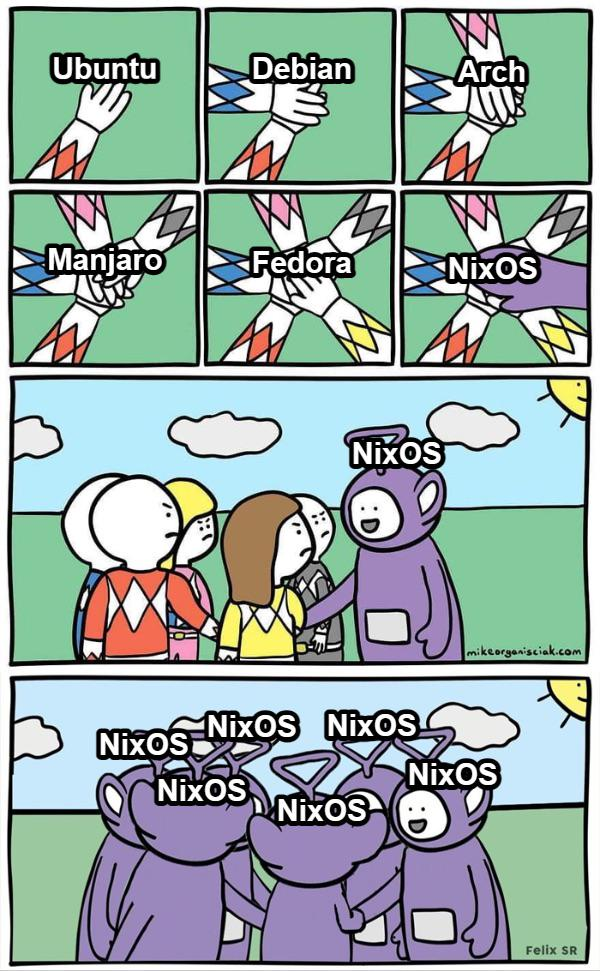

I wanted to do a short article showing you how you can use your Nix config to install NixOS on a new device. Have your
device setup with NixOS in a few commands with all the packages and tooling you want.

Previously I was creating my own ISO and then burning that to a USB and using that USB as live media to install my config.
I had a [ custom script ](https://gitlab.com/hmajid2301/dotfiles/-/blob/3371d7774c133a36d4986a9dcaeb972d4e4638a2/hosts/iso/configuration.nix#L73)
`nix_installer`, which would run automatically when you loaded into the gnome shell.

However, I think I have found a slightly better way to do this, recently (earlier this week). This is the process I used
recently to reinstall my workstation. We will be doing this using this really cool tool
[nixos-anywhere](https://github.com/nix-community/nixos-anywhere). Which involves installing our config using SSH.

> Note you can still generate an ISO using the snowfall library, but I haven't tested it yet with my config.


## What do you need?

- Nix configuration: The nix configuration we want to install
- Two devices
 - Target device: My personal desktop, this is where we will install the config onto
   - Need to be able to connect to this from the source device
 - Source device: My laptop, which can connect to my desktop to install the config
- Disko configuration: So we know how to partition our disk(s)


## Disko
To partition our disks, we can use the fantastic [disko tool](https://github.com/nix-community/disko). Which allows us to
declaratively declare how to partition our disk(s), in nix configuration. Having a look at an example, one I have:

```nix
{
  disko.devices = {
    disk = {
      nvme0n1 = {
        type = "disk";
        device = "/dev/nvme0n1";
        content = {
          type = "gpt";
          partitions = {
            ESP = {
              label = "boot";
              name = "ESP";
              size = "512M";
              type = "EF00";
              content = {
                type = "filesystem";
                format = "vfat";
                mountpoint = "/boot";
                mountOptions = [
                  "defaults"
                ];
              };
            };
            luks = {
              size = "100%";
              label = "luks";
              content = {
                type = "luks";
                name = "cryptroot";
                extraOpenArgs = [
                  "--allow-discards"
                  "--perf-no_read_workqueue"
                  "--perf-no_write_workqueue"
                ];
                # https://0pointer.net/blog/unlocking-luks2-volumes-with-tpm2-fido2-pkcs11-security-hardware-on-systemd-248.html
                settings = {crypttabExtraOpts = ["fido2-device=auto" "token-timeout=10"];};
                content = {
                  type = "btrfs";
                  extraArgs = ["-L" "nixos" "-f"];
                  subvolumes = {
                    "/root" = {
                      mountpoint = "/";
                      mountOptions = ["subvol=root" "compress=zstd" "noatime"];
                    };
                    "/home" = {
                      mountpoint = "/home";
                      mountOptions = ["subvol=home" "compress=zstd" "noatime"];
                    };
                    "/nix" = {
                      mountpoint = "/nix";
                      mountOptions = ["subvol=nix" "compress=zstd" "noatime"];
                    };
                    "/persist" = {
                      mountpoint = "/persist";
                      mountOptions = ["subvol=persist" "compress=zstd" "noatime"];
                    };
                    "/log" = {
                      mountpoint = "/var/log";
                      mountOptions = ["subvol=log" "compress=zstd" "noatime"];
                    };
                    "/swap" = {
                      mountpoint = "/swap";
                      swap.swapfile.size = "64G";
                    };
                  };
                };
              };
            };
          };
        };
      };
    };
  };

  fileSystems."/persist".neededForBoot = true;
  fileSystems."/var/log".neededForBoot = true;
}
```

Here we create a LUKS encrypted using BTRFS. Where we have a bunch of sub volumes intended to be used for impermanence
setup and we even have a swap sub volume.

The cool thing about this it removes the manual partition we would have to-do and now nixos-anywhere can do it for us.
In our system configuration, the disk config is imported like so, in my snowfall-based nix config `systems/x86_64-linux/workstation/default.nix`.

```nix
{
  pkgs,
  lib,
  ...
}: {
  imports = [
    ./hardware-configuration.nix
    ./disks.nix
  ];
}
```


## Install

Assuming the target device has no OS on it yet, you can simply boot from the normal NixOS ISO (say gnome). Which provides
us an SSH service we can connect to from our source device (my laptop). You can see more details
[here](https://github.com/nix-community/nixos-anywhere/blob/main/docs/howtos/no-os.md#installing-on-a-machine-with-no-operating-system).

### On target device

- Boot from live media ISO
- Grab IP address `ip addr`
  - Likely something like `192.168.1.8` (see output below)
- Copy our public SSH keys of the source device and put them into the `authorized_keys`
  - In my case, I can grab them from GitHub
    - `mkdir -p ~/.ssh curl https://github.com/hmajid2301.keys > ~/.ssh/authorized_keys`
- Now we can SSH from source to target


```bash {hl_lines="10"}
 ip addr
1: lo: <LOOPBACK,UP,LOWER_UP> mtu 65536 qdisc noqueue state UNKNOWN group default qlen 1000
    link/loopback 00:00:00:00:00:00 brd 00:00:00:00:00:00
    inet 127.0.0.1/8 scope host lo
       valid_lft forever preferred_lft forever
    inet6 ::1/128 scope host noprefixroute
       valid_lft forever preferred_lft forever
2: enp16s0: <BROADCAST,MULTICAST,UP,LOWER_UP> mtu 1500 qdisc mq state UP group default qlen 1000
    link/ether 74:56:3c:bb:2f:41 brd ff:ff:ff:ff:ff:ff
    inet 192.168.1.8/24 brd 192.168.1.255 scope global noprefixroute enp16s0
       valid_lft forever preferred_lft forever
    inet6 2a0a:ef40:10f9:e01:b554:c3ad:550d:8fcd/64 scope global temporary dynamic
       valid_lft 84920sec preferred_lft 2120sec
    inet6 2a0a:ef40:10f9:e01:7135:7af1:7f82:9ac/64 scope global dynamic mngtmpaddr noprefixroute
       valid_lft 84920sec preferred_lft 2120sec
    inet6 fe80::7203:6b95:514e:c231/64 scope link noprefixroute
       valid_lft forever preferred_lft forever
```

### On source device

```bash
git clone git@github.com:hmajid2301/dotfiles.git ~/dotfiles/
cd dotfiles

nix develop
nixos-anywhere -- --flake '.#workstation' nixos@192.168.1.8
```

Then follow and answer the question it asks you, like the password to use for LUKS. This is basically a really nice way
we can now install NixOS onto a new or existing device. With minimal effort, in my opinion.



[credit for meme](https://old.reddit.com/r/NixOS/comments/1bfc9tm/meme_nixos_infection/)
