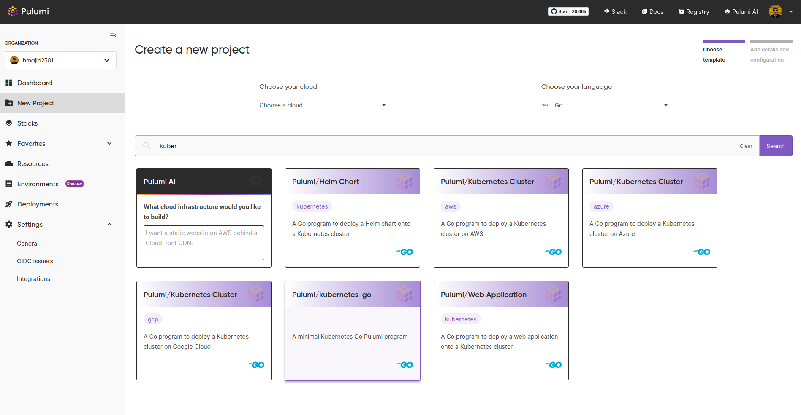
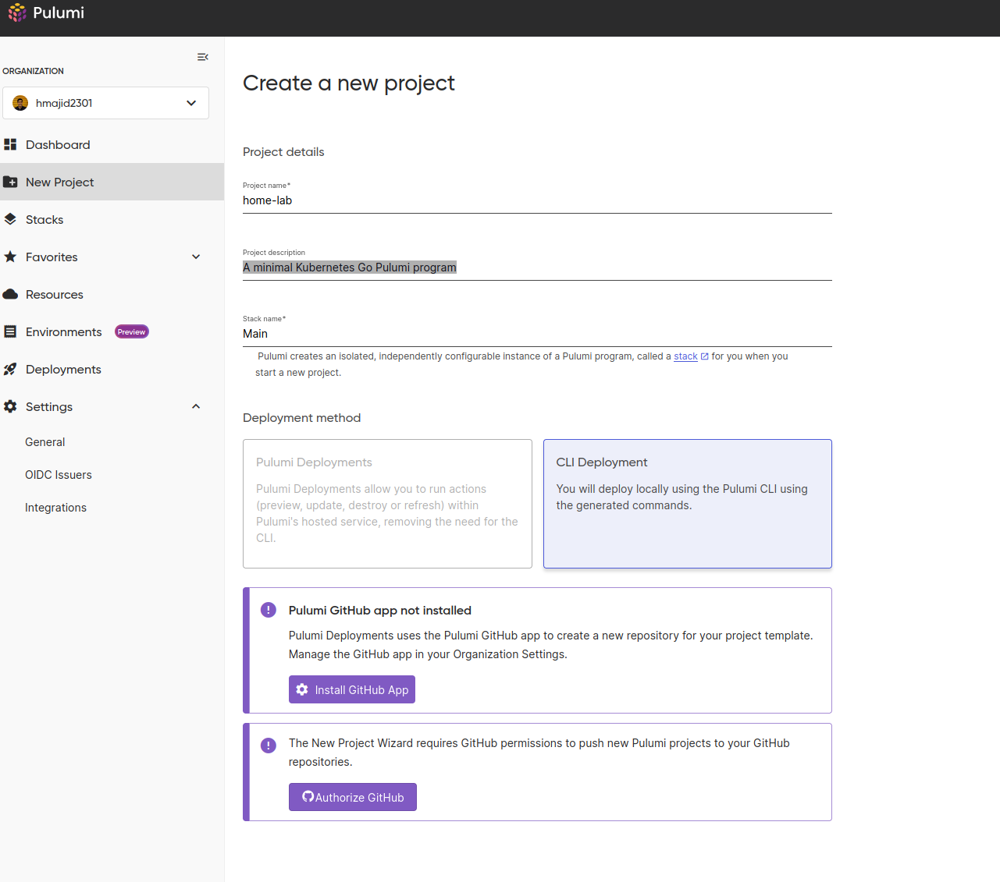
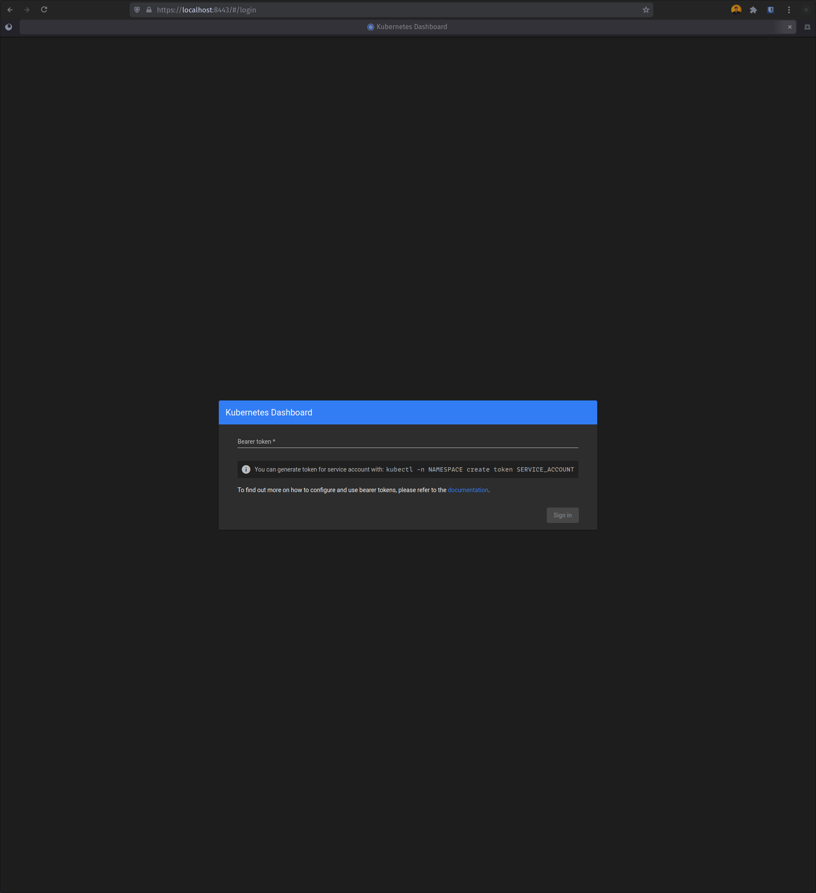
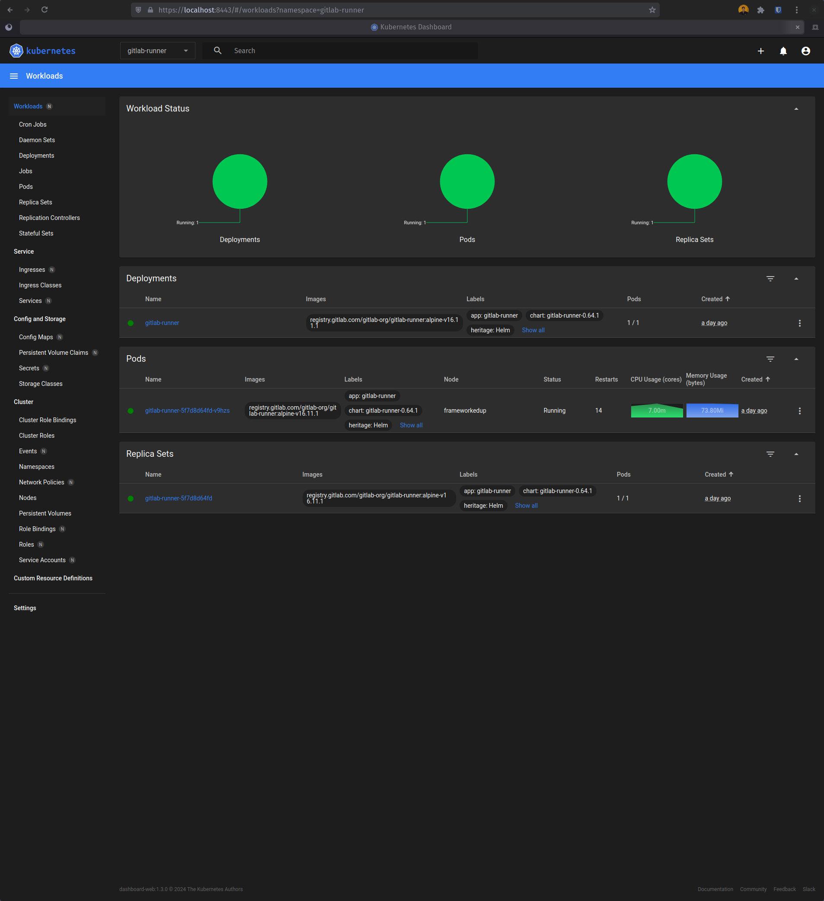


I don't know a ton about Kubernetes. I am still learning, hence this home-lab project. So there may be better ways
to do stuff that I have described below. If that is the case, please let me know! Just take what I say with a pinch of
salt.


It's been a while since I made an update about my home lab, also an aside, I should've given this series a better name.
So recently, I finally went back to my PI cluster and started to actually setup properly. The first thing I decided
to put on it was the Kubernetes dashboard. I could get a nice GUI look into what is happening with my cluster at a
glance. It also looked simple to deploy.

I want to have all my k8s config in code, so I decided to deploy it with helm and Pulumi. One of the nice things about
Pulumi is I can configure resources in a programming language I know, i.e. Go vs having to use Terraform. Which I am
sort of familiar with but no expert.

So, if you have followed my previous posts, we have a working PI k3s cluster running on NixOS. We have also enabled Tailscale
to make it easier to connect to. Now to actually put "things" on our cluster.

## Getting Started
If you are using Nix we can use a flake devshell like so to install Pulumi and some other useful tools. In `flake.nix`

```nix {hl_lines=[16-17]}
{
  description = "Developer Shell";

  inputs = {
    nixpkgs.url = "github:nixos/nixpkgs/nixos-unstable";
  };

  outputs = {nixpkgs, ...}: {
    devShell.x86_64-linux = let
      pkgs = nixpkgs.legacyPackages.x86_64-linux;
    in
      pkgs.mkShell {
        packages = with pkgs; [
          sops
          go
          pulumi
          pulumiPackages.pulumi-language-go
          kubernetes-helm
          k9s
          kubectl
        ];
      };
  };
}

```

Combined with direnv (`.envrc`), we can load into this shell automatically when we change directories to this folder.
So we don't need to have these packages installed globally, we can have them just setup when we need them for this project.

However, it doesn't really matter whether you use Nix or not. You just need to work out how to install Pulumi on your machine.
One thing to remember is this is on our development machine, which will connect to our cluster and deploy our config.
We don't need these tools installed on our PI cluster.


## Pulumi

We can either use Pulumi locally, i.e. store state locally. Or use their managed service, to make my life easier
I created a Pulumi account. Just note, you don't need to use their propriety managed platform if you don't want to.
It just the easiest way to get started and not have to worry about sharing state between machines.
This includes state so that Pulumi knows what is installed on the k3s cluster.

### Managed Platform
So first create an account or login to Pulumi. Then we need to create a new project on Pulumi I am going to create a
new Kubernetes project like so:





We now have a new project and stack. I still fully understand the difference, but it seems we can have multiple stacks
per project. So perhaps this could be useful if we had different environments, such as dev/prod. But we want to keep
them in the same project.

In our case, we will keep it simple with a project called `home-lab` and stack called `main` (I am bad at naming things).
Then go to your home-lab project folder, the one above with the `flake.nix` at the root. Then run
`pulumi new kubernetes-go -s hmajid2301/home-lab/main`. Replace the 2nd part with your own username/project/stack.
This will now give us some boilerplate and set up a `go.mod`, `go.sum` and `main.go` file we can use.


### Test Deploy


Pulumi will the default KUBECONFIG found typically at `~/.kube/config`. In my case, I use `~/.kube/config.personal`
so I set the `KUBECONFIG` environment variable inside my `flake.nix` to point to this config file.


We can then do deploy what is in our `main.go` with `pulumi up`, which will deploy a new nginx app.

```go
package main

import (
	appsv1 "github.com/pulumi/pulumi-kubernetes/sdk/v4/go/kubernetes/apps/v1"
	corev1 "github.com/pulumi/pulumi-kubernetes/sdk/v4/go/kubernetes/core/v1"
	metav1 "github.com/pulumi/pulumi-kubernetes/sdk/v4/go/kubernetes/meta/v1"
	"github.com/pulumi/pulumi/sdk/v3/go/pulumi"
)

func main() {
	pulumi.Run(func(ctx *pulumi.Context) error {

		appLabels := pulumi.StringMap{
			"app": pulumi.String("nginx"),
		}
		deployment, err := appsv1.NewDeployment(ctx, "app-dep", &appsv1.DeploymentArgs{
			Spec: appsv1.DeploymentSpecArgs{
				Selector: &metav1.LabelSelectorArgs{
					MatchLabels: appLabels,
				},
				Replicas: pulumi.Int(1),
				Template: &corev1.PodTemplateSpecArgs{
					Metadata: &metav1.ObjectMetaArgs{
						Labels: appLabels,
					},
					Spec: &corev1.PodSpecArgs{
						Containers: corev1.ContainerArray{
							corev1.ContainerArgs{
								Name:  pulumi.String("nginx"),
								Image: pulumi.String("nginx"),
							}},
					},
				},
			},
		})
		if err != nil {
			return err
		}

		ctx.Export("name", deployment.Metadata.Name())

		return nil
	})
}
```


### Dashboard
However, we want to deploy the Kubernetes dashboard. So let's do the following, create a new file called `dashboard.go`.

```go

func addDashboard(ctx *pulumi.Context) error {}
```

We will call this function from our `main.go` like:

```go

package main

import (
	"github.com/pulumi/pulumi/sdk/v3/go/pulumi"
)

func main() {
	pulumi.Run(func(ctx *pulumi.Context) error {
		err := addDashboard(ctx)
		if err != nil {
			return err
		}

		return nil
	})
}
```

Now when we run `pulumi up`, it will look at our `main.go` and then call the `addDashboard` function.
Now let's create all the specific resources we need for the dashboard.


```go

func addDashboard(ctx *pulumi.Context) error {
	namespace := "monitoring"

	_, err := helmv3.NewChart(ctx, "kubernetes-dashboard", helmv3.ChartArgs{
		Chart: pulumi.String("kubernetes-dashboard"),
		FetchArgs: helmv3.FetchArgs{
			Repo: pulumi.String(`https://kubernetes.github.io/dashboard/`),
		},
		Namespace: pulumi.String(namespace),
	})
	if err != nil {
		return err
	}

    // ...
}
```
First let's define a namespace variable, this is the namespace in Kubernetes that the dashboard will be deployed to.
I am going to create a new namespace `monitoring`. Then we install a new helm chart, which provide an easy way to install
applications into Kubernetes.  Whilst also providing us with some options to tweak the application to our liking.

Normally, we could lock our dependencies using a `chart.lock` file; however, it seems Pulumi does not respect this at
the moment [^1]. This is enough to get the dashboard working. We could do a `pulumi up`.

Then after the deployment check the pods using `kubectl get pods -n monitoring`.

```bash
> kubectl get pods -n monitoring
NAME                                                    READY   STATUS    RESTARTS       AGE
kubernetes-dashboard-metrics-scraper-7f6f977dc9-n7mhn   1/1     Running   1 (122m ago)   38h
kubernetes-dashboard-web-f5d66867c-sk9ms                1/1     Running   1 (122m ago)   38h
kubernetes-dashboard-auth-9688d4ccf-ntdm6               1/1     Running   1 (122m ago)   38h
kubernetes-dashboard-kong-75bb76dd5f-k29x7              1/1     Running   1 (122m ago)   38h
kubernetes-dashboard-api-7dc9dc68df-xrfs7               1/1     Running   2 (119m ago)   38h
```


However, to have permissions to login into the dashboard via the web GUI we need to create some more resources.

```go

func addDashboard(ctx *pulumi.Context) error {
	namespace := "monitoring"

    // ...

	_, err = rbacv1.NewClusterRoleBinding(ctx, "cluster-admin-binding", &rbacv1.ClusterRoleBindingArgs{
		Metadata: metav1.ObjectMetaArgs{
			Name: pulumi.String("admin-user"),
		},
		RoleRef: rbacv1.RoleRefArgs{
			Name:     pulumi.String("cluster-admin"),
			ApiGroup: pulumi.String("rbac.authorization.k8s.io"),
			Kind:     pulumi.String("ClusterRole"),
		},
		Subjects: rbacv1.SubjectArray{
			rbacv1.SubjectArgs{
				Kind:      pulumi.String("ServiceAccount"),
				Name:      svc.Metadata.Name().Elem(),
				Namespace: pulumi.String(namespace),
			},
		},
	})
	if err != nil {
		return err
	}

    return nil
}
```

What we are doing here is creating a role binding, for a new admin-user, which has full privilege to modify the cluster.
Likely later we will want to change this to a read-only user. As we are only accessing the dashboard with this user.

You can see the equivalent YAML we are applying here [^2]:

```yaml
apiVersion: v1
kind: ServiceAccount
metadata:
  name: admin-user
  namespace: kubernetes-dashboard
---
apiVersion: rbac.authorization.k8s.io/v1
kind: ClusterRoleBinding
metadata:
  name: admin-user
roleRef:
  apiGroup: rbac.authorization.k8s.io
  kind: ClusterRole
  name: cluster-admin
subjects:
- kind: ServiceAccount
  name: admin-user
  namespace: kubernetes-dashboard
```


Then run `pulumi up`, to create these resources again.
```bash
# Copy JWT to clipboard that we use to login
kubectl -n monitoring create token admin-user | wl-copy

# Setup port forwarding so we can access the proxy pod locally on httsp://localhost:8443
kubectl -n monitoring port-forward services/kubernetes-dashboard-kong-proxy 8443:443
```

After that, we can get a secret token, we will need to log in to the dashboard. Then we port forward to the proxy pod,
so we can now access the dashboard at `https://localhost:8443`. Ignore the SSL/TLS warnings, as the certificates are
self-signed. I will likely do a post about how we can fix this later, once I have figured it out myself.





That's it! We've deployed something to our Kubernetes cluster, woo-hoo!!!!

[^1]: https://github.com/pulumi/pulumi-kubernetes/issues/2669
[^2]: https://upcloud.com/resources/tutorials/deploy-kubernetes-dashboard
