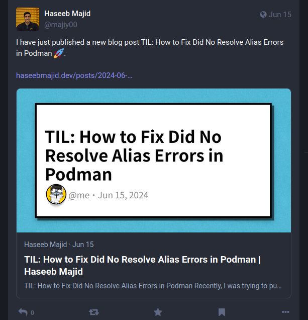

In this post, I will describe how I went about replacing a Python with a bash liner and how it decreased the runtime from 30 seconds to 1 second

## Background

For this blog, I used to have a Python script which I would use to generate open graph images. These are images you sometimes see in apps when you share a link. For example:



Essentially, what it would do is go through every post in my blog repository.
Then run a go program to generate the open graph images based on the markdown
front matter.

Where the structure of my blog looks like:

```bash
├── 2024-05-27-how-i-fixed-hibernation-on-my-nixos-machine
│  ├── images
│  │  └── cover.png
│  └── index.md
├── 2024-06-02-til-how-to-fix-dns-resolution-issues-in-k3s-related-to-flannel-networking
│  ├── images
│  │  └── cover.png
│  └── index.md
├── 2024-06-15-til-how-to-fix-did-no-resolve-alias-errors-in-podman
│  ├── images
│  │  └── cover.png
│  └── index.md
├── 2024-06-17-migrating-my-homelab-to-flux
│  ├── images
│  │  └── cover.png
│  └── index.md
└── 2024-06-30-rewriting-a-python-script-as-a-bash-one-liner
   ├── images
   │  └── cover.png
   └── index.md
```

Each post gets its own folder, where the image generated is called cover.png.
It uses the front matter in the index.md to generate the open graph image.

## How?

### python

To generate the open graph images, I forked this go "script" called tcardgen you can find my version
[here](https://github.com/hmajid2301/tcardgen) [^1]. Where the python script looked like:


```python
import os
from pathlib import Path
import subprocess
import sys

def create_og_image(full_path):
    if os.path.isdir(full_path):
        Path(f"{full_path}/images").mkdir(parents=True, exist_ok=True)
        generate_og = f"tcardgen -c scripts/og/config.yaml --template=scripts/og/template.png -f scripts/og/fonts/ {full_path}/index.md -o {full_path}/images/cover.png"
        print(full_path)
        print(subprocess.Popen(generate_og, shell=True, stdout=subprocess.PIPE).stdout.read())

if sys.argv[1] == "all":
    content_path = 'content/posts/'
    for path in os.listdir(content_path):
        full_path = os.path.join(content_path, path)
        create_og_image(full_path)
        print("\n\n")
else:
    full_path = sys.argv[1]
    create_og_image(full_path)
```

https://explainshell.com/explain?cmd=ls+content%2Fposts%2F+%7C+parallel+%27mkdir+-p+content%2Fposts%2F%7B%7D%2Fimages+%26%26+tcardgen+-c+scripts%2Fog%2Fconfig.yaml+--template%3Dscripts%2Fog%2Ftemplate.png+-f+scripts%2Fog%2Ffonts%2F+content%2Fposts%2F%7B%7D%2Findex.md+-o+content%2Fposts%2F%7B%7D%2Fimages%2Fcover.png%27
Again, just going through each folder in content/posts/, where each folder is its own blog post.
It was taking about 30 seconds to run on for every blog post, i.e. `python ./scripts/og/generate "all"`.

### bash

The bash script looked like [^2]:

```bash
ls content/posts/ | parallel 'mkdir -p content/posts/{}/images && tcardgen -c scripts/og/config.yaml --template=scripts/og/template.png -f scripts/og/fonts/ content/posts/{}/index.md -o content/posts/{}/images/cover.png'
```

Breaking this down:

- `ls content/posts/`: Lists all blog posts in a folder.
- `| parallel`: We pipe this output to the parallel command which will then run an arbitrary command we pass it, in parallel, which each of the inputs. Where each line from the `ls` is a separate input (separate blog post).
- `mkdir -p content/posts/{}/images`: Creates an images' folder if it doesn't exist. Where `{}` is the folder name taken from the input, i.e. the ls content/posts
- `tcardgen ...`: Is the specific used to generate open graph image from our index.md front matter. Again, it uses `{}` as the folder name.


I am by no means a bash expert, and it is likely the script above can be improved. But it is good enough for my use case at the moment.



## Why move to bash?


In theory, I would only need to run this once when I first create a blog post. However, sometimes you end up changing
the title or the date, and then need to generate the image again. And to be honest, I was too lazy to run it in a specific
folder and would just let it run on everything.

This had the added benefit it would also fix any images that I forgot to update. Now 30 seconds isn't long, but I
thought it's basically just looping through a folder, just to do fork a child process to run a go binary.
This will probably be faster in Bash. Also had been watching the [Primeagen](https://github.com/ThePrimeagen) who had been talking about learning
your tools better. So I thought adding parallel as well would just speed it up.

Now there is less code in the project, one fewer script to maintain. Anyone else forking this repository won't need python just to run a simple script as well.

That's it! A rather boring article about doing a small improvement, by moving a script from Python to a bash one-liner.

## Further

Some things I would like to add to my blog repository include:

 - Add this to CI, where if any file's change fails CI, i.e. open graph images aren't up-to-date
 - Add it as a pre-commit hook but just for files that changed

[^1]: [Original](https://github.com/Ladicle/tcardgen)
[^2]: [ExplainShell for the bash command](https://explainshell.com/explain?cmd=ls+content%2Fposts%2F+%7C+parallel+%27mkdir+-p+content%2Fposts%2F%7B%7D%2Fimages+%26%26+tcardgen+-c+scripts%2Fog%2Fconfig.yaml+--template%3Dscripts%2Fog%2Ftemplate.png+-f+scripts%2Fog%2Ffonts%2F+content%2Fposts%2F%7B%7D%2Findex.md+-o+content%2Fposts%2F%7B%7D%2Fimages%2Fcover.png%27)
