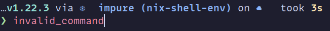
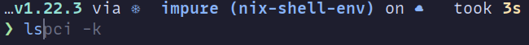
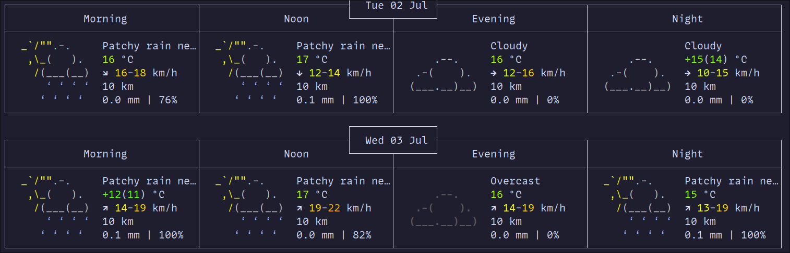
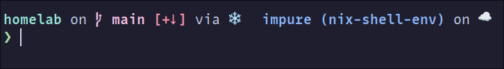

After a long break, I am again writing about my workflow. The big issue I have with this series is that my workflow is
kind of always in flux and changing. Which maybe is a bad thing. I just need to pick some tools and stick to it.
Rather than trying four different terminal emulators, i.e. alacritty, kitty, foot and wezterm.

However, over the last ~5ish years, one thing that has remained pretty constant is my use of [fish](https://github.com/fish-shell/fish-shell) shell.
In this post, I will go over why I stick with fish, and how I have set it up for my own use case.


## Caveat
One big downside to fish shell is that it is not POSIX complaint. Without going to into details, what that basically
means is that some commands/syntax of other shells, mainly bash and zsh. It is not fully compatible with fish shell.

So, sometimes if you are copying a command on the internet, it may not work, or fish will throw an error. There are
some ways around this, though. But it is important to realise that this could cause issues. For this reason, some people
don't really think fish shell is a real shell. Which I disagree with myself.


##  Why fish shell?

So why fish shell? Well, it's a good question., I like most people, started using bash when I started my
programming journey. Which happened to be around the same time I also started learning Linux (at university).

Bash was mostly fine, I mean I remember when I learnt you could press tab to auto-complete commands, mind blown for sure.
I think I first saw fish shell, when I was randomly perusing through random YouTube videos about Linux. I remember
finding the joke on their website about it being a shell designed for the 90s, hilarious.

Until this video, I was pretty happy with bash, even using the default prompt, but seeing how other people customised
their shell, I was intrigued. The main feature of the shell that caught my attention was the colouring of commands when
a binary/script exists. If a binary is not found in your PATH, it would be red else blue, for example.




One other thing I liked is it shows you a command you wish to run (nothing to do with AI). But the last similar
command, you can see in the image above with `ls` and `lscpi`.

Essentially, I like that fish shell feels fast to me, and has a bunch of features built in I think are really cool.


### ZSH

I found out later that you could get most of these features in ZSH as well. Using 3/4 plugins, and make it just like
fish shell. This was a few years ago and the plugins may have improved however at the time, I noticed my shell was a
big slower. Enough where it bothered me, but maybe fine for some people. I also noticed, the colour `zsh-syntax-highlighting`.
It was as good as the built-in fish one.

Again, just something to keep in mind, you can get a "fish like" experience on ZSH and potentially the plugins are better.
You don't notice any difference.


## How I configured it?

[My fish config, at the time of writing this](https://gitlab.com/hmajid2301/dotfiles/-/blob/d62db156dc89ec6ea3b30f479fa7197c8bcafd4a/modules/home/cli/shells/fish/default.nix).

As you can probably imagine, I use nix to configure my fish shell. Using a similar format to my other modules;

```nix {hl_lines=[16]}
{
  pkgs,
  lib,
  config,
  host,
  ...
}:
with lib;
with lib.nixicle; let
  cfg = config.cli.shells.fish;
in {
  options.cli.shells.fish = with types; {
    enable = mkBoolOpt false "enable fish shell";
  };

  config = mkIf cfg.enable {
  }
}

To use it in my config I enable it like so `cli.shells.fish.enable = true`;

```

### Shell Setup
```nix
{
    interactiveShellInit = ''
        ${pkgs.nix-your-shell}/bin/nix-your-shell --nom fish | source
    ''
}
```

We use this package so that when we run certain nix commands, we stay within the fish shell. For example, `nix-shell -p neovim`.
Normally, that command would drop us into a bash shell. It also remembers the fish shell's history we were just in.
For example, when we press the up key to go back to previous command. We also use `--nom` so we have the nix output monitor.
Which provides a nicer output when building packages.

```nix
{
    interactiveShellInit = ''
        fish_vi_key_bindings
        set fish_cursor_default     block      blink
        set fish_cursor_insert      line       blink
        set fish_cursor_replace_one underscore blink
        set fish_cursor_visual      block
        bind --mode insert --sets-mode default jk repaint
    ''
}
```
One really cool thing you can do in most shells is enabling vim mode, so you can use vim commands to navigate. For example,
we can select things using visual mode. Or jumping to the start of the line `^`.

The commands above just set up what the cursor looks like in different modes, i.e. block cursor in visual mode.
Then we also have a command `jk`, to jump into normal mode. Acts like an escape. Though I use this a lot less now
I have a split keyboard and the escape key is on my thumb cluster.

```nix
{
    interactiveShellInit = ''
        set -Ux fifc_editor nvim
        set -U fifc_keybinding \cx
        bind \cx _fifc
        bind -M insert \cx _fifc
    ''
}
```

In another block, I have the following, so I can use `fifc` with `ctrl + x`, instead of tab complete, which I found annoying.
You can read about `fifc` in the plugins section below.
### Plugins

Some of the plugins I use!

- `bass`: Allows us to run bash utilities in fish shell
- `fzf-fish`: Integrates fish shell with FZF, really useful for improved command history search. `ctrl + r`
- `git-abbr` & `kubectl-abbr`: Abbreviations available to me, i.e. `gco` -> `git checkout`
- `fifc`: Use FZF to auto-complete CLI arguments/options
    - `nix.fish`: Very useful when using with nix shell, would usually change to bash now keeps in fish and remembers the history i.e `nix-shell -p neovim`


```nix
{
  plugins = [
    {
      name = "bass";
      inherit (pkgs.fishPlugins.bass) src;
    }
    {
      name = "fzf-fish";
      inherit (pkgs.fishPlugins.fzf-fish) src;
    }
    {
      name = "fifc";
      inherit (pkgs.fishPlugins.fifc) src;
    }
    {
      name = "kubectl-abbr";
      src = pkgs.fetchFromGitHub {
        owner = "lewisacidic";
        repo = "fish-kubectl-abbr";
        rev = "161450ab83da756c400459f4ba8e8861770d930c";
        sha256 = "sha256-iKNaD0E7IwiQZ+7pTrbPtrUcCJiTcVpb9ksVid1J6A0=";
      };
    }
    {
      name = "git-abbr";
      src = pkgs.fetchFromGitHub {
        owner = "lewisacidic";
        repo = "fish-git-abbr";
        rev = "dc590a5b9d9d2095f95f7d90608b48e55bea0b0e";
        sha256 = "sha256-6z3Wr2t8CP85xVEp6UCYaM2KC9PX4MDyx19f/wjHkb0=";
      };
    }
  ];
}
```

### Abbreviations

Abbreviations are like aliases except when you are done, it will turn itself to the actual command, i.e. you could alias
`gco` which is `git checkout`. In your shell history, it will show up as `gco`. However, with abbreviations after you
are down typing the abbreviation it will automagically become a command, i.e. `gco` -> `git checkout`. So this will
show up in your shell history as `git checkout`. Rather than a random alias [^1].

So essentially all my aliases were turned into abbreviations.

```nix
{
      shellAbbrs = {
        vim = "nvim";
        n = "nvim";
        ss = "zellij -l welcome";
        cd = "z";
        cdi = "zi";
        cp = "xcp";
        grep = "rg";
        dig = "dog";
        cat = "bat";
        curl = "curlie";
        rm = "trash";
        ping = "gping";
        ls = "eza";
        sl = "eza";
        l = "eza --group --header --group-directories-first --long --git --all --binary --all --icons always";
        tree = "eza --tree";

        # nix
        nhh = "nh home switch";
        nho = "nh os switch";
        nhu = "nh os --update";
        nd = "nix develop";
        nfu = "nix flake update";

        # new commads
        weather = "curl wttr.in/London";

        pfile = "fzf --preview 'bat --style=numbers --color=always --line-range :500 {}'";
        gdub = "git fetch -p && git branch -vv | grep ': gone]' | awk '{print }' | xargs git branch -D $argv;";
        tldrf = "${pkgs.tldr}/bin/tldr --list | fzf --preview \"${pkgs.tldr}/bin/tldr {1} --color\" --preview-window=right,70% | xargs tldr";
    }
};
```

Some of my most useful abbreviations

- `pfile`: To find a file using `fzf` and `bat`
- `gdub`: Deletes all local branches which don't exist on remote any more
- `tldrf`: Search `tldr` using `fzf` to find
- `weather`: Displays the weather for London in my terminal

#### tldr

For those who don't know nix syntax super well, the `pkgs.tldr` will eventually be turned into a path in the `/nix/store`.
So we don't actually need to have `tldr` installed and available in our PATH variable. If we just want to use it in this
one place we can do the following below:

```nix
{
    tldrf = "${pkgs.tldr}/bin/tldr --list | fzf --preview \"${pkgs.tldr}/bin/tldr {1} --color\" --preview-window=right,70% | xargs tldr";
}

```

In my `~/.config/fish/config.fish` it looks like this:

```fish
abbr --add -- tldrf '/nix/store/yj808bpjs1pircgkhxnpqy0gjc61c6fk-tldr-1.6.1/bin/tldr --list | fzf --preview "/nix/store/yj808bpjs1pircgkhxnpqy0gjc61c6fk-tldr-1.6.1/bin/tldr {1} --color" --preview-window=right,70% | xargs tldr'
```

Looking in that directory, we can see the following:

```bash
eza ... /nix/store/yj808bpjs1pircgkhxnpqy0gjc61c6fk-tldr-1.6.1/
Permissions Size User Group  Date Modified Name
dr-xr-xr-x     - root root    1 Jan  1970   .
drwxrwxr-t     - root nixbld  1 Jul 14:57   ..
dr-xr-xr-x     - root root    1 Jan  1970   bin
dr-xr-xr-x     - root root    1 Jan  1970   share
```



## Prompt

[My current Starship Prompt Nix config](https://gitlab.com/hmajid2301/dotfiles/-/blob/d62db156dc89ec6ea3b30f479fa7197c8bcafd4a/modules/home/cli/programs/starship/default.nix).

Finally, semi-related to my shell, I also use [starship prompt](https://starship.rs/). I moved to starship prompt at the
same time, I moved to fish shell. So I always associate the two together. It is very flexible, however I haven't
configured it myself.



## Terminal

Finally, in my terminal emulator I just specify fish as my default shell

```nix {hl_lines=[9]}
{
programs.foot = {
  enable = true;

  settings = {
    main = {
      term = "foot";
      font = "MonoLisa Nerd Font:size=14";
      shell = "fish";
      pad = "15x15";
      selection-target = "clipboard";
    };

    scrollback = {
      lines = 10000;
    };
  };
 };
};
```

That's it! That is my shell of choice, why I use it and how I configure it!

[^1]: https://allanmacgregor.com/posts/using-abbreviations-instead-of-aliases/
