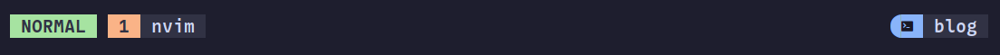
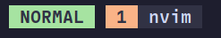
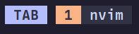
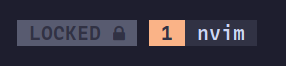
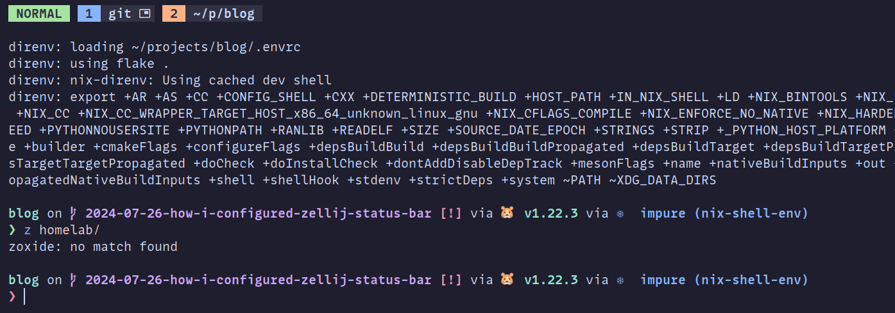
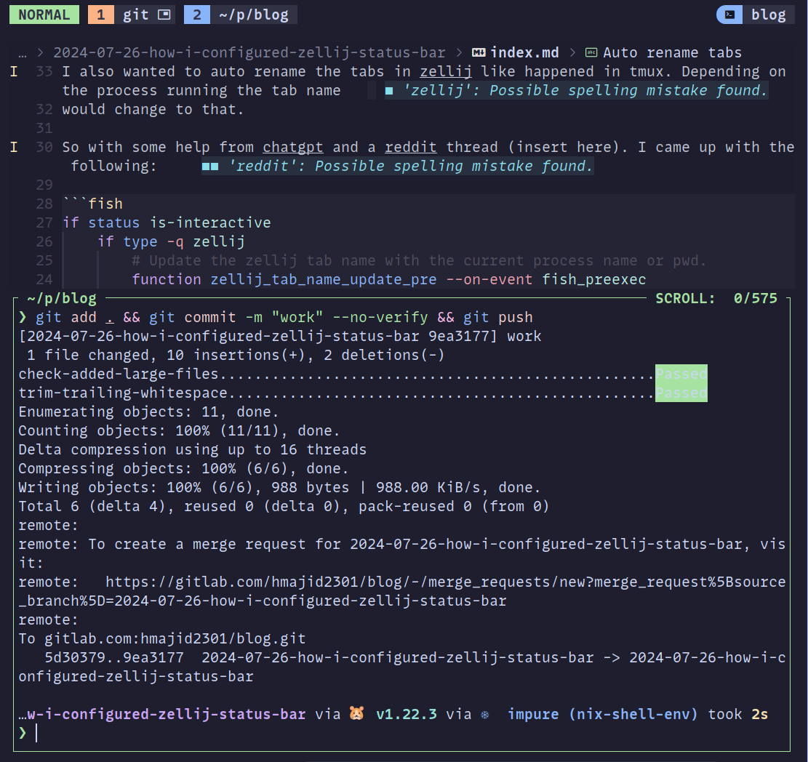

As some of you may know, I moved to Zellij a few months ago from tmux. In this post, I will show you have I configured
the zellij status bar in nix. So it acts more like how my config did in tmux.

My current Zellij status bar.




## (Optional) Background

A bit of background, which you can skip if you'd like.

### What is zellij?
Some of you may be wondering what is zellij/tmux. They are what we call multiplexers. Essentially, our terminals
now can have a client server architecture. So we can kill our terminal but, our session will still be alive.
Which makes it great for jumping between projects if you are using say Neovim. When I first moved to tmux, I found
it is great because now I don't need 4/5 VS Code instances open. Instead, I could use a script to jump between my projects,
and tmux would keep the session alive, so just how I left the project. Zellij does basically the same thing for me.


### Why zellij?

A few reasons, but the main one being I really, really like the floating panes. I know you can probably achieve the
same just using normal panes and just swapping between them, but I really like the idea of having floating panes and still
have what I was working on just behind the pane. It makes harder for me to forget or lost context on what I was doing.

Zellij, is modal a bit like vim, depending on the mode your keyboard shortcuts can change, i.e. scroll mode, tab or pane
mode. At first, I didn't like this, but now I've come to find it pretty useful.


## Status Bar
I don't really like the default status bar in zellij, it is very useful at the beginning when you are learning the
keyboard shortcuts. I soon moved over the minimal status bar and moved it to the top, so I could tell it apart easier
from my Neovim status bar. However, I didn't like the fact I couldn't change the colour, it would always be green
and didn't fit the rest of my theme (catppuccin mocha).


So what we will now do is configure the status bar, I found this [plugin](https://github.com/dj95/zjstatus).
Which allows us to customise our status bar, I wanted mine to look more like how I had it in my tmux configuration.

Here is how the old status bar looked.


### Nix

I have configured zellij using Nix via home-manager. So the rest of the post will show you how I did that. It should be
easily adjusted for other setups.

I will show you how I configured it in Nix, though it should be easy enough to work out the non-nix version. If you are
using Nix flakes, you can add it as an input to your flake.

```nix
{
    zjstatus = {
      url = "github:dj95/zjstatus";
    };
}
```

Then add the following overlay, since I'm using the [snowfall-lib] I can do something like `overlays/zjstatus/default.nix`:

```nix
{
    {inputs, ...}: final: prev: {
      zjstatus = inputs.zjstatus.packages.${prev.system}.default;
    }
}
```

Next create a module for your zellij config, in my case I put in a file called `home/cli/multiplexers/zellij/default.nix`.

Here, we enable zellij (using the home-manager options).

```nix
{
    xdg.configFile."zellij/config.kdl".source = ./config.kdl;
    programs.zellij = {
      enable = true;
    };
}
```


Where my `config.kdl` looks something like this, my [specific key bindings](https://gitlab.com/hmajid2301/dotfiles/-/blob/e7f96144fbb45a99173d21079f3bfbfd20eb7c91/modules/home/cli/multiplexers/zellij/config.kdl#L8). Just to be more Alt based, so it doesn't
clash with my Neovim bindings.

```kdl
theme "catppuccin-mocha"
pane_frames false
simplified_ui true
default_shell "fish"
copy_on_select true

// If you'd like to override the default keybindings completely, be sure to change "keybinds" to "keybinds clear-defaults=true"
keybinds {

}
```

Now onto the real meat and potatoes of the post, my default layout, you can see my full [config here](https://gitlab.com/hmajid2301/dotfiles/-/blob/e7f96144fbb45a99173d21079f3bfbfd20eb7c91/modules/home/cli/multiplexers/zellij/default.nix).
Also note how we reference the plugin using the nix package here `plugin location="file://${pkgs.zjstatus}/bin/zjstatus.wasm"`.

```nix
{
    xdg.configFile."zellij/layouts/default.kdl".text = ''
      layout {
          default_tab_template {
              pane size=2 borderless=true {
                  plugin location="file://${pkgs.zjstatus}/bin/zjstatus.wasm" {
                      format_left   "{mode}#[bg=#${colors.base00}] {tabs}"
                      format_center ""
                      format_right  "#[bg=#${colors.base00},fg=#${colors.base0D}]#[bg=#${colors.base0D},fg=#${colors.base01},bold] #[bg=#${colors.base02},fg=#${colors.base05},bold] {session} #[bg=#${colors.base03},fg=#${colors.base05},bold]"
                      format_space  ""
                      format_hide_on_overlength "true"
                      format_precedence "crl"

                      border_enabled  "false"
                      border_char     "─"
                      border_format   "#[fg=#6C7086]{char}"
                      border_position "top"

                      mode_normal        "#[bg=#${colors.base0B},fg=#${colors.base02},bold] NORMAL#[bg=#${colors.base03},fg=#${colors.base0B}]█"
                      mode_locked        "#[bg=#${colors.base04},fg=#${colors.base02},bold] LOCKED #[bg=#${colors.base03},fg=#${colors.base04}]█"
                      mode_resize        "#[bg=#${colors.base08},fg=#${colors.base02},bold] RESIZE#[bg=#${colors.base03},fg=#${colors.base08}]█"
                      mode_pane          "#[bg=#${colors.base0D},fg=#${colors.base02},bold] PANE#[bg=#${colors.base03},fg=#${colors.base0D}]█"
                      mode_tab           "#[bg=#${colors.base07},fg=#${colors.base02},bold] TAB#[bg=#${colors.base03},fg=#${colors.base07}]█"
                      mode_scroll        "#[bg=#${colors.base0A},fg=#${colors.base02},bold] SCROLL#[bg=#${colors.base03},fg=#${colors.base0A}]█"
                      mode_enter_search  "#[bg=#${colors.base0D},fg=#${colors.base02},bold] ENT-SEARCH#[bg=#${colors.base03},fg=#${colors.base0D}]█"
                      mode_search        "#[bg=#${colors.base0D},fg=#${colors.base02},bold] SEARCHARCH#[bg=#${colors.base03},fg=#${colors.base0D}]█"
                      mode_rename_tab    "#[bg=#${colors.base07},fg=#${colors.base02},bold] RENAME-TAB#[bg=#${colors.base03},fg=#${colors.base07}]█"
                      mode_rename_pane   "#[bg=#${colors.base0D},fg=#${colors.base02},bold] RENAME-PANE#[bg=#${colors.base03},fg=#${colors.base0D}]█"
                      mode_session       "#[bg=#${colors.base0E},fg=#${colors.base02},bold] SESSION#[bg=#${colors.base03},fg=#${colors.base0E}]█"
                      mode_move          "#[bg=#${colors.base0F},fg=#${colors.base02},bold] MOVE#[bg=#${colors.base03},fg=#${colors.base0F}]█"
                      mode_prompt        "#[bg=#${colors.base0D},fg=#${colors.base02},bold] PROMPT#[bg=#${colors.base03},fg=#${colors.base0D}]█"
                      mode_tmux          "#[bg=#${colors.base09},fg=#${colors.base02},bold] TMUX#[bg=#${colors.base03},fg=#${colors.base09}]█"

                      // formatting for inactive tabs
                      tab_normal              "#[bg=#${colors.base03},fg=#${colors.base0D}]█#[bg=#${colors.base0D},fg=#${colors.base02},bold]{index} #[bg=#${colors.base02},fg=#${colors.base05},bold] {name}{floating_indicator}#[bg=#${colors.base03},fg=#${colors.base02},bold]█"
                      tab_normal_fullscreen   "#[bg=#${colors.base03},fg=#${colors.base0D}]█#[bg=#${colors.base0D},fg=#${colors.base02},bold]{index} #[bg=#${colors.base02},fg=#${colors.base05},bold] {name}{fullscreen_indicator}#[bg=#${colors.base03},fg=#${colors.base02},bold]█"
                      tab_normal_sync         "#[bg=#${colors.base03},fg=#${colors.base0D}]█#[bg=#${colors.base0D},fg=#${colors.base02},bold]{index} #[bg=#${colors.base02},fg=#${colors.base05},bold] {name}{sync_indicator}#[bg=#${colors.base03},fg=#${colors.base02},bold]█"

                      // formatting for the current active tab
                      tab_active              "#[bg=#${colors.base03},fg=#${colors.base09}]█#[bg=#${colors.base09},fg=#${colors.base02},bold]{index} #[bg=#${colors.base02},fg=#${colors.base05},bold] {name}{floating_indicator}#[bg=#${colors.base03},fg=#${colors.base02},bold]█"
                      tab_active_fullscreen   "#[bg=#${colors.base03},fg=#${colors.base09}]█#[bg=#${colors.base09},fg=#${colors.base02},bold]{index} #[bg=#${colors.base02},fg=#${colors.base05},bold] {name}{fullscreen_indicator}#[bg=#${colors.base03},fg=#${colors.base02},bold]█"
                      tab_active_sync         "#[bg=#${colors.base03},fg=#${colors.base09}]█#[bg=#${colors.base09},fg=#${colors.base02},bold]{index} #[bg=#${colors.base02},fg=#${colors.base05},bold] {name}{sync_indicator}#[bg=#${colors.base03},fg=#${colors.base02},bold]█"

                      // separator between the tabs
                      tab_separator           "#[bg=#${colors.base00}] "

                      // indicators
                      tab_sync_indicator       " "
                      tab_fullscreen_indicator " 󰊓"
                      tab_floating_indicator   " 󰹙"

                      command_git_branch_command     "git rev-parse --abbrev-ref HEAD"
                      command_git_branch_format      "#[fg=blue] {stdout} "
                      command_git_branch_interval    "10"
                      command_git_branch_rendermode  "static"

                      datetime        "#[fg=#6C7086,bold] {format} "
                      datetime_format "%A, %d %b %Y %H:%M"
                      datetime_timezone "Europe/London"
                  }
              }
              children
          }
      }
    '';
}
```

I am using stylix to theme my apps `inherit (config.lib.stylix) colors;`, which uses the base16 colours so instead of
hardcoding colours, I reference [these colours](https://github.com/tinted-theming/base16-schemes/blob/main/catppuccin-mocha.yaml).

Essentially, all we do on the left-hand side we use straight "█" and on the right-hand side I use the circular "".
My current active tab is orange and inactive is blue, where the colour of the text is white.

Then the different colours for the different modes, i.e. normal, tab, locked.






## Auto rename tabs

I also wanted to auto-rename the tabs in zellij like happened in tmux. Depending on the process running, the tab name
would change to that.

So, with some help from ChatGPT and a [Reddit thread](https://old.reddit.com/r/zellij/comments/10skez0/does_zellij_support_changing_tabs_name_according/).  I came up with the following:

```fish
if status is-interactive
    if type -q zellij
        # Update the zellij tab name with the current process name or pwd.
        function zellij_tab_name_update_pre --on-event fish_preexec
            if set -q ZELLIJ
                set -l cmd_line (string split " " -- $argv)
                set -l process_name $cmd_line[1]
                if test -n "$process_name" -a "$process_name" != "z"
                    command nohup zellij action rename-tab $process_name >/dev/null 2>&1
                end
            end
        end

        function zellij_tab_name_update_post --on-event fish_postexec
            if set -q ZELLIJ
                set -l cmd_line (string split " " -- $argv)
                set -l process_name $cmd_line[1]
                if test "$process_name" = "z"
                    command nohup zellij action rename-tab (prompt_pwd) >/dev/null 2>&1
                end
            end
        end
    end
end
```

Since I use `zoxide`, I don't want to see just z, when I change directory; hence I have the code to ignore.
It is possible we can simplify this, but it works for now. However, one issue I did note was that the process running
the floating pane would overwrite the main process, i.e. running Neovim in a tab I would like to see `nvim` but since
I ran git, it now shows git.





#### Nix

Since I am also configuring fish shell with nix, I added the above to the `interactiveShellInit`.


```nix
{
    programs.fish = {
      enable = true;
      interactiveShellInit = ''
      '';
    }
}
```


## Appendix

- [Thanks for inspiration](https://github.com/dj95/zjstatus/discussions/44#discussioncomment-9641187)
- [Reddit thread auto-rename](https://old.reddit.com/r/zellij/comments/10skez0/does_zellij_support_changing_tabs_name_according/)
