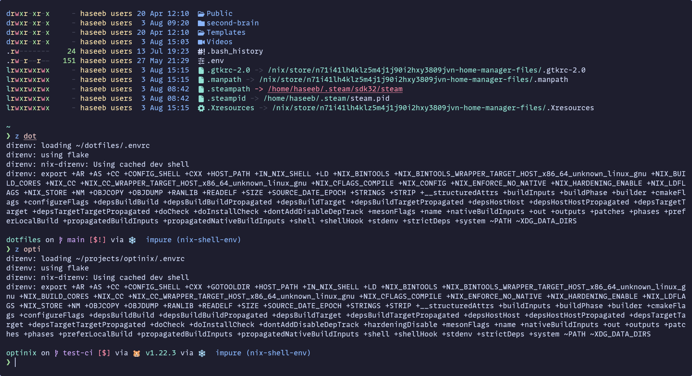

Recently, I was trying to configure the terminal emulator Kitty with Nix and Stylix, and I was having issues with it
showing emojis. It took me a lot longer to figure out than I would like to admit. So I decided to write a blog post,
showing you how I did it and perhaps saving you some time.


I did this in my [home-manger config](https://gitlab.com/hmajid2301/dotfiles/-/blob/79d1ddee586a98816af3f5605de3059d675d58fe/modules/home/cli/terminals/kitty/default.nix).
First we install the `Symbols Nerd Font`, there are two ways we can normally add nerd fonts. Either patch our font,
which I had already done with my font Mono Lisa or use this font (symbols), alongside your font (as a fallback).
I haven't fully managed to get that to work on my system, so I have both normal Mono Lisa and Nerd Font variants on my
system at the moment. Else other apps besides Kitty break. Anyway, tangent aside, you can install like this:

```nix
{
home.packages = with pkgs; [
  (nerdfonts.override {fonts = ["NerdFontsSymbolsOnly"];})
];
}

```

Next my [Stylix config](https://gitlab.com/hmajid2301/dotfiles/-/blob/79d1ddee586a98816af3f5605de3059d675d58fe/modules/home/styles/stylix/default.nix)
looks something like this, for my emoji font:

```nix
{
stylix = {
  enable = true;

  fonts = {
    emoji = {
      package = pkgs.noto-fonts-emoji;
      name = "Noto Color Emoji";
    };
  };
};
}
```

Then finally, I configure Kitty like this, the key lines being the ones defined in the `extraConfig`. Here we are setting
symbols to map to emoji font and other nerd font symbols to the symbols' font.

```nix {hl_lines=[5-8]}
{
programs.kitty = {
  enable = true;

  extraConfig = ''
    symbol_map U+e000-U+e00a,U+ea60-U+ebeb,U+e0a0-U+e0c8,U+e0ca,U+e0cc-U+e0d4,U+e200-U+e2a9,U+e300-U+e3e3,U+e5fa-U+e6b1,U+e700-U+e7c5,U+f000-U+f2e0,U+f300-U+f372,U+f400-U+f532,U+f0001-U+f1af0 Symbols Nerd Font Mono
    symbol_map U+2600-U+26FF Noto Color Emoji
  '';

  settings = {
    shell = "fish";
    window_padding_width = 10;
    scrollback_lines = 10000;
    show_hyperlink_targets = "yes";
    enable_audio_bell = false;
    url_style = "none";
    underline_hyperlinks = "never";
    copy_on_select = "clipboard";
  };
};
}
```

This is what it looks like.


