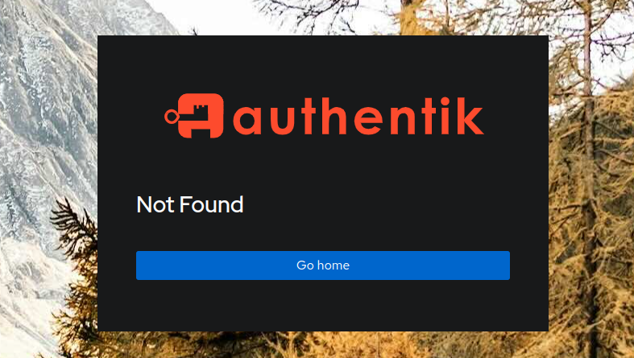
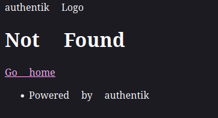

In this post, I will show you how you can set up forward auth for a single host in Authentik, with Traefik as our reverse
proxy on NixOS. This is particularly useful way to protect apps that don't have any built in auth.

Authentik is a great app which can handle authentication for almost all of our home lab. So we only need to log in
with Authentik, to log in to any of our apps. Rather than needing separate passwords and usernames for each app.

You may see an error like this, when trying to access the app:



or you may see this




## Background

As per is the case with everything I do, rather than sticking to my home lab in K3S. I decided to move some of it to
NixOS. The main reason for this being, it felt like there was a lot of boilerplate, sometimes 4 files just to deploy
an app. I felt like I was getting more frustrated and not really spending any time setting up my home lab.

So hence I decided to have a look at how I could do it with NixOS itself. I would lose out on some of the HA features, i.e.
if a node goes down, pods would get moved to another node. But for now, it would be good enough.

One thing that took me a while to figure out was how to set up forward auth like I had working with my Kubernetes
cluster. Such as protecting apps from the "arr" stack, such as Sonarr.

As seems to be the norm for these blog posts it took me longer than I would care to admit, so let me show you how
I did it.


## Getting started

For this, I will use the embedded outpost we have with Authentik and you are already using Traefik as your reverse proxy.

### Authentik

To set up Authentik, I used [authentik-nix](https://github.com/nix-community/authentik-nix). Where my config looks
something like this:

```nix
{
    services = {
      authentik = {
        enable = true;
        environmentFile = config.sops.secrets.authenik_env.path;
        settings = {
          email = {
          # email settings
          };
          disable_startup_analytics = true;
          avatars = "initials";
        };
      };
    };
}
```

Where my authentik_env config in sops looks like:

```
authenik_env: |
    AUTHENTIK_SECRET_KEY=
    AUTHENTIK_EMAIL__PASSWORD=
```

Then the key bit I was missing the relevant Traefik config:

- Define a new middleware
- Define a new service
- Define a new route to take us to the Authentik embedded outpost

```nix
{

 services.traefik = {
    dynamicConfigOptions = {
      http = {
        middlewares = {
          authentik = {
            forwardAuth = {
              tls.insecureSkipVerify = true;
              address = "https://localhost:9443/outpost.goauthentik.io/auth/traefik";
              trustForwardHeader = true;
              authResponseHeaders = [
                "X-authentik-username"
                "X-authentik-groups"
                "X-authentik-email"
                "X-authentik-name"
                "X-authentik-uid"
                "X-authentik-jwt"
                "X-authentik-meta-jwks"
                "X-authentik-meta-outpost"
                "X-authentik-meta-provider"
                "X-authentik-meta-app"
                "X-authentik-meta-version"
              ];
            };
          };
        };

        services = {
          auth.loadBalancer.servers = [
            {
              url = "http://localhost:9000";
            }
          ];
        };

        routers = {
          auth = {
            entryPoints = ["websecure"];
            rule = "Host(`authentik.haseebmajid.dev`) || HostRegexp(`{subdomain:[a-z0-9]+}.haseebmajid.com`) && PathPrefix(`/outpost.goauthentik.io/`)";
            service = "auth";
            tls.certResolver = "letsencrypt";
          };
        };
      };
    };
 };
}
```

The main bit I was missing was the address I needed to use the port `9443` to redirect to the embed outpost.
Then creating the relevant auth redirect:

```nix
  auth = {
    entryPoints = ["websecure"];
    rule = "Host(`authentik.haseebmajid.dev`) || HostRegexp(`{subdomain:[a-z0-9]+}.haseebmajid.com`) && PathPrefix(`/outpost.goauthentik.io/`)";
    service = "auth";
    tls.certResolver = "letsencrypt";
  };
```

Where you should adjust `authentik.haseebmajid.dev` to match the domain you are using to access authentik on.
Then you can simply follow the [docs](https://docs.goauthentik.io/integrations/services/sonarr/) and should be
able to repeat this for all apps you want to set this forward auth for.

Finally, in our Sonarr Traefik config, we would like to add our middleware that we just defined above:

```nix
  sonarr = {
    entryPoints = ["websecure"];
    rule = "Host(`sonarr.bare.homelab.haseebmajid.dev`)";
    service = "sonarr";
    tls.certResolver = "letsencrypt";
    middlewares = ["authentik"];
  };
```

That's about it! The main thing I was missing was that `https://localhost:9443/outpost.goauthentik.io/auth/traefik`
especially the port. After I added that everything worked like a dream.

## Appendix

- My home lab Nix config
  - [Sonarr Traefik config](https://gitlab.com/hmajid2301/nixicle/-/blob/58ba59fee49b2533f1e047acae7fc06d6192667d/modules/nixos/services/arr/default.nix#L143)
  - [Authentik config](https://gitlab.com/hmajid2301/nixicle/-/blob/58ba59fee49b2533f1e047acae7fc06d6192667d/modules/nixos/services/authentik/default.nix#L55)
