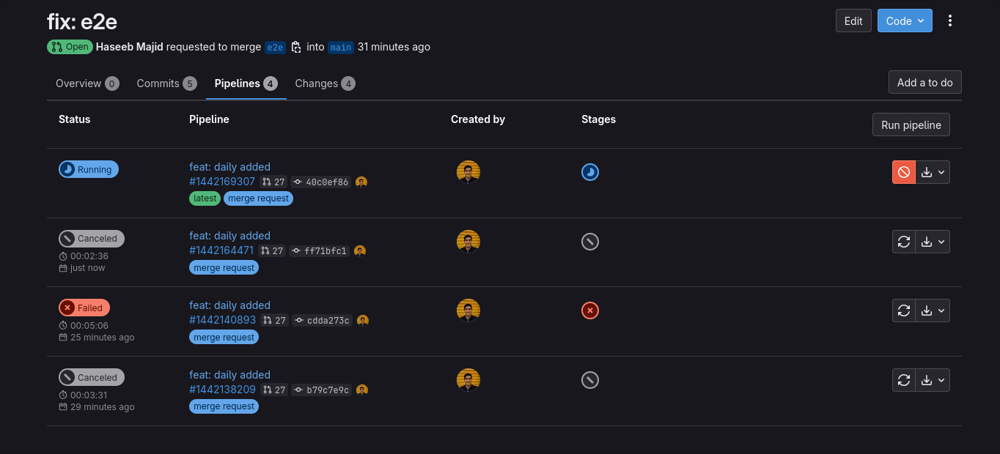

**TIL: How to Cancel Stale Pipelines in GitLab CI**

Today I learnt that we can cancel old pipelines in MRs. For example, you push a new commit, and you don't care about the
old pipeline running any more. You want to cancel them to save CI minutes etc.

Here is an example, you can see the 2nd pipeline is cancelled:




We need to add this to our `.gitlab-ci.yml` file. Where the `default.interruptible` marks every job as it can be
cancelled [^1].

```yaml
workflow:
  auto_cancel:
    on_new_commit: interruptible

default:
  interruptible: true
```

Then on new commits, we cancel all interruptible jobs. Just make sure to be careful where jobs actually deploy stuff.
You don't want to partially deploy things. But for jobs like running tests, linting etc this should be all good.

[^1]: https://docs.gitlab.com/ee/ci/yaml/index.html#interruptible## Appendix
- [Example gitlab pipeline](https://gitlab.com/hmajid2301/banterbus/-/blob/1ef5ae17e81b75576d7df02a60c9e95e11fc6d96/.gitlab-ci.yml)
