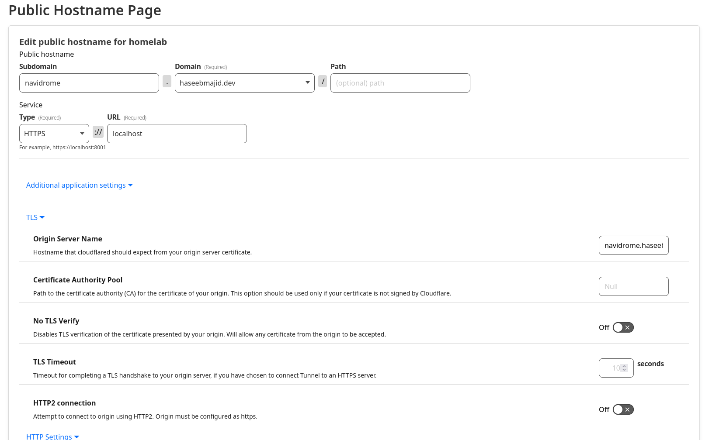

Recently, I was setting up Navidrome, kind of like a self-hosted Spotify, in my home lab and I wanted to set it up to use
proxy auth in Authentik. But to do this I needed to use with a reverse proxy, i.e. Traefik. In this article
I will show you how to you can point your Cloudflare tunnel to Traefik and have that forward the request to the service.


## Prerequisite

In this article, I assume you are already familiar with Cloudflare Tunnels and Traefik.

## Background

Cloudflare tunnels are an easy way to allow access to apps running on a server, i.e. home lab. Where you only want
expose, say, a few services. When a client connects, they connect to Cloudflare and then Cloudflare makes a secure
connection to your server. Which is running the `cloudflared` daemon.

Where my Cloudflare nix config looks something like this [^1]:

```nix
{
  config,
  lib,
  ...
}:
with lib;
with lib.nixicle; let
  cfg = config.services.nixicle.cloudflared;
in {
  options.services.nixicle.cloudflared = {
    enable = mkEnableOption "Enable The cloudflared (tunnel) service";
  };

  config = mkIf cfg.enable {
    sops.secrets.cloudflared = {
      sopsFile = ../secrets.yaml;
      owner = "cloudflared";
    };

    services = {
      cloudflared = {
        enable = true;
        tunnels = {
          "ec0b6af0-a823-4616-a08b-b871fd2c7f58" = {
            credentialsFile = config.sops.secrets.cloudflared.path;
            default = "http_status:404";
          };
        };
      };
    };
  };
}
```

The other apps I have set up in Cloudflare tunnels point directly to the service itself. This is the first one
I needed to point to Traefik, and then Traefik would forward the request to Navidrome.

Where my Traefik setup looks something [^2]:

```nix
{
  config,
  lib,
  ...
}:
with lib; let
  cfg = config.services.nixicle.traefik;
in {
  options.services.nixicle.traefik = {
    enable = mkEnableOption "Enable traefik";
  };

  config = mkIf cfg.enable {
    services = {
      traefik = {
        enable = true;

        staticConfigOptions = {
          # removed config to simplify

          entryPoints.web = {
            address = "0.0.0.0:80";
            http.redirections.entryPoint = {
              to = "websecure";
              scheme = "https";
              permanent = true;
            };
          };

          entryPoints.websecure = {
            address = "0.0.0.0:443";
            http.tls = {
              certResolver = "letsencrypt";
              domains = [
                {
                  main = "homelab.haseebmajid.dev";
                  sans = ["*.homelab.haseebmajid.dev"];
                }
                {
                  main = "haseebmajid.dev";
                  sans = ["*.haseebmajid.dev"];
                }
              ];
            };
          };
        };
      };
    };
  };
}
```

Things to note about my setup (now shown here) but Traefik is set up to be able to provision certificates from let's encrypt
using Cloudflare DNS challenge (see full config linked above).


## Setup



We can see here this is how I configured my tunnel, first I point to traefik on port 443, i.e. https. As Traefik
I have set up always expects traffic on 443. Also notice the `origin server name` is `navidrome.haseebmajid.dev`.
This will get passed to Traefik.

Or in my Nix config I have defined it like so:

```nix
{
services = {
  cloudflared = {
    enable = true;
    tunnels = {
      "ec0b6af0-a823-4616-a08b-b871fd2c7f58" = {
        ingress = {
          "navidrome.haseebmajid.dev" = {
            service = "https://localhost";
            originRequest = {
              originServerName = "navidrome.haseebmajid.dev";
            };
          };
        };
      };
    };
  };
};
}
```

Finally, the last bit to connect the two bits together, the Traefik config:

```nix
{
  traefik = {
    dynamicConfigOptions = {
      http = {
        services = {
          navidrome.loadBalancer.servers = [
            {
              url = "http://localhost:4533";
            }
          ];
        };

        routers = {
          navidrome = {
            entryPoints = ["websecure"];
            rule = "Host(`navidrome.haseebmajid.dev`)";
            service = "navidrome";
            tls.certResolver = "letsencrypt";
            middlewares = ["authentik"];
          };
        };
      };
    };
  };
}
```

Pointing to our local service `http://localhost:4533` where Navidrome is running.
We also tell it that if we get a request for host `navidrome.haseebmajid.dev` it should forward it to that
localhost service. We also tell it to provision a certificate using letsencrypt. Though you may not need this
as Cloudflare does it for you.

However, Cloudflare will only do it on direct subdomains, i.e. it won't work on `navidrome.homelab.haseebmajid.dev`.
Because it's a subdomain of a subdomain.

Then tell it to use the `authentik` middleware, which you can find out how to set up
[here](/posts/2024-09-06-how-to-setup-authentik-forward-auth-with-traefik-on-nixos/). This tells Traefik to forward
the request to Authentik, so we can correctly authenticate the user.

That's it, we should be able to access our service Navidrome when it's all deployed. The request is going from
Client → Cloudflare →Traefik → Navidrome.


[^1]: https://gitlab.com/hmajid2301/nixicle/-/blob/39654a157bc95d02ad24b4fd9bb2379d3173f53b/modules/nixos/services/cloudflared/default.nix
[^2]: https://gitlab.com/hmajid2301/nixicle/-/blob/39654a157bc95d02ad24b4fd9bb2379d3173f53b/modules/nixos/services/traefik/default.nix

