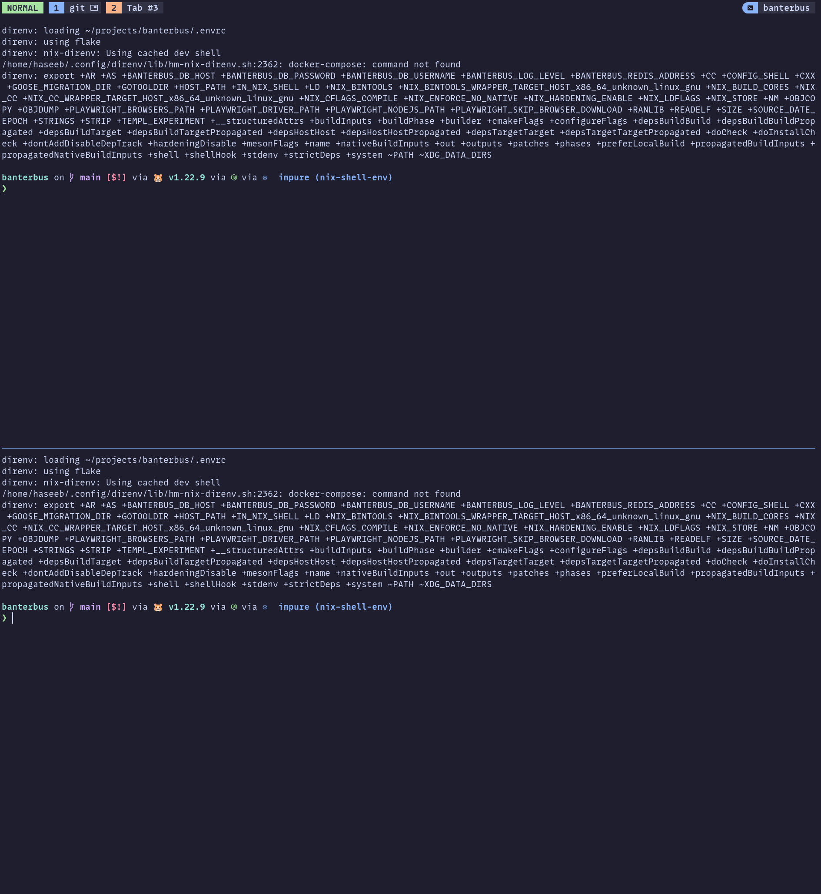
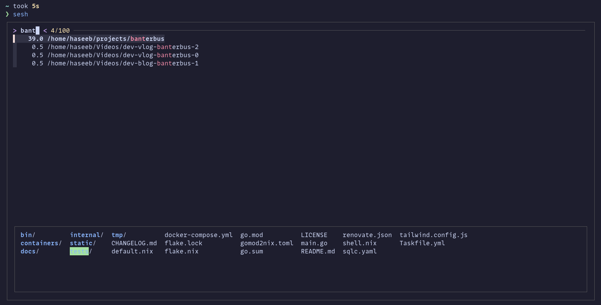

After another 5 months I'm finally back blogging about my development setup. Which since my last post, has been
a lot more stable. As much closer to a workflow I am mostly happy with. In this post, we will go over how I integrate
[Zellij](https://github.com/zellij-org/zellij).

## What is a terminal multiplexer?

Zellij is a terminal multiplexer think like tmux or screen. It another one of those projects written in rust.
Which seems pretty popular for creating similar tools to existing ones but usually faster.

It allows us to split up our terminal into multiple panes or sections, then navigate between them. Now if you are using
a tiling window manager you could also just create 4 terminals. But one other nice feature that tmux and Zellij let
you do it they have a server client architecture so you can close your terminal connecting to a session. Then
open a new one say an hour later and connect to your session, and it will be in the same state you left it.
This also works well if you accidentally closed your terminal that was doing some work.

These tools also allow us to have tabs that we can navigate between. In the image below you can see a Zellij
session which has two tabs and the current tab is split into two panes horizontally.




## Why Zellij?

I was using tmux until earlier this year. The main reason I moved to Zellij was basically one main feature, floating panes.
I can press a key combination and then voilà get a floating terminal I can run commands in like, linting my code or
running tests and then when it's done, I can hide it.

Now you can do this in tmux with plugins, though I couldn't make it work ([floax](https://github.com/omerxx/tmux-floax)).
You can also do this within Neovim, but the nice thing about Zellij is it stays for the duration that the tab
you are in the open. Some terminals also provide the ability to split into panes and tabs, i.e. Wezterm.

There are two main reasons I want to use Zellij; the floating panes and the client server architecture. Which makes it
much easier for me to jump between my projects.


## How I configured it?

As will be no surprise to anyone following me, I have set it up using Nix;
You can find my [full config here](https://gitlab.com/hmajid2301/nixicle/-/blob/9d9d50ea3d8c5746bfb3f53fdfa46b8fe1d09106/modules/home/cli/multiplexers/zellij/default.nix).


```nix
{
  pkgs,
  lib,
  config,
  ...
}:
with lib;
with lib.nixicle; let
  cfg = config.cli.multiplexers.zellij;
  inherit (config.lib.stylix) colors;

  sesh = pkgs.writeScriptBin "sesh" ''
    // ...
  '';
in {
  options.cli.multiplexers.zellij = with types; {
    enable = mkBoolOpt false "enable zellij multiplexer";
  };

  config = mkIf cfg.enable {
    home.packages = [
      sesh
    ];

    xdg.configFile."zellij/config.kdl".source = ./config.kdl;
    xdg.configFile."zellij/layouts/default.kdl".text = ''
        // ...
    '';

    programs.zellij = {
      enable = true;
    };
  };
}
```

I've removed some parts of my config to make it easier to read. But essentially, we set up some config files and enable
Zellij. I also have a custom script sesh which allows me to jump between my different projects. Easily!
Where I basically count as a folder/git repo as a project.


### Sesh

As I said, I have a script called `sesh`, which I use to open a folder in a Zellij session. It combines
Zoxide (better cd tool) to fuzzy find (zoxide uses FZF I believe) any directory we have previously navigated to with
Zoxide.

Once we pick a folder we will load into a Zellij session.

```nix
  sesh = pkgs.writeScriptBin "sesh" ''
    #! /usr/bin/env sh

    # Taken from https://github.com/zellij-org/zellij/issues/884#issuecomment-1851136980
    # select a directory using zoxide
    ZOXIDE_RESULT=$(zoxide query --interactive)
    # checks whether a directory has been selected
    if [[ -z "$ZOXIDE_RESULT" ]]; then
    	# if there was no directory, select returns without executing
    	exit 0
    fi
    # extracts the directory name from the absolute path
    SESSION_TITLE=$(echo "$ZOXIDE_RESULT" | sed 's#.*/##')

    # get the list of sessions
    SESSION_LIST=$(zellij list-sessions -n | awk '{print $1}')

    # checks if SESSION_TITLE is in the session list
    if echo "$SESSION_LIST" | grep -q "^$SESSION_TITLE$"; then
    	# if so, attach to existing session
    	zellij attach "$SESSION_TITLE"
    else
    	# if not, create a new session
    	echo "Creating new session $SESSION_TITLE and CD $ZOXIDE_RESULT"
    	cd $ZOXIDE_RESULT
    	zellij attach -c "$SESSION_TITLE"
    fi
  '';
```

This is not as flexible as the session switcher I had in tmux as I cannot swap using the same sesh script.
I need to use the built-in session switcher from Zellij. I don't really like the asymmetry, but it works fine.
Furthermore, I usually end up opening a new terminal and run sesh there, rather than remembering my key bind in zellij
swap sessions.

Here you can see the script, showing us the FZF fuzzy searcher alongside the Zoxide results.




### Key Bindings

Another problem Zellij faces is the default key binding use `Ctrl` a lot and clash with my Neovim bindings.
So I ended up swapping the main key to be Alt, which doesn't seem to clash with anything else in my system.

Again, not quite as convenient as what I had in tmux, but it is mostly good enough, and I've built enough muscle memory.
To achieve this, I updated my `config.kdl` file such that it looks this (I'm pretty sure I just copied someone else's but
cannot find who, sorry helpful person.).

Zellij is modal, so we have different modes, i.e. pane mode, tab mode, search mode.

Find my [full `config.kdl` here](https://gitlab.com/hmajid2301/nixicle/-/blob/9d9d50ea3d8c5746bfb3f53fdfa46b8fe1d09106/modules/home/cli/multiplexers/zellij/config.kdl).

```kdl
theme "catppuccin-mocha"
pane_frames false
simplified_ui true
default_shell "fish"
copy_on_select true

// If you'd like to override the default keybindings completely, be sure to change "keybinds" to "keybinds clear-defaults=true"
keybinds {
    unbind "Ctrl q"
    normal {
        // uncomment this and adjust key if using copy_on_select=false
        // bind "Alt c" { Copy; }
    }
    locked clear-defaults=true {
        bind "Alt u" { SwitchToMode "Normal"; }
    }

    resize clear-defaults=true {
        bind "Alt r" "Esc" "Ctrl {" { SwitchToMode "Normal"; }

        bind "h" "Left" { Resize "Increase Left"; }
        bind "j" "Down" { Resize "Increase Down"; }
        bind "k" "Up" { Resize "Increase Up"; }
        bind "l" "Right" { Resize "Increase Right"; }
        bind "H" { Resize "Decrease Left"; }
        bind "J" { Resize "Decrease Down"; }
        bind "K" { Resize "Decrease Up"; }
        bind "L" { Resize "Decrease Right"; }
        bind "=" "+" { Resize "Increase"; }
        bind "-" { Resize "Decrease"; }
    }

    // ...
}
```

So I use `alt + t` for example to go into tab mode, and then we could press `n` to create a new tab.
Equally, `alt + p` then `-` will create a horizontal pane split.

One other super useful key binding I use a lot is `alt + f` and `e` which opens the panes contents in my editor i.e.
Neovim. Which I can then use to copy data, open links etc. Again there are tmux plugins which let use navigate the
pane itself, but I like that I can just use Neovim as I normally would.

### Neovim

In tmux, I had a plugin which allowed me to navigate panes using CTRL, but I haven't setup anything similar in zellij.
For now, I am happy navigating using Alt between the panes whenever I need to, that which is not frequent.

### Status Bar

You can find some nice examples [here](https://github.com/dj95/zjstatus/discussions/44) for some inspiration of possible
status bars.

The final part of the config is using the [zellij status bar plugin](https://github.com/dj95/zjstatus).
Which I wanted to look more like tmux catppuccin theme and that basically what this does. We do some string
interpolation with Nix and stylix for the base16 colours. So I could change them in one place and it would do it
across my config.


```kdl
  default_tab_template {
      pane size=2 borderless=true {
          plugin location="file://${pkgs.zjstatus}/bin/zjstatus.wasm" {
              format_left   "{mode}#[bg=#${colors.base00}] {tabs}"
              format_center ""
              format_right  "#[bg=#${colors.base00},fg=#${colors.base0D}]#[bg=#${colors.base0D},fg=#${colors.base01},bold] #[bg=#${colors.base02},fg=#${colors.base05},bold] {session} #[bg=#${colors.base03},fg=#${colors.base05},bold]"
              format_space  ""
              format_hide_on_overlength "true"
              format_precedence "crl"

              border_enabled  "false"
              border_char     "─"
              border_format   "#[fg=#6C7086]{char}"
              border_position "top"

              mode_normal        "#[bg=#${colors.base0B},fg=#${colors.base02},bold] NORMAL#[bg=#${colors.base03},fg=#${colors.base0B}]█"
              mode_locked        "#[bg=#${colors.base04},fg=#${colors.base02},bold] LOCKED #[bg=#${colors.base03},fg=#${colors.base04}]█"
              mode_resize        "#[bg=#${colors.base08},fg=#${colors.base02},bold] RESIZE#[bg=#${colors.base03},fg=#${colors.base08}]█"
              mode_pane          "#[bg=#${colors.base0D},fg=#${colors.base02},bold] PANE#[bg=#${colors.base03},fg=#${colors.base0D}]█"
              mode_tab           "#[bg=#${colors.base07},fg=#${colors.base02},bold] TAB#[bg=#${colors.base03},fg=#${colors.base07}]█"
              mode_scroll        "#[bg=#${colors.base0A},fg=#${colors.base02},bold] SCROLL#[bg=#${colors.base03},fg=#${colors.base0A}]█"
              mode_enter_search  "#[bg=#${colors.base0D},fg=#${colors.base02},bold] ENT-SEARCH#[bg=#${colors.base03},fg=#${colors.base0D}]█"
              mode_search        "#[bg=#${colors.base0D},fg=#${colors.base02},bold] SEARCHARCH#[bg=#${colors.base03},fg=#${colors.base0D}]█"
              mode_rename_tab    "#[bg=#${colors.base07},fg=#${colors.base02},bold] RENAME-TAB#[bg=#${colors.base03},fg=#${colors.base07}]█"
              mode_rename_pane   "#[bg=#${colors.base0D},fg=#${colors.base02},bold] RENAME-PANE#[bg=#${colors.base03},fg=#${colors.base0D}]█"
              mode_session       "#[bg=#${colors.base0E},fg=#${colors.base02},bold] SESSION#[bg=#${colors.base03},fg=#${colors.base0E}]█"
              mode_move          "#[bg=#${colors.base0F},fg=#${colors.base02},bold] MOVE#[bg=#${colors.base03},fg=#${colors.base0F}]█"
              mode_prompt        "#[bg=#${colors.base0D},fg=#${colors.base02},bold] PROMPT#[bg=#${colors.base03},fg=#${colors.base0D}]█"
              mode_tmux          "#[bg=#${colors.base09},fg=#${colors.base02},bold] TMUX#[bg=#${colors.base03},fg=#${colors.base09}]█"

              // formatting for inactive tabs
              tab_normal              "#[bg=#${colors.base03},fg=#${colors.base0D}]█#[bg=#${colors.base0D},fg=#${colors.base02},bold]{index} #[bg=#${colors.base02},fg=#${colors.base05},bold] {name}{floating_indicator}#[bg=#${colors.base03},fg=#${colors.base02},bold]█"
              tab_normal_fullscreen   "#[bg=#${colors.base03},fg=#${colors.base0D}]█#[bg=#${colors.base0D},fg=#${colors.base02},bold]{index} #[bg=#${colors.base02},fg=#${colors.base05},bold] {name}{fullscreen_indicator}#[bg=#${colors.base03},fg=#${colors.base02},bold]█"
              tab_normal_sync         "#[bg=#${colors.base03},fg=#${colors.base0D}]█#[bg=#${colors.base0D},fg=#${colors.base02},bold]{index} #[bg=#${colors.base02},fg=#${colors.base05},bold] {name}{sync_indicator}#[bg=#${colors.base03},fg=#${colors.base02},bold]█"

              // formatting for the current active tab
              tab_active              "#[bg=#${colors.base03},fg=#${colors.base li09}]█#[bg=#${colors.base09},fg=#${colors.base02},bold]{index} #[bg=#${colors.base02},fg=#${colors.base05},bold] {name}{floating_indicator}#[bg=#${colors.base03},fg=#${colors.base02},bold]█"
              tab_active_fullscreen   "#[bg=#${colors.base03},fg=#${colors.base09}]█#[bg=#${colors.base09},fg=#${colors.base02},bold]{index} #[bg=#${colors.base02},fg=#${colors.base05},bold] {name}{fullscreen_indicator}#[bg=#${colors.base03},fg=#${colors.base02},bold]█"
              tab_active_sync         "#[bg=#${colors.base03},fg=#${colors.base09}]█#[bg=#${colors.base09},fg=#${colors.base02},bold]{index} #[bg=#${colors.base02},fg=#${colors.base05},bold] {name}{sync_indicator}#[bg=#${colors.base03},fg=#${colors.base02},bold]█"

              // separator between the tabs
              tab_separator           "#[bg=#${colors.base00}] "

              // indicators
              tab_sync_indicator       " "
              tab_fullscreen_indicator " 󰊓"
              tab_floating_indicator   " 󰹙"

              command_git_branch_command     "git rev-parse --abbrev-ref HEAD"
              command_git_branch_format      "#[fg=blue] {stdout} "
              command_git_branch_interval    "10"
              command_git_branch_rendermode  "static"

              datetime        "#[fg=#6C7086,bold] {format} "
              datetime_format "%A, %d %b %Y %H:%M"
              datetime_timezone "Europe/London"
          }
      }
      children
  }
}
```


## Workflow

On start up of my PC, I open a terminal and run the `sesh` script pick a project, say banter bus.
Which should in theory resurrect the session if it was alive but seems to have issues with on Nix. I usually get
around this by pressing `ESC` but ideally, it would resurrect the session. Usually, though, It's not super complicated.
To set up most of my projects again.

I also usually hibernate my PC so I can carry on where I left off from. When working, I will often use the floating
pane which I toggle using `alt + p` and `w`. Where I will run commands like `task lint` to lint my code.
Or say `task dev` to start my app and view logs.

That's it! My Zellij setup and roughly how I use it.
